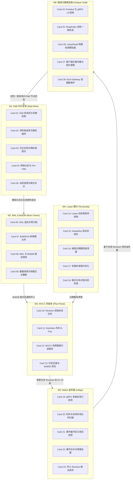

# 《etcd-io / etcd》高密度卡片系统设计大图

本设计大图为《etcd-io / etcd》的分布式强一致性协调与系统设计高密度拆解卡片设计指南。我们将 28 张核心速查卡片划分为六大核心模块，每个模块采用低饱和度的莫兰迪（Morandi）色彩进行视觉归类，并设计了其拓扑交互图与物理源头锚点。

---

## 🎨 莫兰迪内核诊断视觉配色方案 (Morandi Color System)

为保证排版的高级感与学术硬核感，采用低饱和度、高质感的莫兰迪色彩体系：

| 模块编码 | 模块名称 | 莫兰迪色系 | 浅色底色 (Light Mode) | 深色边框 / 文字 (Dark Mode) | 对应设计领域 |
| :--- | :--- | :--- | :--- | :--- | :--- |
| **M1** | Raft 共识与日志复制 | 石板蓝 (Slate Blue) | `#F0F3F5` / `#D2DBE0` | `#4E5D6C` / `#2F3C47` | 选主防撞、日志状态追加、分区防御、成员共识变更 |
| **M2** | WAL 预写日志与存储 | 苔绿 (Moss Green) | `#F2F4F0` / `#D5DDD1` | `#5F6C5B` / `#3A4438` | WAL 预分配与顺序写、BoltDB 树结构、持久化提交屏障 |
| **M3** | MVCC 多版本控制 | 梅玫瑰 (Plum Rose) | `#F5F0F2` / `#E0D2D7` | `#6F525A` / `#4A353A` | 全局 Revision 事务定位、内存 KeyIndex 索引映射、历史整理 |
| **M4** | Lease 租约与生存期 | 陶土红 (Terracotta) | `#F5F1EF` / `#E0D3CD` | `#793C2C` / `#522114` | Lease ID 堆排序、KeepAlive 双向流、级联过期、共享租约 |
| **M5** | Watch 异步事件流 | 靛青 (Indigo) | `#F0F2F5` / `#D1D8E0` | `#3E4C5B` / `#232F3C` | synced/unsynced 双队列扫描、背压流控、事件去重与断点 |
| **M6** | 集群变更与强一致读 | 古董金 (Antique Gold) | `#F6F4EE` / `#E3DEC8` | `#8C7344` / `#5C4A28` | gRPC 多路复用、ReadIndex/LeaseRead 强一致读、负载容灾 |

---

## 🗺️ 28张高密速查卡片大图拓扑 (Card Topology)

---

## ⚡ 物理代码与规范源头锚点 (Physical Source Anchors)

本设计大图与 etcd 开源项目的物理代码路径映射如下：
1. **Raft 状态机与日志流**：映射 `server/etcdserver/raft.go` 以及底层依赖的 `go.etcd.io/raft` 包。核心关注 `raft.Step` 状态转移入口、`raftLog` 内存日志缓冲。
2. **WAL 物理预写日志追加**：映射 `server/storage/wal/wal.go`，重点关注 `wal.Save` 物理刷盘操作，以及文件预分配（File Preallocation）如何调用 `fallocate` 规避文件系统磁盘分配抖动。
3. **BoltDB B+树文件调度**：映射 `server/storage/backend/backend.go` 以及 `go.etcd.io/bbolt` 的核心事务提交逻辑，分析只读事务（Read Tx）与读写事务（Batch Tx）的全局缓冲隔离。
4. **KeyIndex 内存索引查找**：映射 `server/mvcc/key_index.go`，重点关注 `keyIndex` 结构体的物理实现，`generations` 数组存储生命周期，以及利用 `go-adaptive-radix-tree` 或内存 B-Tree 进行键名匹配的算法。
5. **LeaseManager 租约堆排调度**：映射 `server/lease/leaseid.go` 与 `server/lease/lessor.go`，分析租约到期轮询线程（Lessor Expired Channel）、最小堆到期判断时间复杂度，以及 gRPC 流式多路复用保活机制。
6. **WatchableStore 双队列流控**：映射 `server/mvcc/watchable_store.go`，关注同步队列（synced）与未同步队列（unsynced）如何通过 `syncWatchersLoop` 进行滑动窗口补发，以及背压控制机制。
7. **ReadIndex 一致性读广播**：映射 `server/etcdserver/linearizer.go` 及 `server/etcdserver/v3_actions.go`，追踪 ReadIndex 如何获取 Leader 确认并等待本地应用指针（ApplyIndex）追上 ReadIndex 的调用图。
