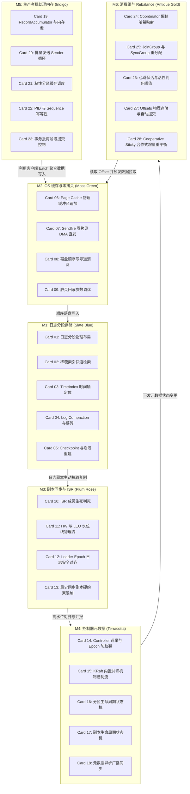

# 《apache / kafka-internals》高密度卡片系统设计大图

本设计大图为《apache / kafka-internals》的分布式高吞吐事件存储与系统设计高密度拆解卡片设计指南。我们将 28 张核心速查卡片划分为六大核心模块，每个模块采用低饱和度的莫兰迪（Morandi）色彩进行视觉归类，并设计了其拓扑交互图与物理源头锚点。

---

## 🎨 莫兰迪内核诊断视觉配色方案 (Morandi Color System)

为保证排版的高级感与学术硬核感，采用低饱和度、高质感的莫兰迪色彩体系：

| 模块编码 | 模块名称 | 莫兰迪色系 | 浅色底色 (Light Mode) | 深色边框 / 文字 (Dark Mode) | 对应设计领域 |
| :--- | :--- | :--- | :--- | :--- | :--- |
| **M1** | 日志存储与索引 | 石板蓝 (Slate Blue) | `#F0F3F5` / `#D2DBE0` | `#4E5D6C` / `#2F3C47` | 日志分段、稀疏索引二分查找、TimeIndex 过期清理、Log Compaction 压实 |
| **M2** | 页缓存与零拷贝 | 苔绿 (Moss Green) | `#F2F4F0` / `#D5DDD1` | `#5F6C5B` / `#3A4438` | OS Page Cache 物理写入、Sendfile 零拷贝 DMA 链路、脏页回写参数调优 |
| **M3** | 复制同步与 ISR | 梅玫瑰 (Plum Rose) | `#F5F0F2` / `#E0D2D7` | `#6F525A` / `#4A353A` | ISR 动态变化管理、HW 与 LEO 物理推进边界、Leader Epoch 崩溃日志对齐 |
| **M4** | 协调器与 KRaft | 陶土红 (Terracotta) | `#F5F1EF` / `#E0D3CD` | `#793C2C` / `#522114` | Controller 控制器选举、KRaft 共识替换 ZK 架构、状态机模型与路由同步 |
| **M5** | 生产者批处理 | 靛青 (Indigo) | `#F0F2F5` / `#D1D8E0` | `#3E4C5B` / `#232F3C` | BufferPool 内存分配、Sender 线程网络合并、粘性分区与幂等事务写入 |
| **M6** | 消费者组再平衡 | 古董金 (Antique Gold) | `#F6F4EE` / `#E3DEC8` | `#8C7344` / `#5C4A28` | Group Coordinator 映射选举、Join/Sync 重平衡流、增量平滑再平衡机制 |

---

## 🗺️ 28张高密速查卡片大图拓扑 (Card Topology)

---

## ⚡ 物理代码与规范源头锚点 (Physical Source Anchors)

本设计大图与 Kafka 开源项目的物理代码路径映射如下：
1. **日志存储与物理索引**：映射 `core/src/main/scala/kafka/log/LocalLog.scala` 以及 `core/src/main/scala/kafka/log/AbstractIndex.scala`。核心关注稀疏索引物理写入控制、`.index` 和 `.timeindex` 文件的物理偏移计算。
2. **零拷贝文件通道发送**：映射 `clients/src/main/java/org/apache/kafka/common/network/FileChannelSend.java`，利用 Java NIO 的 `transferTo` 调用，底层映射操作系统的 `sendfile` 系统调用。
3. **ISR 动态调度与 HW 推进**：映射 `core/src/main/scala/kafka/cluster/Partition.scala`，分析 `maybeShrinkIsr()` 自动缩容判定、Follower 获取最新日志进度后 Leader 推进 High Watermark 的调用流程。
4. **Leader Epoch 日志一致性**：映射 `core/src/main/scala/kafka/server/epoch/LeaderEpochFileCache.scala`，跟踪 Leader Epoch 在重启和切主后如何防止历史未持久化日志产生 HW 覆盖。
5. **生产者 RecordAccumulator 与内存池**：映射 `clients/src/main/java/org/apache/kafka/clients/producer/internals/RecordAccumulator.java` 及 `BufferPool.java`，重点阅读以 `Page (默认32KB)` 分配与回收的内存池机制。
6. **消费者二阶段 Rebalance 协议**：映射 `core/src/main/scala/kafka/coordinator/group/GroupCoordinator.scala`，重点阅读 `handleJoinGroup()` 与 `handleSyncGroup()` 的处理时序，以及消费者偏移量存储管理器 `OffsetManager` 逻辑。
