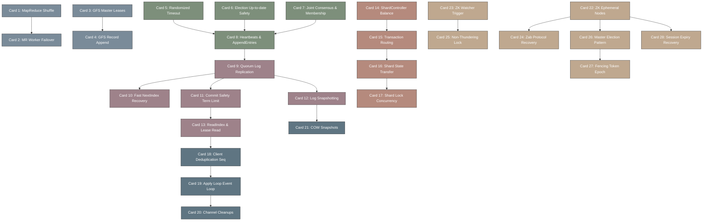

# mit_6.824-高密度卡片系统设计大图 (分布式系统工程)

本大图展示了 `MIT 6.824 / distributed-systems` 的 28 张核心卡片的物理依赖与控制流走向，并对应了核心共识算法、哈希分片、去重与分布式锁的数理推导模型。

## 1. 卡片依赖拓扑 (Mermaid Diagram)

---

## 2. 核心算法与物理公式映射

*   **Raft 选举安全定理（Election Safety）之日志新旧对比规则**：
    *   在 RequestVote RPC 中，Follower 判断 Candidate 的日志是否至少与自己一样新：
        *   若 Candidate 的最后一条日志的 Term 较大，则为真。
        *   若 Term 相同，且 Candidate 的最后一条日志的 Index 较大或相等，则为真。
        *   数学表达式：
            $$\text{GrantVote} = (T_{\text{last,c}} > T_{\text{last,f}}) \lor \left((T_{\text{last,c}} == T_{\text{last,f}}) \land (I_{\text{last,c}} \ge I_{\text{last,f}})\right)$$

*   **Raft 日志快速回溯（Fast Recovery）之冲突索引跳过**：
    *   当 Follower 拒绝 Leader 的日志对齐请求时，回传三个关键字段：
        *   `ConflictTerm`：冲突位置 Follower 的任期号。
        *   `ConflictFirstIndex`：Follower 中拥有 `ConflictTerm` 的第一条日志的索引。
        *   `ConflictLen`：Follower 的日志总长度（当 Leader 发送的日志越界时）。
    *   Leader 处理逻辑：
        *   若 Leader 的日志中没有任期为 `ConflictTerm` 的日志，则直接设置 `nextIndex = ConflictFirstIndex`。
        *   若 Leader 有该任期的日志，则设置 `nextIndex` 为 Leader 中该任期日志的最后一条的下一索引。

*   **幂等客户端序列号去重与线性化读校验**：
    *   在状态机层面，对每个客户端请求缓存最后一次的返回状态：
        $$\text{State}_{\text{apply}}(C_i, S_k) = \begin{cases} \text{ApplyAndCache}(\text{Request}), & \text{if } S_k > \text{CachedSeq}(C_i) \\ \text{ReturnCachedResponse}(C_i), & \text{if } S_k == \text{CachedSeq}(C_i) \\ \text{DropRequest}, & \text{if } S_k < \text{CachedSeq}(C_i) \end{cases}$$
