# CockroachDB / Spanner 高密度卡片系统设计大图

## 1. 28张卡片依赖拓扑关系图

```mermaid
graph TD
    %% M1: SQL Execution & DistSQL
    Card1["Card 1: SQL Gateway 两阶段分发"] --> Card2["Card 2: DistSQL Flow 拓扑流式处理"]
    Card1 --> Card3["Card 3: 分布式 Scan 与 KV 编码"]
    Card3 --> Card4["Card 4: CBO 优化器路径选择"]
    Card2 --> Card4

    %% M2: Range Splits & Multi-Raft
    Card5["Card 5: Range 动态分片分裂合并"] --> Card6["Card 6: Multi-Raft 心跳合并"]
    Card5 --> Card7["Card 7: Leaseholder 副本租约读写"]
    Card7 --> Card8["Card 8: Allocator 副本重平衡"]
    Card6 --> Card8

    %% M3: Transactions & 2PC
    Card9["Card 9: 2PC 事务记录 Transaction Record"] --> Card10["Card 10: Write Intent 写意图锁"]
    Card9 --> Card11["Card 11: 单阶段提交 1PC 优化"]
    Card10 --> Card12["Card 12: Intent Cleanup 异步清理"]
    Card10 --> Card13["Card 13: 事务优先级与冲突重试"]
    Card12 --> Card13

    %% M4: HLC & TrueTime
    Card14["Card 14: HLC 物理逻辑复合时钟"] --> Card15["Card 15: 时钟偏移不确定区间重试"]
    Card14 --> Card16["Card 16: HLC Tick/Update 推进协议"]
    Card15 --> Card17["Card 17: Follower Reads 历史读"]
    Card16 --> Card17

    %% M5: MVCC & SI
    Card18["Card 18: MVCC 物理存储与 Key 编码"] --> Card19["Card 19: SI 读屏障快照读取"]
    Card18 --> Card20["Card 20: SSI 串行化与冲突依赖环检测"]
    Card19 --> Card21["Card 21: MVCC 历史版本 GC 与 Compaction"]
    Card20 --> Card21

    %% M6: Topology & Rebalance
    Card22["Card 22: Gossip 集群成员自动发现"] --> Card23["Card 23: Locality 容灾放置策略"]
    Card22 --> Card24["Card 24: 副本数在线调整与平滑迁移"]
    Card25["Card 25: 非阻塞 Schema 结构升级"] --> Card26["Card 26: 慢节点隔离与 Lease 漂移"]
    Card23 --> Card27["Card 27: Hotspot 热点分裂调度"]
    Card26 --> Card27
    Card28["Card 28: 时钟偏差宕机熔断防护"] --> Card26
```

---

## 2. CockroachDB 物理源码位置映射锚点

为确保技术速查的精确性，以下是 28 张核心卡片对应在 CockroachDB 官方开源仓库中的核心源码文件及函数位置：

*   **SQL 解析与逻辑执行 (M1)**:
    *   Gateway SQL 解析与解析器：`pkg/sql/parser/parse.go` -> `Parse()`
    *   DistSQL 计划分发与 Flow 拓扑构建：`pkg/sql/distsqlrun/flow.go` -> `Flow` 结构体
    *   KV 编解码及 Scan 算子映射：`pkg/sql/row/kv_coder.go` & `pkg/sql/row/row_source.go`
    *   CBO 优化器路径与统计信息维护：`pkg/sql/opt/optbuilder/opt_builder.go`
*   **Range 分片与 Multi-Raft 共识 (M2)**:
    *   Range Splits 动态分裂机制：`pkg/kv/kvserver/replica_command.go` -> `executeSplit()`
    *   Multi-Raft 心跳合并与队列优化：`pkg/kv/kvserver/coalesced_heartbeats.go` -> `CoalescedHeartbeats`
    *   Leaseholder 副本租约授予与本地读：`pkg/kv/kvserver/leaseholder.go` -> `Replica.getLease()`
    *   Allocator 副本重平衡与 Joint Consensus：`pkg/kv/kvserver/allocator/allocator.go`
*   **分布式事务与 2PC 提交控制 (M3)**:
    *   Transaction Record 事务记录更新：`pkg/kv/kvserver/txn_coord_sender.go` -> `TxnCoordSender`
    *   Write Intent 写意图临时锁机制：`pkg/storage/enginepb/mvcc.proto` -> `MVCCMetadata` (Intent 指针)
    *   1PC 单阶段提交事务快捷路径：`pkg/kv/kvserver/replica_transaction.go` -> `try1PC()`
    *   Intent Cleanup 异步清理与锁解除：`pkg/kv/kvserver/intent_resolver.go` -> `IntentResolver.ResolveIntents()`
    *   事务冲突重试与 PushTransaction：`pkg/kv/kvserver/concurrency/concurrency_manager.go`
*   **HLC 混合逻辑时钟与快照一致性 (M4)**:
    *   HLC 物理与逻辑计数器公式实现：`pkg/util/hlc/hlc.go` -> `Clock.Now()`, `Clock.Update()`
    *   时钟不确定性区间 Read Restart 错误捕获：`pkg/kv/kvclient/kvcoord/dist_sender.go` -> `ReadUncertaintyLimit`
    *   Follower Reads 历史时间戳一致性校验：`pkg/kv/kvserver/replica_read.go` -> `Replica.readOnlyCmd()`
*   **MVCC 多版本存储与串行化隔离 (M5)**:
    *   MVCC Pebble 存储引擎 Key/Timestamp 编解码：`pkg/storage/mvcc.go` -> `MVCCGet()`, `MVCCPut()`
    *   Read Timestamp Cache 读时间戳缓存：`pkg/kv/kvserver/read_timestamp_cache.go` -> `ReadTimestampCache`
    *   SSI 快照隔离防写偏斜冲突重启：`pkg/kv/kvserver/concurrency/lock_table.go`
    *   MVCC GC 与 RocksDB/Pebble Compaction：`pkg/kv/kvserver/gc_queue.go`
*   **拓扑管理与集群维护 (M6)**:
    *   Gossip 拓扑发现状态广播：`pkg/gossip/gossip.go`
    *   Locality 容灾放置配置：`pkg/config/zone_config.go`
    *   非阻塞 Schema 变更三阶段演进：`pkg/sql/schemachanger/schemachanger.go`
    *   时钟同步偏差 Panic 熔断自我隔离：`pkg/util/metric/clock_offset.go`
