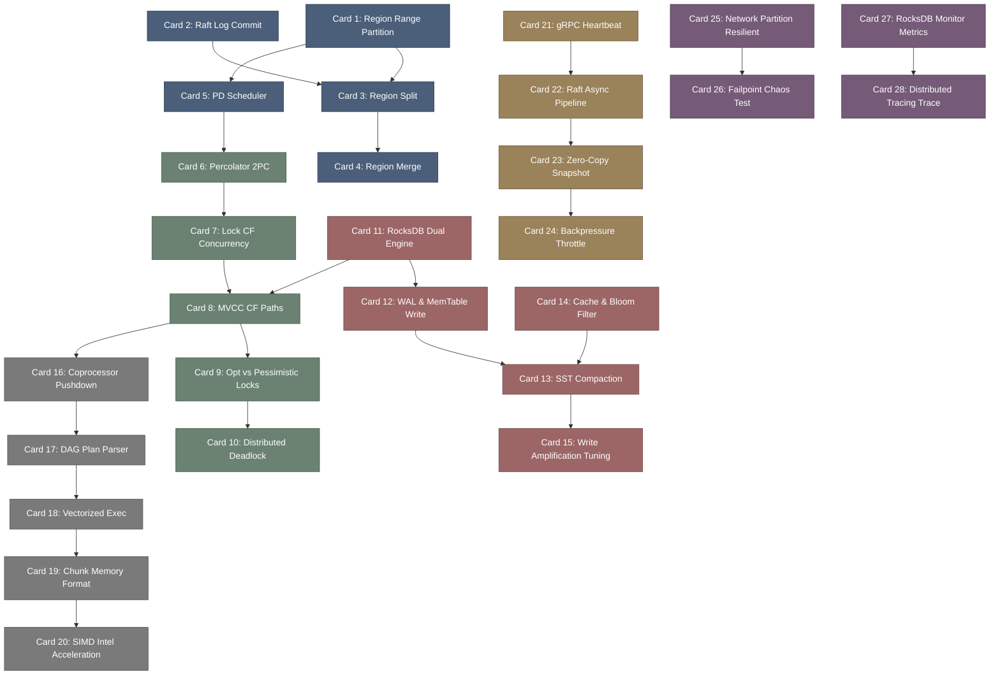

# tikv-高密度卡片系统设计大图.md

本文件定义了 **tikv (CNCF 毕业级分布式事务 Key-Value 数据库)** 28张核心知识卡片之间的依赖拓扑结构，以及物理代码映射锚点。

---

## 🗺️ 28 张卡片依赖拓扑图 (Mermaid)

---

## 📍 TiKV 物理源码位置映射

本设计大图的知识节点与 TiKV 核心类库及 Crate 物理源码强关联：
1. **Multi-Raft Core**: `components/raftstore/` 目录下的 `src/store/` 包含 Raft 状态机核心。
2. **Percolator & MVCC**: `src/storage/` 目录下的 `txn/` 和 `mvcc/` 分层。
3. **RocksDB Integration**: `components/engine_rocks/` 内部封装了 RocksDB 双引擎访问逻辑。
4. **Coprocessor Pushdown**: `components/coprocessor/` 包含向量化算子、DAG 结构解析。
