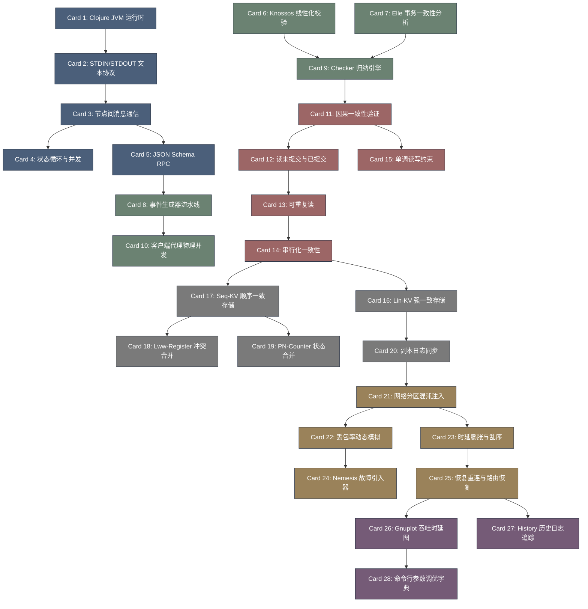

# maelstrom-高密度卡片系统设计大图

## 1. 卡片依赖拓扑图 (Mermaid)

## 2. 源码符号映射
- `maelstrom.core` (Card 1, 2) - Clojure 主入口，标准输入输出解析器。
- `maelstrom.node` (Card 3, 4) - 节点间通信状态机，消息缓冲队列。
- `jepsen.checker` (Card 9, 11) - 一致性校验接口及 Elle 核心分析模块。
- `knossos.linear` (Card 6, 14) - Knossos WGL 算法进行线性化校验。
- `maelstrom.db` (Card 16, 17) - Lin-KV 与 Seq-KV 物理抽象桥接。
- `maelstrom.nemesis` (Card 21, 24) - 故障注入管理器（分区、丢包）。
