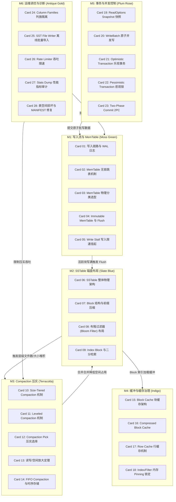

# 《facebook / rocksdb》高密度卡片系统设计大图

本设计大图为《facebook / rocksdb》的 LSM-Tree 存储引擎高密度拆解卡片设计指南。我们将 28 张核心速查卡片划分为六大核心模块，每个模块采用低饱和度的莫兰迪（Morandi）色彩进行视觉归类，并设计了其拓扑交互图与物理源码锚点。

---

## 🎨 莫兰迪存储引擎视觉配色方案 (Morandi Color System)

为保证排版的高级感与学术硬核感，采用低饱和度、高质感的莫兰迪色彩体系：

| 模块编码 | 模块名称 | 莫兰迪色系 | 浅色底色 (Light Mode) | 深色边框 / 文字 (Dark Mode) | 对应设计领域 |
| :--- | :--- | :--- | :--- | :--- | :--- |
| **M1** | 写入流与 MemTable | 苔绿 (Moss Green) | `#F2F4F0` / `#D5DDD1` | `#5F6C5B` / `#3A4438` | WAL 日志、无锁跳表、Flush 刷盘与写入挂起 |
| **M2** | SSTable 磁盘布局 | 石板蓝 (Slate Blue) | `#F0F3F5` / `#D2DBE0` | `#4E5D6C` / `#2F3C47` | Data Block、重启点、布隆过滤器与索引结构 |
| **M3** | Compaction 压实机制 | 陶土红 (Terracotta) | `#F5F1EF` / `#E0D3CD` | `#793C2C` / `#522114` | Size-Tiered/Leveled/FIFO 算法与三大放大折中 |
| **M4** | 缓冲与缓存治理 | 靛青 (Indigo) | `#F0F2F5` / `#D1D8E0` | `#3E4C5B` / `#232F3C` | Block Cache、分片锁设计、行缓存与物理 Pinning |
| **M5** | 事务与并发控制 | 梅玫瑰 (Plum Rose) | `#F5F0F2` / `#E0D2D7` | `#6F525A` / `#4A353A` | MVCC 快照、WriteBatch 原子提写、乐观与悲观锁 |
| **M6** | 运维调优与诊断 | 古董金 (Antique Gold) | `#F6F4EE` / `#E3DEC8` | `#8C7344` / `#5C4A28` | 列族隔离、磁盘吞吐限速、日志审计与崩溃恢复 |

---

## 🗺️ 28张高密速查卡片大图拓扑 (Card Topology)

---

## ⚡ 物理代码与结构规范源头锚点 (Physical Source Anchors)

本设计大图与 RocksDB 开源项目的物理源码结构映射如下：
1. **MemTable 并发跳表实现**：映射 `db/memtable.cc` 与 `db/skiplist.h`，关注基于 Compare-And-Swap (CAS) 构建的 lock-free 并发写入，以及 `Arena` 物理分配的行级空间连续性。
2. **SSTable Block 物理分块与重启点**：映射 `table/block_based/block_builder.cc` 与 `table/block_based/block.cc`，关注前缀压缩如何依靠 `restart_offset` 重启点数组进行二分折半定位。
3. **Leveled Compaction 层级压实策略**：映射 `db/compaction/compaction_picker_level.cc`，重点分析 `CompactionScore` 层级评分模型计算逻辑，以及 L0 文件数如何作为强制减速阈值。
4. **Sharded LRU Cache 锁分离设计**：映射 `util/lru_cache.cc`，关注分片哈希环（默认 16 片）如何拆分底层互斥锁 `port::Mutex` 以消除高频并发读缓存时的自旋开销。
5. **WriteBatch 并发合并提写原理**：映射 `db/db_impl/db_impl_write.cc` 中的 `WriteThread` 实现，深入剖析 Leader 线程代表同一批队列中的所有 Follower 统一写入 WAL，随之 Follower 并发写入各自 MemTable 的并轨控制模型。
6. **MANIFEST 版本变更日志**：映射 `db/version_set.cc`，关注每次 SSTable 增减如何产生 `VersionEdit` 并记录在 `MANIFEST` 中，以及 MANIFEST 文件损坏下的数据恢复路径。
