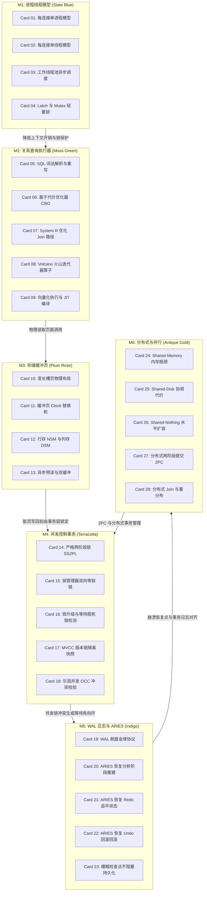

# 《architecture-of-a-database-system》高密度卡片系统设计大图

本设计大图为《architecture-of-a-database-system》（The Red Book）的关系型数据库核心架构与系统设计高密度拆解卡片设计指南。我们将 28 张核心速查卡片划分为六大核心模块，每个模块采用低饱和度的莫兰迪（Morandi）色彩进行视觉归类，并设计了其拓扑交互图与物理源头锚点。

---

## 🎨 莫兰迪内核诊断视觉配色方案 (Morandi Color System)

为保证排版的高级感与学术硬核感，采用低饱和度、高质感的莫兰迪色彩体系：

| 模块编码 | 模块名称 | 莫兰迪色系 | 浅色底色 (Light Mode) | 深色边框 / 文字 (Dark Mode) | 对应设计领域 |
| :--- | :--- | :--- | :--- | :--- | :--- |
| **M1** | 进程与线程模型 | 石板蓝 (Slate Blue) | `#F0F3F5` / `#D2DBE0` | `#4E5D6C` / `#2F3C47` | 多进程共享内存、单线程多路复用连接池、工作线程保护轻量锁 Latch |
| **M2** | 关系查询处理器 | 苔绿 (Moss Green) | `#F2F4F0` / `#D5DDD1` | `#5F6C5B` / `#3A4438` | SQL 语法解析树、CBO 代价搜索树、Volcano 迭代算子、向量化 SIMD 汇编 |
| **M3** | 存储管理器与缓冲 | 梅玫瑰 (Plum Rose) | `#F5F0F2` / `#E0D2D7` | `#6F525A` / `#4A353A` | 槽页行偏移排布、Clock 指针循环淘汰、列存与行存 I/O、缓冲异步预读 |
| **M4** | 事务与并发控制 | 陶土红 (Terracotta) | `#F5F1EF` / `#E0D3CD` | `#793C2C` / `#522114` | SS2PL 排他提交锁、锁管理器双向链表、有向等待图死锁、MVCC 快照读 |
| **M5** | 预写日志与恢复 | 靛青 (Indigo) | `#F0F2F5` / `#D1D8E0` | `#3E4C5B` / `#232F3C` | WAL 原子刷盘限制、ARIES 三阶段崩溃恢复、增量模糊检查点落盘 |
| **M6** | 并行与分布式 | 古董金 (Antique Gold) | `#F6F4EE` / `#E3DEC8` | `#8C7344` / `#5C4A28` | Shared-Nothing 物理拓扑、两阶段提交协议 2PC、分布式 Join 重分布 |

---

## 🗺️ 28张高密速查卡片大图拓扑 (Card Topology)

---

## ⚡ 物理代码与规范源头锚点 (Physical Source Anchors)

本设计大图与主流工业级开源数据库项目的物理代码路径映射如下：
1. **SS2PL 与锁管理器结构**：映射 PostgreSQL 的 `src/backend/storage/lmgr/lock.c` 与 MySQL InnoDB 的 `storage/innobase/lock/lock0lock.cc`，重点阅读 `LockMethod` 结构定义、哈希表等锁冲突判定及锁升级逻辑。
2. **ARIES 崩溃恢复三阶段**：映射 PostgreSQL 的 `src/backend/access/transam/xlog.c` 与 MySQL InnoDB 的 `storage/innobase/log/log0recv.cc`。跟踪 redo 重做扫描，从 LSN 开始恢复状态，以及利用 Undo Log 回滚未提交事务的逻辑。
3. **Volcano 火山迭代模型**：映射 PostgreSQL 的 `src/backend/executor/execMain.c` 及各个物理算子 `nodeSeqscan.c`、`nodeNestloop.c` 中的 `ExecProcNode` 指针调用。
4. **缓冲池 Clock 页面替换**：映射 PostgreSQL 的 `src/backend/storage/buffer/freelist.c`，关注时钟扫描（Clock Sweep）中 `usage_count` 使用位的循环自减判定算法。
5. **CBO 查询优化动态规划**：映射 PostgreSQL 的 `src/backend/optimizer/path/joinpath.c` 中的 `make_one_rel_by_joins` 函数，深入学习 System R 动态规划搜索最优多表 Join 路径的剪枝边界。
