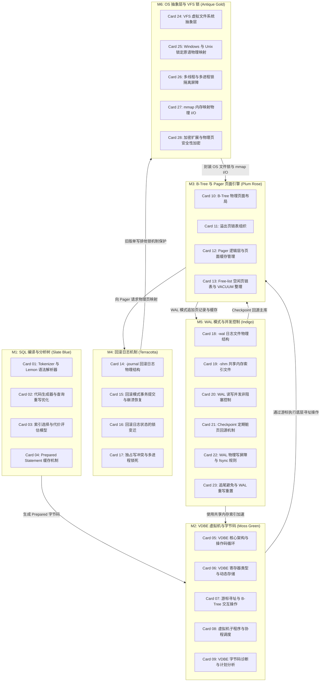

# 《sqlite-internals》高密度卡片系统设计大图

本设计大图为《sqlite-internals》（SQLite 存储引擎内核实现）的嵌入式数据库核心架构与系统设计高密度拆解卡片设计指南。我们将 28 张核心速查卡片划分为六大核心模块，每个模块采用低饱和度的莫兰迪（Morandi）色彩进行视觉归类，并设计了其拓扑交互图与物理源头锚点。

---

## 🎨 莫兰迪内核诊断视觉配色方案 (Morandi Color System)

为保证排版的高级感与学术硬核感，采用低饱和度、高质感的莫兰迪色彩体系：

| 模块编码 | 模块名称 | 莫兰迪色系 | 浅色底色 (Light Mode) | 深色边框 / 文字 (Dark Mode) | 对应设计领域 |
| :--- | :--- | :--- | :--- | :--- | :--- |
| **M1** | SQL 编译与分析树 | 石板蓝 (Slate Blue) | `#F0F3F5` / `#D2DBE0` | `#4E5D6C` / `#2F3C47` | Lemon 词法语法解析、查询打平与重写、Prepared 语句缓存复用 |
| **M2** | VDBE 虚拟机与字节码 | 苔绿 (Moss Green) | `#F2F4F0` / `#D5DDD1` | `#5F6C5B` / `#3A4438` | VDBE 寄存器虚拟机、巨型解释循环、游标寻址、Explain 执行计划分析 |
| **M3** | B-Tree 与 Pager 页面引擎 | 梅玫瑰 (Plum Rose) | `#F5F0F2` / `#E0D2D7` | `#6F525A` / `#4A353A` | 叶子与内部节点结构、变长单元槽页布局、PCache 页面缓存、真空整理 |
| **M4** | 回滚日志机制 | 陶土红 (Terracotta) | `#F5F1EF` / `#E0D3CD` | `#793C2C` / `#522114` | Rollback Journal 结构、SHARED $\rightarrow$ EXCLUSIVE 锁升级、崩坏事务回滚恢复 |
| **M5** | WAL 模式与并发控制 | 靛青 (Indigo) | `#F0F2F5` / `#D1D8E0` | `#3E4C5B` / `#232F3C` | WAL 日志格式、`-shm` 共享内存哈希索引、读写非阻塞并发、脏页回源 |
| **M6** | OS 抽象层与 VFS 锁 | 古董金 (Antique Gold) | `#F6F4EE` / `#E3DEC8` | `#8C7344` / `#5C4A28` | VFS 操作系统抽象、POSIX/Win32 文件锁映射、mmap 零拷贝、页面加密 SEE |

---

## 🗺️ 28张高密速查卡片大图拓扑 (Card Topology)

---

## ⚡ 物理代码与规范源头锚点 (Physical Source Anchors)

本设计大图与 SQLite 官方源码仓库的物理代码路径映射如下：
1. **Lemon 语法解析与编译**：映射 `src/tokenize.c` 和 `src/parse.y`。Lemon 解析器不包含全局变量，保证了线程安全性；生成的语法分析树在 `src/select.c` 中进行重写拍平优化（Query Flattening）。
2. **VDBE 字节码分发解释循环**：映射 `src/vdbe.c` 中的 `sqlite3VdbeExec` 函数。内部由一个数万行的巨大 switch-case 分发器组成，利用 `Opcode` 对寄存器及内存进行指针计算与游标控制。
3. **B-Tree 页面分裂与变长单元布局**：映射 `src/btree.c` 和 `src/btreeInt.h` 中的 `MemPage` / `CellInfo` 结构体。观察溢出页在 payload 超过页容量时的分配逻辑 `sqlite3BtreeInsert`。
4. **Pager 缓存分配与 Rollback Journal**：映射 `src/pager.c`。跟踪 Pager 状态转换（SHARED $\rightarrow$ RESERVED $\rightarrow$ EXCLUSIVE）以及日志物理写入、回滚恢复逻辑。
5. **WAL 日志记录与共享内存哈希索引**：映射 `src/wal.c`。关注共享内存映射 `walIndexPage` 以及基于哈希的 WAL 快速页号定位，以及脏页 Checkpoint 回写逻辑。
6. **VFS 物理锁定与 OS API 转化**：映射 `src/os_unix.c` (利用 POSIX `fcntl` 字节范围锁映射 SHARED/PENDING/EXCLUSIVE 锁状态) 与 `src/os_win.c` (使用 Windows API `LockFileEx` 实现同等锁机制)。
