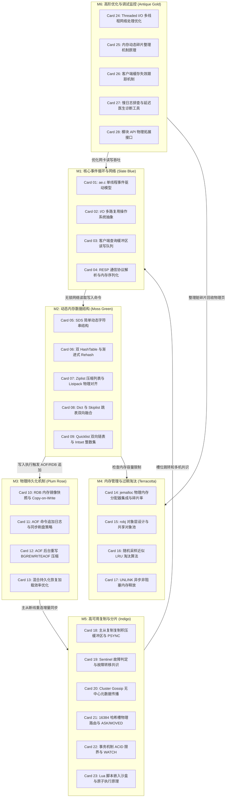

# 《redis-internals》高密度卡片系统设计大图

本设计大图为《redis-internals》（Redis 存储内核与高并发内幕）的内存型 Key-Value 数据库内核实现与系统设计高密度拆解卡片设计指南。我们将 28 张核心速查卡片划分为六大核心模块，每个模块采用低饱和度的莫兰迪（Morandi）色彩进行视觉归类，并设计了其拓扑交互图与物理源头锚点。

---

## 🎨 莫兰迪内核诊断视觉配色方案 (Morandi Color System)

为保证排版的高级感与学术硬核感，采用低饱和度、高质感的莫兰迪色彩体系：

| 模块编码 | 模块名称 | 莫兰迪色系 | 浅色底色 (Light Mode) | 深色边框 / 文字 (Dark Mode) | 对应设计领域 |
| :--- | :--- | :--- | :--- | :--- | :--- |
| **M1** | 核心事件循环与网络 | 石板蓝 (Slate Blue) | `#F0F3F5` / `#D2DBE0` | `#4E5D6C` / `#2F3C47` | ae.c 事件轮询、epoll 驱动包装、RESP 协议状态机、Socket 读写 |
| **M2** | 动态内存数据结构 | 苔绿 (Moss Green) | `#F2F4F0` / `#D5DDD1` | `#5F6C5B` / `#3A4438` | SDS 二进制串、双 HashTable dict 渐进 rehash、Ziplist/Listpack 连续对齐、跳表 zset |
| **M3** | 物理持久化机制 | 梅玫瑰 (Plum Rose) | `#F5F0F2` / `#E0D2D7` | `#6F525A` / `#4A353A` | fork() 子进程 COW 内存快照、AOF 追加重写 BGREWRITEAOF、同步 fsync、混合加载 |
| **M4** | 内存管理与过期淘汰 | 陶土红 (Terracotta) | `#F5F1EF` / `#E0D3CD` | `#793C2C` / `#522114` | jemalloc 内存申请与回收、robj 引用计数、近似 LRU 随机抽样淘汰、UNLINK 异步线程 |
| **M5** | 高可用复制与分片 | 靛青 (Indigo) | `#F0F2F5` / `#D1D8E0` | `#3E4C5B` / `#232F3C` | replication 复制缓冲区 backlog、Sentinel 哨兵 Failover 共识、Cluster gossip 16384 槽路由 |
| **M6** | 高阶优化与调试监控 | 古董金 (Antique Gold) | `#F6F4EE` / `#E3DEC8` | `#8C7344` / `#5C4A28` | Threaded I/O 多线程网卡卸载、Active Defrag 碎片原地整理、Invalidate 客户端二级缓存、慢日志 |

---

## 🗺️ 28张高密速查卡片大图拓扑 (Card Topology)

---

## ⚡ 物理代码与规范源头锚点 (Physical Source Anchors)

本设计大图与 Redis 官方源码仓库的物理代码路径映射如下：
1. **ae.c 单线程多路复用驱动**：映射 `src/ae.c` 核心驱动循环。`aeCreateEventLoop` 创建事件轮询；文件 `src/ae_epoll.c`、`src/ae_select.c`、`src/ae_kqueue.c` 分别根据 OS 条件编译提供非阻塞 I/O 硬件支撑。
2. **渐进式 Rehash 物理实现**：映射 `src/dict.c` 中的 `dictRehash` 函数。该函数每次只将指定数量（通常是 1 步）的 bucket 链表节点从 `ht[0]` 搬移到 `ht[1]`，在 `dictFind` 或 `dictAdd` 中被单步调用（`_dictRehashStep`），实现超低开销平摊。
3. **Copy-On-Write 写时复制快照**：映射 `src/rdb.c` 中的 `rdbSaveBackground`。调用标准 OS `fork()`，子进程独立持有一致的页表副本进行只读落盘，而主进程只在写入时引起 OS 缺页中断触发页表页面的物理分离拷贝。
4. **随机抽样近似 LRU 淘汰**：映射 `src/evict.c` 中的 `performEvict`。避免维护全局大双向链表导致的锁代价，随机抽取 `maxmemory-samples`（默认 5）个键，计算其空闲时间并逐出空闲时间最大的键。
5. **主从复制积压缓冲区 backlog**：映射 `src/replication.c`。跟踪主节点持有的环形 FIFO 回滚积压缓冲区 `backlog` 结构，在从节点发送 `PSYNC <runid> <offset>` 时，判断 offset 是否在环内以决定增量（Partial Sync）还是全量同步。
6. **Threaded I/O 细粒度并行网络**：映射 `src/networking.c` 中的 `handleClientsWithPendingReadsUsingThreads` 和 `handleClientsWithPendingWritesUsingThreads`。 offload socket 解析与写回，逻辑计算部分继续返回主线程单线程闭环。
