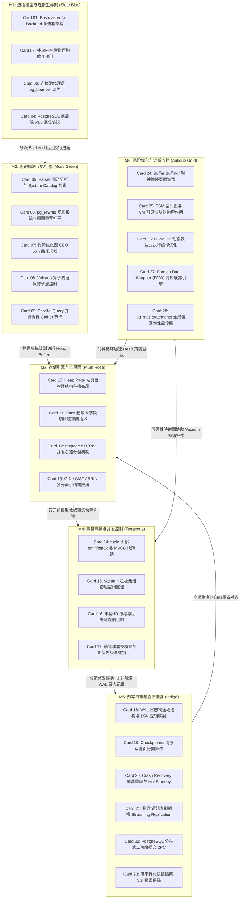

# 《postgres-internals》高密度卡片系统设计大图

本设计大图为《postgres-internals》（PostgreSQL 存储内核与事务隔离内幕）的学院派关系型数据库内核实现与系统设计高密度拆解卡片设计指南。我们将 28 张核心速查卡片划分为六大核心模块，每个模块采用低饱和度的莫兰迪（Morandi）色彩进行视觉归类，并设计了其拓扑交互图与物理源头锚点。

---

## 🎨 莫兰迪内核诊断视觉配色方案 (Morandi Color System)

为保证排版的高级感与学术硬核感，采用低饱和度、高质感的莫兰迪色彩体系：

| 模块编码 | 模块名称 | 莫兰迪色系 | 浅色底色 (Light Mode) | 深色边框 / 文字 (Dark Mode) | 对应设计领域 |
| :--- | :--- | :--- | :--- | :--- | :--- |
| **M1** | 进程模型与连接生命期 | 石板蓝 (Slate Blue) | `#F0F3F5` / `#D2DBE0` | `#4E5D6C` / `#2F3C47` | Postmaster 管理、Backend 进程创建、共享内存区、pg_bouncer 连接池 |
| **M2** | 查询规划与执行器 | 苔绿 (Moss Green) | `#F2F4F0` / `#D5DDD1` | `#5F6C5B` / `#3A4438` | Parser/Rewrite 规则重写、CBO 最优 Scan/Join 路径生成、Volcano 迭代树、并行计算 |
| **M3** | 存储引擎与堆页面 | 梅玫瑰 (Plum Rose) | `#F5F0F2` / `#E0D2D7` | `#6F525A` / `#4A353A` | Heap Page 双向行指针偏移、TOAST 切片附属存储、nbtpage.c B-Tree 并发写链分裂、GIN/GiST |
| **M4** | 事务隔离与并发控制 | 陶土红 (Terracotta) | `#F5F1EF` / `#E0D3CD` | `#793C2C` / `#522114` | tuple 头部 xmin/xmax 版本链可见性、Auto-vacuum 物理回收、XID 冻结 Freeze、锁等待死锁 |
| **M5** | 预写日志与崩溃恢复 | 靛青 (Indigo) | `#F0F2F5` / `#D1D8E0` | `#3E4C5B` / `#232F3C` | WAL 预写日志段、Checkpointer 背景平滑刷脏、Standby 物理/逻辑复制插槽、分布式 2PC |
| **M6** | 高阶优化与诊断监控 | 古董金 (Antique Gold) | `#F6F4EE` / `#E3DEC8` | `#8C7344` / `#5C4A28` | Shared Buffers 时钟扫描、VM/FSM 图可见性、LLVM JIT 动态表达式编译、pg_stats |

---

## 🗺️ 28张高密速查卡片大图拓扑 (Card Topology)

---

## ⚡ 物理代码与规范源头锚点 (Physical Source Anchors)

本设计大图与 PostgreSQL 官方源码仓库的物理代码路径映射如下：
1. **多进程共享内存初始化**：映射 `src/backend/storage/ipc/ipci.c`。跟踪共享内存段的内存拓扑分配（`CreateSharedMemoryAndSemaphores`），以及 `ProcArray` 结构体的全局初始化。
2. **CBO 路径搜索与 System R 规划**：映射 `src/backend/optimizer/path/joinpath.c` 中的 `make_one_rel_by_joins` 函数。优化器递归计算 Scan 和 Join 的物理代价，并裁剪左深树路径。
3. **Heap Page 物理布局与行插入**：映射 `src/backend/storage/page/bufpage.c` 与 `src/backend/access/heap/heapam.c` 中的 `heap_insert`。解析 `PageHeaderData` 头部指针与 ItemId 数组地址移动。
4. **Auto-Vacuum 自动清理与 XID 冻结**：映射 `src/backend/postmaster/autovacuum.c` 和 `src/backend/commands/vacuum.c`。阅读垃圾元组扫描删除逻辑、Free Space Map (FSM) 更新、以及 `heap_prepare_freeze_tuple` 对 32 位 XID 回绕溢出前的强制 Freeze 操作。
5. **nbtpage.c 并发右指针裂变**：映射 `src/backend/access/nbtree/nbtpage.c` 中的 `_bt_split`。研究 B-Tree 节点分裂时如何先向右指针链加锁并记录 High Key，允许读进程在无父节点锁时继续通过右链接读取正确数据。
6. **SSI 串行化快照谓词锁判定**：映射 `src/backend/storage/lmgr/predicate.c`。跟踪 SIREAD 谓词锁哈希表，当并发读写出现 $T_1 \xrightarrow{rw} T_2 \xrightarrow{rw} T_3$ 因果环时，自动触发 transaction abort 机制。
