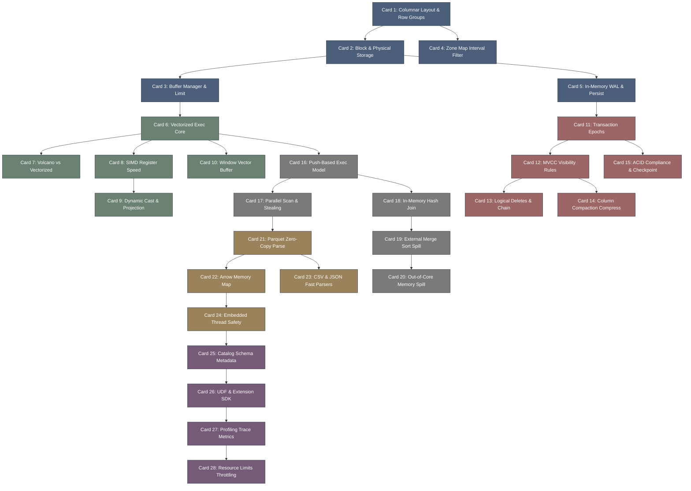

# duckdb-高密度卡片系统设计大图

## 1. 卡片依赖拓扑图 (Mermaid)

## 2. 源码符号映射
- `duckdb/common/vector.hpp` (Card 6, 9) - 内存向量的物理封装与批数据布局。
- `duckdb/storage/block_manager.cpp` (Card 2, 3) - 数据块的读写、物理分配和缓存回收。
- `duckdb/transaction/transaction_manager.cpp` (Card 11, 12) - Epoch 状态转换与 MVCC 读写过滤。
- `duckdb/execution/physical_operator.cpp` (Card 16, 17) - Push 架构物理执行算子与工作线程。
- `duckdb/main/catalog/catalog.cpp` (Card 25) - 数据库目录元数据管理器。
