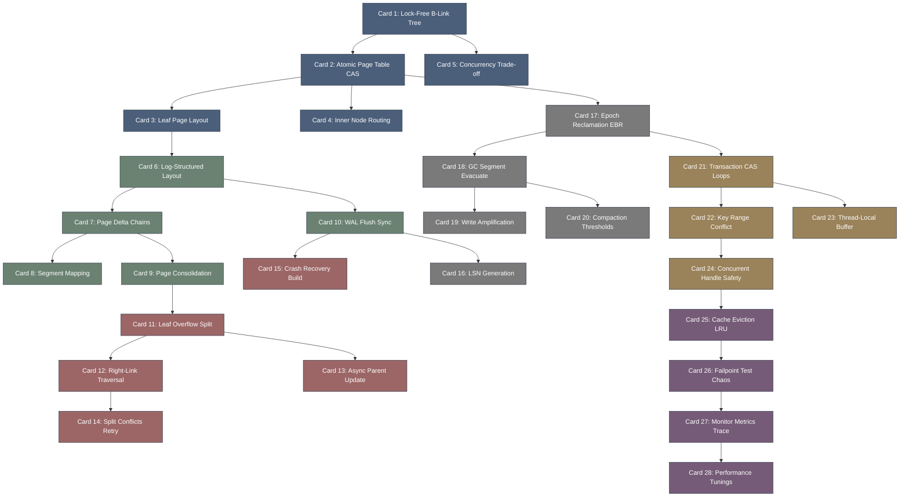

# sled-高密度卡片系统设计大图

## 1. 卡片依赖拓扑图 (Mermaid)

## 2. 源码符号映射
- `sled/src/pagecache/mod.rs` (Card 2, 7) - Page Cache 和内存 Delta 链的逻辑抽象。
- `sled/src/tree.rs` (Card 1, 11) - 无锁 B-Link 树的分裂、遍历和路由更新。
- `sled/src/pagecache/segment.rs` (Card 18) - 闪存段（Segment）GC 及页面移动整理。
- `sled/src/pagecache/log.rs` (Card 6, 10) - Append-Only 日志的物理追加与持久化。
