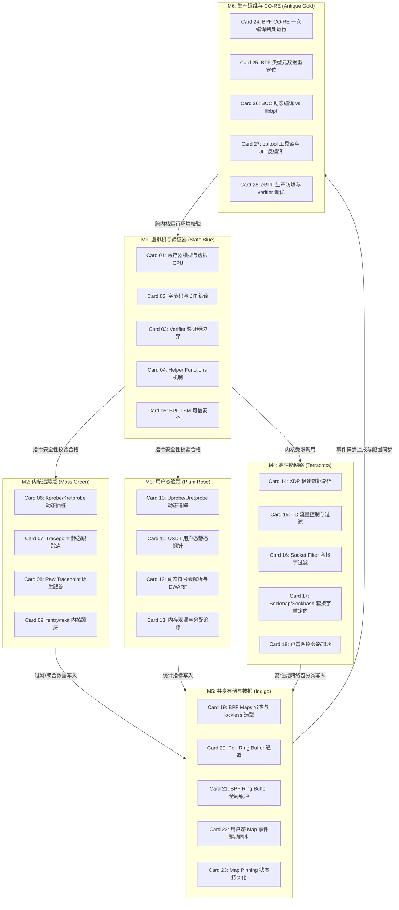

# 《iovisor / bcc (eBPF)》高密度卡片系统设计大图

本设计大图为《iovisor / bcc (eBPF)》的内核可编程与系统诊断高密度拆解卡片设计指南。我们将 28 张核心速查卡片划分为六大核心模块，每个模块采用低饱和度的莫兰迪（Morandi）色彩进行视觉归类，并设计了其拓扑交互图与物理源头锚点。

---

## 🎨 莫兰迪内核诊断视觉配色方案 (Morandi Color System)

为保证排版的高级感与学术硬核感，采用低饱和度、高质感的莫兰迪色彩体系：

| 模块编码 | 模块名称 | 莫兰迪色系 | 浅色底色 (Light Mode) | 深色边框 / 文字 (Dark Mode) | 对应设计领域 |
| :--- | :--- | :--- | :--- | :--- | :--- |
| **M1** | 安全沙盒与VM架构 | 石板蓝 (Slate Blue) | `#F0F3F5` / `#D2DBE0` | `#4E5D6C` / `#2F3C47` | eBPF 寄存器限制、字节码 JIT、Verifier 边界、LSM 挂钩 |
| **M2** | 内核插桩与追踪 | 苔绿 (Moss Green) | `#F2F4F0` / `#D5DDD1` | `#5F6C5B` / `#3A4438` | kprobes/kretprobes 动态插桩、Tracepoints 静态跟踪点 |
| **M3** | 用户态追踪与符号 | 梅玫瑰 (Plum Rose) | `#F5F0F2` / `#E0D2D7` | `#6F525A` / `#4A353A` | uprobes/uretprobes 动态插桩、USDT 静态探针、符号表解析 |
| **M4** | 高性能网络与旁路 | 陶土红 (Terracotta) | `#F5F1EF` / `#E0D3CD` | `#793C2C` / `#522114` | XDP 极速驱动层、TC 分类器、Sockmap 套接字重定向 |
| **M5** | 共享存储与数据流 | 靛青 (Indigo) | `#F0F2F5` / `#D1D8E0` | `#3E4C5B` / `#232F3C` | BPF Maps 分类选择、Perf/BPF Ring Buffer 事件流、Pinning |
| **M6** | 移植适配与防爆 | 古董金 (Antique Gold) | `#F6F4EE` / `#E3DEC8` | `#8C7344` / `#5C4A28` | BPF CO-RE 一次编译、BTF 元数据、bpftool 调试、生产防爆 |

---

## 🗺️ 28张高密速查卡片大图拓扑 (Card Topology)

---

## ⚡ 物理代码与规范源头锚点 (Physical Source Anchors)

本设计大图与 Linux 内核及 BCC 开源项目的物理映射如下：
1. **BPF 寄存器与 CPU 架构限制**：映射 Linux 内核 `include/uapi/linux/bpf.h`，关注 11 个寄存器的定义与 `BPF_MAXINSNS` (原 4096，现提升至 100 万指令) 限制。
2. **Verifier 验证器分支分析**：映射 Linux 内核 `kernel/bpf/verifier.c`，重点关注寄存器状态剪枝 (State Pruning)、`check_cfg()` 有向无环图深度优先搜索检查逻辑。
3. **Kprobes 底层蹦床实现**：映射 Linux 内核 `kernel/kprobes.c` 及 `kernel/bpf/trampoline.c`，关注由 `fentry/fexit` 引入的直接跳板 (Trampoline) 优化如何绕过 `int3` 中断陷阱。
4. **XDP 驱动收包链路**：映射 Linux 内核 `net/core/dev.c` 中 `do_xdp_generic` 与网卡驱动 `rx` 环中直接执行 `bpf_prog_run_xdp` 机制，对比 `XDP_DROP` 零拷贝丢包链路。
5. **BPF Ring Buffer 无锁设计**：映射 Linux 内核 `kernel/bpf/ringbuf.c`，关注基于内存映射 (mmap) 实现的全局环形缓冲区以及 `reserve`/`commit` 双阶段提交如何免除互斥锁。
6. **BPF CO-RE 编译重定位原理**：映射 libbpf 库中 `src/libbpf.c` 的 `bpf_object__relocate` 字段重定位逻辑，配合内核 `kernel/bpf/btf.c` 的 BPF Type Format 结构分析。
