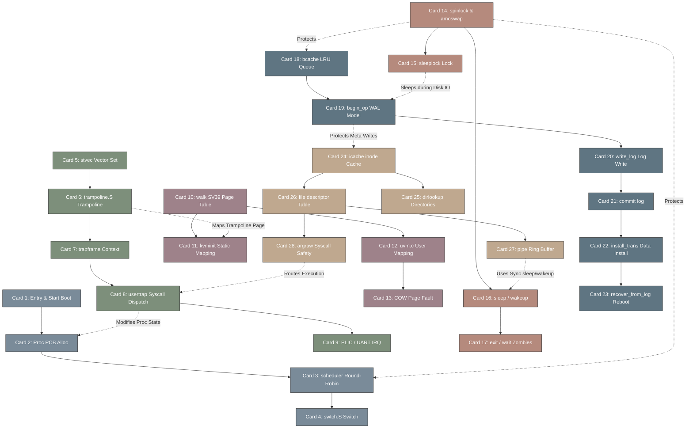

# xv6-riscv 高密度卡片系统设计大图

## 1. 28张卡片依赖拓扑关系图 (Mermaid)

---

## 2. xv6-riscv 源码文件物理路径与 L0~L2 锚点映射

| 卡片 ID | 卡片名称 | 源码对应物理路径 / 汇编位置 | 核心逻辑锚点 (Anchor API / Macro) |
| :--- | :--- | :--- | :--- |
| **Card 1** | Entry & Start Boot | `kernel/entry.S`, `kernel/start.c` | `_entry` ➜ `mstatus` ➜ `timerinit()` ➜ `main()` |
| **Card 2** | Proc PCB Alloc | `kernel/proc.h`, `kernel/proc.c` | `struct proc`, `allocproc()`, `struct context` |
| **Card 3** | scheduler Round-Robin | `kernel/proc.c` | `scheduler()`, `sched()`, `myproc()`, `yield()` |
| **Card 4** | swtch.S Switch | `kernel/swtch.S` | `swtch(struct context *old, struct context *new)` |
| **Card 5** | stvec Vector Set | `kernel/trap.c` | `w_stvec()`, `stvec`, `kernelvec()`, `uservec()` |
| **Card 6** | trampoline.S Trampoline | `kernel/trampoline.S` | `uservec` (U➜S), `userret` (S➜U), `satp` reload |
| **Card 7** | trapframe Context | `kernel/proc.h` | `struct trapframe`, `epc`, `sp`, `kernel_satp`, `kernel_sp` |
| **Card 8** | usertrap Syscall Dispatch | `kernel/trap.c`, `kernel/syscall.c` | `usertrap()`, `usertrapret()`, `syscall()`, `p->trapframe->a7` |
| **Card 9** | PLIC / UART IRQ | `kernel/plic.c`, `kernel/uart.c` | `plicinit()`, `plicinithart()`, `uartinit()`, `uartintr()` |
| **Card 10** | walk SV39 Page Table | `kernel/vm.c` | `walk(pagetable_t, uint64, int)`, `PTE_V`, `PTE_W`, `PTE_R` |
| **Card 11** | kvminit Static Mapping | `kernel/vm.c` | `kvminit()`, `kvmmap()`, `KERNBASE`, `PHYSTOP`, `UART0`, `PLIC` |
| **Card 12** | uvm.c User Mapping | `kernel/vm.c` | `uvmfirst()`, `uvmalloc()`, `uvmdealloc()`, `uvmcopy()` |
| **Card 13** | COW Page Fault | `kernel/trap.c` (优化) | `scause` == 15 (Store Page Fault), `ref_count` tracking |
| **Card 14** | spinlock & amoswap | `kernel/spinlock.h`, `kernel/spinlock.c` | `struct spinlock`, `acquire()`, `release()`, `__sync_lock_test_and_set` |
| **Card 15** | sleeplock Lock | `kernel/sleeplock.c` | `struct sleeplock`, `acquiresleep()`, `releasesleep()` |
| **Card 16** | sleep / wakeup | `kernel/proc.c` | `sleep(void *chan, struct spinlock *lk)`, `wakeup(void *chan)` |
| **Card 17** | exit / wait Zombies | `kernel/proc.c` | `exit(int)`, `wait(uint64)`, `reparent()`, `ZOMBIE` state |
| **Card 18** | bcache LRU Queue | `kernel/bio.c` | `struct buf`, `binit()`, `bget()`, `brelse()`, `bcache.head` |
| **Card 19** | begin_op WAL Model | `kernel/log.c` | `begin_op()`, `end_op()`, `log.outstanding`, `log.lh.n` |
| **Card 20** | write_log Log Write | `kernel/log.c` | `write_log()`, `log.lh.block[i]`, `log.lh.n`, `bwrite()` |
| **Card 21** | commit log | `kernel/log.c` | `commit()`, `write_head()`, `log.lh.n` metadata sync |
| **Card 22** | install_trans Data Install | `kernel/log.c` | `install_trans()`, copy log block to home block, `brelse()` |
| **Card 23** | recover_from_log Reboot | `kernel/log.c` | `initlog()`, `recover_from_log()`, replay transactions |
| **Card 24** | icache inode Cache | `kernel/fs.h`, `kernel/fs.c` | `struct inode`, `struct dinode`, `iget()`, `iput()`, `iupdate()` |
| **Card 25** | dirlookup Directories | `kernel/fs.c` | `dirlookup(struct inode*, char*, uint*)`, `dirlink()` |
| **Card 26** | file descriptor Table | `kernel/file.h`, `kernel/file.c` | `struct file`, `filealloc()`, `fileclose()`, `fileread()`, `filewrite()` |
| **Card 27** | pipe Ring Buffer | `kernel/pipe.c` | `struct pipe`, `pipealloc()`, `piperead()`, `pipewrite()`, `PIPESIZE` |
| **Card 28** | argraw Syscall Safety | `kernel/syscall.c` | `argraw()`, `argint()`, `argaddr()`, `argstr()`, boundary checks |
