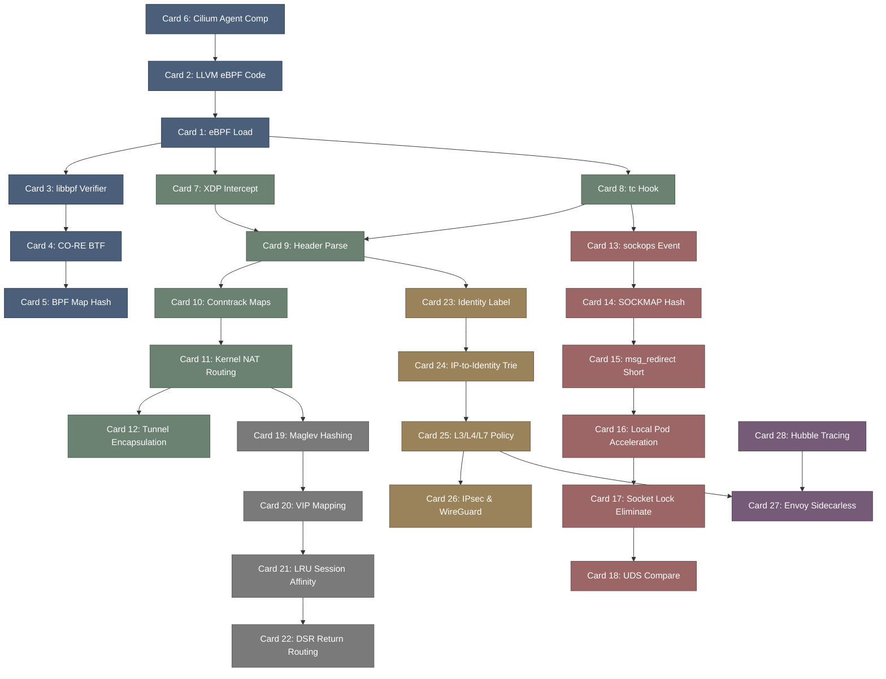

# cilium-高密度卡片系统设计大图.md

本文件定义了 **cilium (基于 eBPF 的高性能云原生网络与安全网关)** 28张核心知识卡片之间的依赖拓扑结构，以及物理代码映射锚点。

---

## 🗺️ 28 张卡片依赖拓扑图 (Mermaid)

---

## 📍 Cilium 物理源码位置映射

本设计大图的知识节点与 Cilium 核心类库及 Crate 物理源码强关联：
1. **Cilium Agent**: `daemon/` 目录下的核心守护进程。
2. **eBPF Datapath C Code**: `bpf/` 目录下的内核 eBPF 代码，包括 `bpf_lxc.c`（LXC 数据路径钩子）和 `bpf_xdp.c`。
3. **Maglev Load Balancer**: `pkg/loadbalancer/` 与 `bpf/lib/lb.h`。
4. **Identity Policy Manager**: `pkg/policy/` 和 `bpf/lib/policy.h`。
