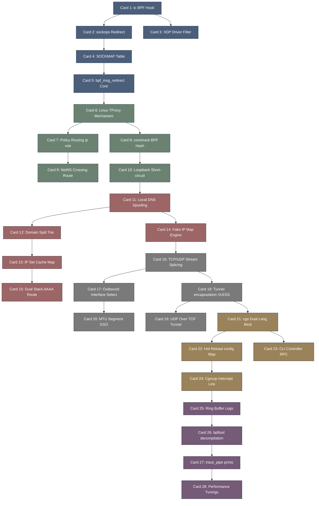

# dae-高密度卡片系统设计大图

## 1. 卡片依赖拓扑图 (Mermaid)

## 2. 源码符号映射
- `dae/pkg/ebpf/c/dae.c` (Card 1, 2, 5) - eBPF 内核 C 语言主逻辑，TC 过滤及 SOCKMAP 路由。
- `dae/pkg/ebpf/c/dns.h` (Card 11) - DNS 过滤、Fake IP 重写规则。
- `dae/pkg/tproxy/tproxy.go` (Card 6, 7) - TProxy 用户态透明套接字接收。
- `dae/pkg/proxy/tunnel.go` (Card 18, 19) - 代理隧道建立及网络包封装协议。
