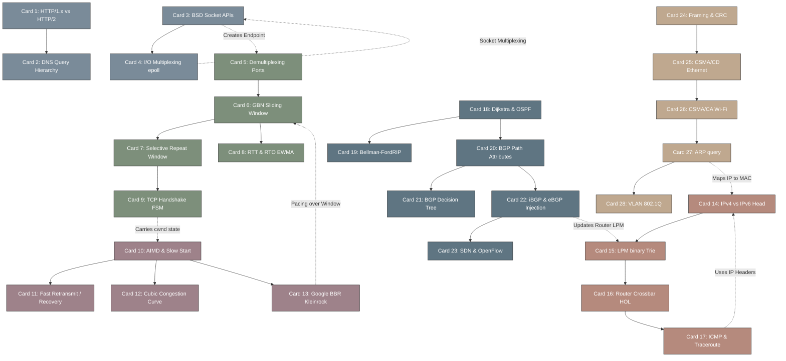

# top-down-networking 高密度卡片系统设计大图

## 1. 28张卡片依赖拓扑关系图 (Mermaid)

---

## 2. 计算机网络自顶向下核心概念与 Linux 内核/RFC 标准物理映射

| 卡片 ID | 卡片名称 | Linux 内核实现物理路径 | 核心规范与 RFC 标准锚点 |
| :--- | :--- | :--- | :--- |
| **Card 1** | HTTP/1.x vs HTTP/2 | N/A (User space, e.g. `nginx/src/http/v2`) | RFC 7540 (HTTP/2), RFC 9113 (HTTP/2 Updates) |
| **Card 2** | DNS Query Hierarchy | N/A (e.g. `systemd-resolved`, `bind9`) | RFC 1034, RFC 1035 (Domain Names) |
| **Card 3** | BSD Socket APIs | `net/socket.c`, `net/ipv4/af_inet.c` | POSIX.1g, BSD Sockets Standard |
| **Card 4** | epoll Multiplexing | `fs/eventpoll.c` | `epoll_create()`, `epoll_ctl()`, `epoll_wait()` |
| **Card 5** | Demultiplexing Ports | `net/ipv4/inet_hashtables.c` | `__inet_lookup_established()`, 4-tuple hashing |
| **Card 6** | GBN Sliding Window | `net/ipv4/tcp_input.c` | RFC 793 (TCP Standard), cumulative ACKs |
| **Card 7** | Selective Repeat | `net/ipv4/tcp_input.c` (SACK block logic) | RFC 2018 (TCP Selective Acknowledgment Options) |
| **Card 8** | RTT & RTO EWMA | `net/ipv4/tcp_input.c` | RFC 6298 (Computing TCP's Retransmission Timer) |
| **Card 9** | TCP Handshake FSM | `net/ipv4/tcp_input.c`, `net/ipv4/tcp_output.c` | RFC 793 (TCP State Machine transitions) |
| **Card 10** | AIMD & Slow Start | `net/ipv4/tcp_cong.c`, `net/ipv4/tcp_input.c` | RFC 5681 (TCP Congestion Control) |
| **Card 11** | Fast Retransmit / Recovery | `net/ipv4/tcp_input.c` | RFC 5681, `tcp_fastretrans_alert()` |
| **Card 12** | Cubic Congestion Curve | `net/ipv4/tcp_cubic.c` | RFC 8312 (CUBIC Congestion Control) |
| **Card 13** | Google BBR Kleinrock | `net/ipv4/tcp_bbr.c` | draft-cardwell-iccrg-bbr-congestion-control |
| **Card 14** | IPv4 vs IPv6 Head | `net/ipv4/ip_input.c`, `net/ipv6/ip6_input.c` | RFC 791 (IPv4), RFC 8200 (IPv6) |
| **Card 15** | LPM binary Trie | `net/ipv4/fib_trie.c` | LC-Trie (Level-Compressed Trie) lookup |
| **Card 16** | Router Crossbar HOL | N/A (Hardware Layer - e.g. ASIC Switch fabric) | Input Queueing & Virtual Output Queueing (VOQ) |
| **Card 17** | ICMP & Traceroute | `net/ipv4/icmp.c`, `net/ipv4/ip_forward.c` | RFC 792 (ICMP), TTL Exceeded handling |
| **Card 18** | Dijkstra & OSPF | N/A (Routing Daemon, e.g. `frr/ospfd`) | RFC 2328 (OSPF Version 2) |
| **Card 19** | Bellman-Ford RIP | N/A (Routing Daemon, e.g. `frr/ripd`) | RFC 2453 (RIP Version 2) |
| **Card 20** | BGP Path Attributes | N/A (Routing Daemon, e.g. `frr/bgpd`) | RFC 4271 (A Border Gateway Protocol 4) |
| **Card 21** | BGP Decision Tree | N/A (Routing Daemon, e.g. `frr/bgpd`) | RFC 4271 (BGP route selection rules) |
| **Card 22** | iBGP & eBGP Injection | N/A (Routing Daemon, e.g. `frr/bgpd`) | RFC 4271 (BGP session types & split horizon) |
| **Card 23** | SDN & OpenFlow | `drivers/net/ethernet/...` (OVS OpenvSwitch) | OpenFlow Switch Specification v1.3 / v1.5 |
| **Card 24** | Framing & CRC | `drivers/net/ethernet/...` (MAC driver) | IEEE 802.3 (Ethernet FCS 32-bit CRC) |
| **Card 25** | CSMA/CD Ethernet | `drivers/net/ethernet/...` (Old half-duplex) | IEEE 802.3 half-duplex CSMA/CD standard |
| **Card 26** | CSMA/CA Wi-Fi | `net/mac80211/` (Wireless subsystem) | IEEE 802.11 (DCF, RTS/CTS handshake) |
| **Card 27** | ARP query | `net/ipv4/arp.c` | RFC 826 (An Ethernet Address Resolution Protocol) |
| **Card 28** | VLAN 802.1Q | `net/8021q/vlan_core.c` | IEEE 802.1Q (Virtual Bridged Local Area Networks) |
