# DPDK (Data Plane Development Kit) 高密度卡片系统设计大图

本文定义了 28 张核心 cheatsheet 卡片与 DPDK 官方源码库 (v23.11 标杆版本) 物理实现文件、核心 API 及底层原理的映射锚点。

---

## 1. 依赖与演进拓扑大图 (Mermaid)

```mermaid
graph TD
    %% M1: Userspace Driver
    M1_1["Card 1: UIO vs VFIO"] --> M1_2["Card 2: BAR mmap"]
    M1_2 --> M1_3["Card 3: EAL Init Sequence"]
    M1_3 --> M1_4["Card 4: Userspace DMA Copy"]
    
    %% M2: Lockless Ring & Mempool
    M1_4 --> M2_5["Card 5: SPSC Ring"]
    M2_5 --> M2_6["Card 6: MPMC CAS Ring"]
    M2_6 --> M2_7["Card 7: Memory Barriers"]
    M2_7 --> M2_8["Card 8: Mempool Header"]
    M2_8 --> M2_9["Card 9: Lcore Local Cache"]
    
    %% M3: Hugepages & NUMA
    M2_9 --> M3_10["Card 10: Hugepage & TLB"]
    M3_10 --> M3_11["Card 11: IOVA Mode"]
    M3_11 --> M3_12["Card 12: NUMA Socket Affinity"]
    M3_12 --> M3_13["Card 13: Cacheline Alignment"]
    
    %% M4: PMD & Burst
    M3_13 --> M4_14["Card 14: PMD Polling vs NAPI"]
    M4_14 --> M4_15["Card 15: Descriptor Ring"]
    M4_15 --> M4_16["Card 16: Burst Pre-fetch"]
    M4_16 --> M4_17["Card 17: CPU Isolcpus Affinity"]
    
    %% M5: mbuf & Pipeline
    M4_17 --> M5_18["Card 18: rte_mbuf Meta Layout"]
    M5_18 --> M5_19["Card 19: Headroom / Tailroom"]
    M5_19 --> M5_20["Card 20: Clone & Refcnt"]
    M5_20 --> M5_21["Card 21: Run-to-completion Model"]
    M5_21 --> M5_22["Card 22: Pipeline Inter-core Ring"]
    M5_22 --> M5_23["Card 23: ACL Trie Match"]
    
    %% M6: NIC Offload & Virtualization
    M5_23 --> M6_24["Card 24: RSS Toeplitz Split"]
    M6_24 --> M6_25["Card 25: FDIR Five-tuple Rules"]
    M6_25 --> M6_26["Card 26: Checksum Offload"]
    M6_26 --> M6_27["Card 27: TSO DMA Send"]
    M6_27 --> M6_28["Card 28: SR-IOV PF/VF Pass-through"]
```

---

## 2. 28张卡片源码与硬件物理锚点映射

### 📂 M1: 内核旁路与用户态驱动
*   **Card 1 (UIO vs VFIO)**:
    *   `源码锚点`: `kernel/linux/igb_uio/igb_uio.c` (UIO实现), `lib/eal/linux/eal_vfio.c` (VFIO支持)
    *   `技术原理`: UIO 不提供 IOMMU DMA 物理保护；VFIO 利用 CPU 硬件级 IOMMU 提供安全的设备隔离与页映射，支持安全用户态分配。
*   **Card 2 (BAR mmap)**:
    *   `源码锚点`: `lib/pci/rte_pci.c` (`rte_pci_map_device()`)
    *   `技术原理`: 通过 sysfs 中的 `/sys/bus/pci/devices/.../resourceX` 文件句柄，调用 `mmap()` 将网卡寄存器的物理 PCI BAR 空间直接投射至用户空间地址。
*   **Card 3 (EAL Init Sequence)**:
    *   `源码锚点`: `lib/eal/common/eal_common_options.c`, `lib/eal/linux/eal.c` (`rte_eal_init()`)
    *   `技术原理`: 参数解析 ➜ Hugepage 内存探测与共享配置映射 ➜ 物理 PCI 总线扫描 ➜ 线程创建绑定 ➜ 驱动初始化。
*   **Card 4 (sk_buff vs mbuf)**:
    *   `源码锚点`: Linux 内核 `net/core/skbuff.c` 对比 DPDK `lib/mbuf/rte_mbuf.h`
    *   `技术原理`: 内核网卡通过中断触发 DMA ➜ 拷贝至内核 sk_buff ➜ 协议栈拷贝至用户态；DPDK 则直接通过 DMA 将网卡包送入 Hugepage mbuf 中，零内存拷贝。

### 📂 M2: 无锁环形队列与内存池
*   **Card 5 (SPSC Ring)**:
    *   `源码锚点`: `lib/ring/rte_ring.h`
    *   `技术原理`: 单生产者/单消费者无需原子 CAS。只依赖 `prod.head` / `cons.head` 及写屏障，实现完全无竞争的队列指针滑动。
*   **Card 6 (MPMC CAS Ring)**:
    *   `源码锚点`: `lib/ring/rte_ring_c11_mem.h` (`__rte_ring_move_prod_head()`)
    *   `技术原理`: 多生产者在入队时，通过 `__atomic_compare_exchange_n()` (CAS) 并发抢占预留 `prod.head` 到 `next` 空间，写毕后再以自旋对齐方式更新 `prod.tail` 指针。
*   **Card 7 (Memory Barriers)**:
    *   `源码锚点`: `lib/eal/include/generic/rte_atomic.h` (`rte_smp_wmb()`, `rte_io_wmb()`)
    *   `技术原理`: C11 内存模型屏障，确保在多核 Out-of-Order (乱序) 执行体系下，mbuf 数据内容写入操作先于 Ring 队列指针更新操作可见。
*   **Card 8 (Mempool Header)**:
    *   `源码锚点`: `lib/mempool/rte_mempool.c`, `rte_mempool.h` (`struct rte_mempool`)
    *   `技术原理`: 数据池由一个总控 Header 管理，后端通常挂载 `rte_ring` 用于物理存放块句柄指针，最大程度提供高并发分配吞吐率。
*   **Card 9 (Lcore Local Cache)**:
    *   `源码锚点`: `lib/mempool/rte_mempool.h` (`struct rte_mempool_cache`)
    *   `技术原理`: 类似 CPU L1 Cache 机制。每个物理核心（Lcore）自带一个私有 Cache，收发包时优先在 Cache 内部存取，绕过全局 Mempool 锁及原子 CAS 开销。

### 📂 M3: 大页内存与 NUMA 亲和性
*   **Card 10 (Hugepage & TLB)**:
    *   `源码锚点`: `lib/eal/linux/eal_memory.c` (`rte_eal_hugepage_init()`)
    *   `技术原理`: 将默认 4KB 页扩充至 2MB / 1GB，大幅减小多级页表查表层数，在 GB 级大容量缓存区下实现近乎 100% 的 TLB 命中。
*   **Card 11 (IOVA Mode)**:
    *   `源码锚点`: `lib/eal/common/eal_common_memory.c`
    *   `技术原理`: IOVA as PA 模式用户态虚地址转换物理地址直接供 DMA 寻址（需要 Root）；IOVA as VA 模式使用虚地址作为物理 DMA 目标，VFIO 负责映射，安全性高。
*   **Card 12 (NUMA Socket Affinity)**:
    *   `源码锚点`: `lib/eal/include/rte_malloc.h` (`rte_malloc_socket()`), `lib/eal/common/eal_common_lcore.c`
    *   `技术原理`: 将网卡物理 RX Ring、 Hugepage 缓冲区、执行 PMD 的 Lcore 强制分配在相同的 CPU Socket 上，禁止跨越 QPI/UPI 总线进行内存读写。
*   **Card 13 (Cacheline Alignment)**:
    *   `源码锚点`: `lib/eal/include/rte_common.h` (`__rte_cache_aligned`)
    *   `技术原理`: 使用 `__attribute__((aligned(64)))` 强制结构体或关键数组边界与 Cacheline (64 字节) 对齐，并添加 Padding 防止不同核心的并发读写落入同一缓存行，彻底消除 False Sharing 伪共享。

### 📂 M4: 轮询驱动 (PMD) 与 Burst I/O
*   **Card 14 (PMD Polling vs NAPI)**:
    *   `源码锚点`: `drivers/net/ixgbe/ixgbe_rxtx.c` / `drivers/net/i40e/i40e_rxtx.c`
    *   `技术原理`: 放弃网络包到达触发硬中断、软中断 NAPI 收包策略；独占 CPU 核心持续处于轮询紧密循环，直接读取网卡 RX Ring 的物理描述符状态。
*   **Card 15 (Descriptor Ring)**:
    *   `源码锚点`: `drivers/net/ixgbe/ixgbe_rxtx.h` (`union ixgbe_adv_rx_desc`)
    *   `技术原理`: 网卡网口与主机内存的桥梁。包含网卡写入的物理地址与 DD (Descriptor Done) 完成标志位。CPU 与网卡分别作为消费者与生产者在这个环形数组上进行追逐。
*   **Card 16 (Burst Pre-fetch)**:
    *   `源码锚点`: `drivers/net/ixgbe/ixgbe_rxtx.c` (`rte_prefetch0()`, `ixgbe_rx_scan_hw_ring()`)
    *   `技术原理`: `rte_eth_rx_burst` 默认以 32 为粒度批量拉包，并调用硬件汇编指令 `prefetch0` 提前加载下一个 mbuf 的元数据到 CPU L1 Cache，以均摊指令开销。
*   **Card 17 (CPU Isolcpus Affinity)**:
    *   `源码锚点`: `lib/eal/include/rte_lcore.h` (`rte_thread_set_affinity()`)
    *   `技术原理`: 绑定 CPU 亲和性掩码，并在 Linux 系统启动命令行设置 `isolcpus=X` 孤立核，完全剥离 Linux 系统调度器的进程切换与中断抖动。

### 📂 M5: mbuf 报文结构与数据流转管线
*   **Card 18 (rte_mbuf Meta Layout)**:
    *   `源码锚点`: `lib/mbuf/rte_mbuf_core.h` (`struct rte_mbuf`)
    *   `技术原理`: 头 64 字节 (Cacheline 0) 放核心元数据（如数据物理/虚拟指针、长度、数据池类型）；第 2 个 64 字节 (Cacheline 1) 放二层包属性，确保常用元数据高速载入。
*   **Card 19 (Headroom / Tailroom)**:
    *   `源码锚点`: `lib/mbuf/rte_mbuf.h` (`rte_pktmbuf_mtod()`, `rte_pktmbuf_prepend()`)
    *   `技术原理`: 报文头部预留 Headroom (默认 128B) 方便快速添加 Tunnel 隧道封装（如 VXLAN、GRE）；尾部 Tailroom 方便在报文尾部追加校验和或日志标记。
*   **Card 20 (Clone & Refcnt)**:
    *   `源码锚点`: `lib/mbuf/rte_mbuf.h` (`rte_pktmbuf_clone()`, `rte_mbuf_refcnt_update()`)
    *   `技术原理`: 克隆报文时仅生成一个新的 mbuf Header 指向原始大页内存的同一个数据区，并将数据区的引用计数递增，实现多播或多路分发下的零拷贝。
*   **Card 21 (Run-to-completion Model)**:
    *   `源码锚点`: DPDK 典型 App 示列 `examples/l3fwd/main.c`
    *   `技术原理`: 单个 lcore 完成从收包、解析、查表路由、硬件卸载设置到发包的全部逻辑。无核心间通信与跨核内存传输，Cache 命中率达到最优。
*   **Card 22 (Pipeline Inter-core Ring)**:
    *   `源码锚点`: DPDK 典型 App 示例 `examples/ip_pipeline/`
    *   `技术原理`: 将大型协议栈切分为收包、解密、分类、发包等微服务级线程，各个 lcore 线程之间通过 `rte_ring` 队列进行包指针单向流动传递。
*   **Card 23 (ACL Trie Match)**:
    *   `源码锚点`: `lib/acl/rte_acl.c`, `acl_run_scalar.c`
    *   `技术原理`: 实现高性能 5 元组过滤规则。通过多维 Trie 树（二叉/四叉查找树）将多维规则展开并进行压缩匹配，支持线速的安全过滤判定。

### 📂 M6: 硬件网卡卸载与流量分流
*   **Card 24 (RSS Toeplitz Split)**:
    *   `源码锚点`: `lib/ethdev/rte_ethdev.h` (`struct rte_eth_rss_conf`)
    *   `技术原理`: 网卡 ASIC 提取报文的 IP+Port 四元组，基于预设的 Toeplitz 哈希秘钥进行计算，根据哈希低位分流到网卡不同的物理 RX Queue 上，实现硬件负载均衡。
*   **Card 25 (Flow Director / FDIR)**:
    *   `源码锚点`: `lib/ethdev/rte_flow.h` (`struct rte_flow_attr`, `struct rte_flow_action`)
    *   `技术原理`: 流向引导支持配置极其精准的规则匹配。网卡硬件分析特定协议字段，将符合五元组特征的流强行投递至绑定的特定 RX 队列，避免 CPU 核心间包分发的二次开销。
*   **Card 26 (Checksum Offload)**:
    *   `源码锚点`: `lib/mbuf/rte_mbuf_core.h` (`RTE_MBUF_F_TX_IP_CKSUM`, `RTE_MBUF_F_TX_TCP_CKSUM`)
    *   `技术原理`: CPU 无需执行昂贵的数据包整包循环累加校验运算。只需在 mbuf 标志位里设置卸载位，网卡发送 DMA 时会自动由硬件电路实时计算并补齐校验和。
*   **Card 27 (TSO DMA Send)**:
    *   `源码锚点`: `lib/mbuf/rte_mbuf_core.h` (`RTE_MBUF_F_TX_TCP_SEG`)
    *   `技术原理`: TCP 分段卸载让 CPU 可以直接向网卡递交一个超大 TCP 包（最大 64KB）。网卡 DMA 控制器在硬件层面根据 MSS 自动拆分成多个标准 MTU (1500B) 的物理以太网帧。
*   **Card 28 (SR-IOV PF/VF)**:
    *   `源码锚点`: `drivers/net/ixgbe/ixgbe_pf.c` (PF 驱动), `drivers/net/ixgbe/ixgbe_vf_representor.c` (VF 驱动)
    *   `技术原理`: 将单张物理网卡（PF）在硬件上虚拟化出多个独立 PCI 设备（VF），每个 VF 绑定给虚拟机或容器内的 DPDK 驱动直通运行，性能接近物理裸机线速。
