# Envoy Proxy 高密度卡片系统设计大图

本文定义了 28 张核心 cheatsheet 卡片与 Envoy 官方源码库 (v1.28 标杆版本) 物理实现文件、核心 C++ 类及底层原理的映射锚点。

---

## 1. 依赖与演进拓扑大图 (Mermaid)

```mermaid
graph TD
    %% M1: Threading Model & Event Loop
    M1_1["Card 1: Thread-per-core"] --> M1_2["Card 2: Libevent & Timers"]
    M1_2 --> M1_3["Card 3: SO_REUSEPORT Listener"]
    M1_3 --> M1_4["Card 4: Hot Restart Socket Move"]
    
    %% M2: xDS Config Plane
    M1_4 --> M2_5["Card 5: xDS Dependency Model"]
    M2_5 --> M2_6["Card 6: gRPC Subscription Stream"]
    M2_6 --> M2_7["Card 7: Shared_ptr Config Swap"]
    M2_7 --> M2_8["Card 8: Static Config Boot"]
    M2_8 --> M2_9["Card 9: Listener Graceful Draining"]
    
    %% M3: Filter Chain Architecture
    M2_9 --> M3_10["Card 10: SNI Listener Filter"]
    M3_10 --> M3_11["Card 11: Network Filter Manager"]
    M3_11 --> M3_12["Card 12: HTTP Filter Pipeline"]
    M3_12 --> M3_13["Card 13: Wasm/Lua Extensibility"]
    
    %% M4: Load Balancing & Pools
    M3_13 --> M4_14["Card 14: Downstream/Upstream Conn Pool"]
    M4_14 --> M4_15["Card 15: RR & Least Request LB"]
    M4_15 --> M4_16["Card 16: Maglev Consistent Hash"]
    M4_16 --> M4_17["Card 17: Locality Priority Routing"]
    
    %% M5: Protocols & Buffers
    M4_17 --> M5_18["Card 18: H1 to H2 Translation"]
    M5_18 --> M5_19["Card 19: gRPC HTTP/2 Framing"]
    M5_19 --> M5_20["Card 20: QUIC Connection Migration"]
    M5_20 --> M5_21["Card 21: Stream HOLB Elimination"]
    M5_21 --> M5_22["Card 22: Buffer Slice Chain"]
    M5_22 --> M5_23["Card 23: Compression Filters"]
    
    %% M6: Resilience & Protection
    M5_23 --> M6_24["Card 24: Circuit Breaker Limits"]
    M6_24 --> M6_25["Card 25: Outlier Ejection"]
    M6_25 --> M6_26["Card 26: Active Health Checking"]
    M6_26 --> M6_27["Card 27: Retry Budget Limit"]
    M6_27 --> M6_28["Card 28: Local & Global Rate Limit"]
```

---

## 2. 28张卡片源码与核心 C++ 类映射

### 📂 M1: 非阻塞事件驱动线程模型
*   **Card 1 (Thread-per-core)**:
    *   `源码锚点`: `source/server/worker_impl.cc` (`WorkerImpl`), `source/common/event/dispatcher_impl.cc` (`DispatcherImpl`)
    *   `技术原理`: 工作线程 (Worker) 相互独立，每个 Worker 包含一个专属的事件分发器 (Dispatcher) 处理套接字 I/O，完全消除线程切换及共享锁开销。
*   **Card 2 (Libevent & Timers)**:
    *   `源码锚点`: `source/common/event/libevent.cc`, `source/common/event/timer_impl.cc`
    *   `技术原理`: 封装系统 `event_base`，基于 epoll/kqueue 进行非阻塞 I/O 多路复用。高精时钟定时器利用 Libevent 的最小堆 (Min-Heap) 结构，保证 O(1) 的探测与触发性能。
*   **Card 3 (SO_REUSEPORT Listener)**:
    *   `源码锚点`: `source/common/network/listener_impl.cc`
    *   `技术原理`: 允许多个工作线程上的 Listener Socket 绑定至相同的物理端口。系统内核在收到连接请求时，通过哈希运算自动将套接字分发至对应的 Worker 核，避免用户态锁征用。
*   **Card 4 (Hot Restart Socket Move)**:
    *   `源码锚点`: `source/server/hot_restart_impl.cc` (`HotRestartImpl`)
    *   `技术原理`: 新旧进程之间通过 Unix 域套接字进行通信。利用控制帧传输的辅助数据 (`SCM_RIGHTS`)，将旧进程的监听 Socket 物理描述符 (File Descriptor) 直接复制并传递给新进程，实现无感平滑切换。

### 📂 M2: xDS 动态配置与控制平面 API
*   **Card 5 (xDS Dependency Model)**:
    *   `源码锚点`: `source/common/config/grpc_subscription_impl.cc`, `source/common/config/subscription_factory.cc`
    *   `技术原理`: 构建 LDS ➜ RDS ➜ CDS ➜ EDS 依赖路径。新订阅发现时优先保证后端集群（CDS）与端点列表（EDS）就绪，再发布前端监听器（LDS），避免路由空哨。
*   **Card 6 (gRPC Subscription Stream)**:
    *   `源码锚点`: `source/common/config/grpc_stream.h` (`GrpcStream`)
    *   `技术原理`: 客户端向控制面发起双向 gRPC 流。每次配置更改时，控制面发送带版本号的新配置。客户端校验成功后发送 ACK，校验失败（如配置语法错）发送 NACK 维持上个有效版本。
*   **Card 7 (Shared_ptr Config Swap)**:
    *   `源码锚点`: `source/common/config/utility.cc`, `source/common/config/shared_ptr_val.h`
    *   `技术原理`: 配置在内存中通过智能指针存放。当 xDS 收到新配置并在主线程编译完毕后，利用原子操作 (`std::atomic_store`) 直接用新指针替换旧指针。工作线程在下一个 Event Loop 时读取新指针，无缝切换且零锁阻塞。
*   **Card 8 (Static Config Boot)**:
    *   `源码锚点`: `source/server/configuration_impl.cc`
    *   `技术原理`: 解析 yaml/json 的 Bootstrap 静态启动文件。如果配置了动态订阅，则先初始化本地基础设施并加载静态路由，然后发起 xDS gRPC 连接订阅剩余变量。
*   **Card 9 (Listener Graceful Draining)**:
    *   `源码锚点`: `source/server/drain_manager_impl.cc` (`DrainManagerImpl`)
    *   `技术原理`: 当监听器注销时，旧连接不会被立刻强拆。Listener 停止接收新连接，并向旧连接发送 `Connection: close` 标头，通过计时器在超时（Drain Timeout）内慢慢耗尽活跃请求再完全释放连接。

### 📂 M3: 过滤器链架构与插件化扩展
*   **Card 10 (SNI Listener Filter)**:
    *   `源码锚点`: `source/extensions/filters/listener/original_dst/`, `source/extensions/filters/listener/tls_inspector/`
    *   `技术原理`: 在 TCP 完成握手但未建立网络连接前，监听过滤器先读取网卡数据流首包。通过解析 TLS Client Hello 提取 SNI 域名，并根据域名确定匹配的网络过滤器链。
*   **Card 11 (Network Filter Manager)**:
    *   `源码锚点`: `source/common/network/filter_manager_impl.cc` (`FilterManagerImpl`)
    *   `技术原理`: L4 传输管理层。由读过滤器、写过滤器和读写过滤器串联而成。管理连接握手、TLS 终止（`SslSocket`）以及调用下游协议管理器（如 HTTP Connection Manager）。
*   **Card 12 (HTTP Filter Pipeline)**:
    *   `源码锚点`: `source/common/http/conn_manager_impl.cc` (`ConnectionManagerImpl`)
    *   `技术原理`: L7 过滤管线。每个过滤器通过实现 `decodeHeaders()`, `decodeData()`, `encodeHeaders()` 等回调，流式拦截和重写 HTTP 报文，最后由 Router Filter 进行上游发送。
*   **Card 13 (Wasm/Lua Extensibility)**:
    *   `源码锚点`: `source/extensions/common/wasm/`, `source/extensions/filters/http/lua/`
    *   `技术原理`: Wasm 过滤器将安全沙箱运行时（如 V8 或 Wasmtime）集成在 HTTP 请求链路中。插件失败时只崩溃沙箱，不会影响 Envoy 主进程的稳定性。

### 📂 M4: 连接池、负载均衡与集群管理
*   **Card 14 (Downstream/Upstream Conn Pool)**:
    *   `源码锚点`: `source/common/http/conn_pool_base.cc` (`ConnPoolImplBase`)
    *   `技术原理`: 对下游连接，Envoy 作为服务器维护大量长连接。对上游集群，它为每个不同的目标节点及协议版本（HTTP/1, HTTP/2）维护一个 Upstream 连接池，动态复用物理连接，减少 TCP 握手。
*   **Card 15 (RR & Least Request LB)**:
    *   `源码锚点`: `source/common/upstream/load_balancer_impl.cc`
    *   `技术原理`: 默认的 Round Robin 轮询。Least Request（最小活跃请求）算法在分配包时，会随机挑出两个后端节点进行对比，选择当前处理活跃请求数更小的那一个，实现更好的平滑防暴。
*   **Card 16 (Maglev Consistent Hash)**:
    *   `源码锚点`: `source/common/upstream/maglev_lb.cc` (`MaglevLoadBalancer`)
    *   `技术原理`: Google 提出的 Maglev 一致性哈希。在内存中构建一个巨大的预查表。后端节点抖动（上线/下线）时，表的重新生成代价极低，请求路由哈希极速查表，避免网络路径大规模重漂移。
*   **Card 17 (Locality Priority Routing)**:
    *   `源码锚点`: `source/common/upstream/upstream_impl.cc`
    *   `技术原理`: 支持多机房/多区域路由。当本地 Locality 后端健康度高于阈值时，100% 流量在本地转发；本地节点故障时，根据健康百分比优雅溢出到邻近机房，防止流量瞬间拥挤。

### 📂 M5: 多协议转换与头部阻塞消除
*   **Card 18 (H1 to H2 Translation)**:
    *   `源码锚点`: `source/common/http/codec_client.cc` (`CodecClient`)
    *   `技术原理`: 接收下游 HTTP/1.1 串行连接，将其解析为逻辑流。在连接池内部将其转换并多路复用到上游 HTTP/2 的单条物理连接的多条 Stream 上，实现高性能翻译网关。
*   **Card 19 (gRPC HTTP/2 Framing)**:
    *   `源码锚点`: `source/common/grpc/codec.cc`, `source/common/grpc/common.cc`
    *   `技术原理`: gRPC 的实质是基于 HTTP/2 承载。Envoy 动态解析 gRPC 的 protobuf 帧元数据，将其映射到 HTTP/2 的 HEADER 帧和 DATA 帧中，支持将标准 REST HTTP 转换映射为上游 gRPC。
*   **Card 20 (QUIC Connection Migration)**:
    *   `源码锚点`: `source/common/quic/envoy_quic_server_session.cc`
    *   `技术原理`: 基于 UDP 承载的 HTTP/3。连接不依赖源/目的 IP+Port 的四元组，而是依靠唯一的 `Connection ID`。当客户端发生物理网络切换（如 Wi-Fi 转 4G）时，通过发送带相同 ID 的 UDP 包实现无缝连接迁移，连接不中断。
*   **Card 21 (Stream HOLB Elimination)**:
    *   `源码锚点`: `source/common/quic/envoy_quic_utils.cc`
    *   `技术原理`: 传统 HTTP/2 在遇到物理 TCP 丢包时，因为底层 TCP 是单流，所有未丢失的 Stream 都会由于 TCP 头部阻塞 (Head-of-Line Blocking) 挂起等待重传。而 HTTP/3 (QUIC) 采用多路独立流，某一路流丢包只阻塞该流本身，其他流完全不受影响。
*   **Card 22 (Buffer Slice Chain)**:
    *   `源码锚点`: `source/common/buffer/buffer_impl.cc` (`WatermarkBuffer`)
    *   `技术原理`: 类似于 Linux 的 `sk_buff` 链表。使用分片 Slice 链表组合报文。添加协议头或分流时只修改链表节点的指针与偏移量，不复制实际包体数据，实现用户态零拷贝。
*   **Card 23 (Compression Filters)**:
    *   `源码锚点`: `source/extensions/filters/http/compressor/`
    *   `技术原理`: 拦截响应数据流。在 HTTP 过滤器链中动态执行 Gzip/Brotli 压缩，支持根据报文类型和大小决定压缩策略，并配合异步非阻塞缓冲区提高网络数据吞吐量。

### 📂 M6: 弹性设计：熔断、重试与主动异常检测
*   **Card 24 (Circuit Breaker Limits)**:
    *   `源码锚点`: `source/common/router/router.cc`, `source/common/upstream/upstream_impl.cc`
    *   `技术原理`: 经典熔断限制。不依赖传统的错误率阈值，而是通过资源计数器在 Upstream 限制：当前最大连接数 (`max_connections`)、排队待处理请求数 (`max_pending_requests`) 以及最大并发重试数 (`max_retries`)，超出则立刻本地返回 503 保护集群。
*   **Card 25 (Outlier Ejection)**:
    *   `源码锚点`: `source/common/upstream/outlier_detection_impl.cc` (`DetectorImpl`)
    *   `技术原理`: 被动容灾检测。监控流量返回状态，如果某个端点端节点连续返回 5 次 5xx 错误（或连续网关连接超时），将其判断为 Outlier，暂时从负载均衡列表中剔除，并设置优雅恢复期。
*   **Card 26 (Active Health Checking)**:
    *   `源码锚点`: `source/common/upstream/health_checker_impl.cc` (`HttpHealthCheckerImpl`)
    *   `技术原理`: 主动容灾检测。开启后台辅助计时器，定期向集群所有节点发送空闲探测请求（如 `GET /healthz`）。连续失败则标记不健康并剔除，连续成功则恢复，与被动异常检测互补。
*   **Card 27 (Retry Budget Limit)**:
    *   `源码锚点`: `source/common/router/retry_state_impl.cc`
    *   `技术原理`: 限制重试包所占正常流量的最大百分比（默认 20%）。当上游集群发生大面积超时崩溃时，严格限制重试频次，防止重试包指数级叠加形成重试风暴（Retry Storm）彻底击穿服务。
*   **Card 28 (Local & Global Rate Limit)**:
    *   `源码锚点`: `source/extensions/filters/http/local_ratelimit/`, `source/extensions/filters/common/ratelimit/`
    *   `技术原理`: 局部限流由过滤器在本地内存中通过令牌桶（Token Bucket）算法实现，无外部网络开销，性能极高；全局限流通过 gRPC 异步向外部 Redis 集群发起请求，进行跨多实例分布式配额校验。
