# h2o / quic-http3 高密度卡片系统设计大图

本文定义了 28 张核心 cheatsheet 卡片与 H2O HTTP 服务器官方源码库（含子模块 `quicly` 与 `picotls`）物理实现文件、核心 C 结构体、关键 API 接口及底层原理的映射锚点。

---

## 1. 依赖与演进拓扑大图 (Mermaid)

```mermaid
graph TD
    %% M1: Event Loop (h2o_evloop)
    M1_1["Card 1: h2o_evloop_t Base"] --> M1_2["Card 2: _statechanged List"]
    M1_2 --> M1_3["Card 3: h2o_timerwheel_t"]
    M1_3 --> M1_4["Card 4: Worker Threads load balance"]
    
    %% M2: QUIC Transport (quicly)
    M1_4 --> M2_5["Card 5: quicly_conn_t State"]
    M2_5 --> M2_6["Card 6: picotls Integration"]
    M2_6 --> M2_7["Card 7: First Byte Routing"]
    M2_7 --> M2_8["Card 8: Connection Migration"]
    M2_8 --> M2_9["Card 9: AES-GCM Fusion Speedup"]
    
    %% M3: HTTP/3 & QPACK
    M2_9 --> M3_10["Card 10: h2o_http3_conn_t Context"]
    M3_10 --> M3_11["Card 11: QPACK Static/Dynamic Table"]
    M3_11 --> M3_12["Card 12: Encoder/Decoder Stream"]
    M3_12 --> M3_13["Card 13: HOLB Free Stream Dispatch"]
    
    %% M4: HTTP/2 Scheduler
    M3_13 --> M4_14["Card 14: Scheduler Dependency Tree"]
    M4_14 --> M4_15["Card 15: WDRR scheduler run"]
    M4_15 --> M4_16["Card 16: 16KB Chunking limits"]
    M4_16 --> M4_17["Card 17: Heuristic Client Tuning"]
    M4_17 --> M4_18["Card 18: Window Flow Control"]
    
    %% M5: Zero-Copy & I/O
    M4_18 --> M5_19["Card 19: h2o_iovec_t Slice"]
    M5_19 --> M5_20["Card 20: h2o_buffer_t Mempool"]
    M5_20 --> M5_21["Card 21: TCP Sendfile Bypass"]
    M5_21 --> M5_22["Card 22: UDP GSO sendmmsg"]
    M5_22 --> M5_23["Card 23: Write Backpressure Flow"]
    
    %% M6: Resilience & Features
    M5_23 --> M6_24["Card 24: 103 Early Hints Preload"]
    M6_24 --> M6_25["Card 25: Session Ticket Sync"]
    M6_25 --> M6_26["Card 26: CC Pluggable Interface"]
    M6_26 --> M6_27["Card 27: Graceful Shutdown Draining"]
    M6_27 --> M6_28["Card 28: Anti-DoS flood Limits"]
```

---

## 2. 28张卡片源码与核心 C 类映射

### 📂 M1: 自研轻量级事件循环 (h2o_evloop)
*   **Card 1 (h2o_evloop_t Base)**:
    *   `源码锚点`: `include/h2o/socket/evloop.h` (`h2o_evloop_t`), `lib/common/socket/evloop.c.h` (`h2o_evloop_run`)
    *   `技术原理`: H2O 放弃臃肿的第三方库，构建了自研轻量级事件循环 `h2o_evloop_t`，通过抽象后端支持不同系统的 `epoll` 或 `kqueue`，以统一的句柄管理和分配异步 I/O。
*   **Card 2 (_statechanged List)**:
    *   `源码锚点`: `lib/common/socket/evloop.c.h` (函数 `update_states`, `link_socket`)
    *   `技术原理`: 读写状态变更不立即执行系统调用更新内核事件，而是挂载于 `_statechanged` 延迟变更链表中。在事件循环的 Tick 开始时，批量将状态更改合并为一次系统调用（如 `epoll_ctl`），显著降低用户态/内核态切换频率。
*   **Card 3 (h2o_timerwheel_t)**:
    *   `源码锚点`: `include/h2o/timerwheel.h` (`h2o_timerwheel_t`), `lib/common/timerwheel.c` (`h2o_timerwheel_run`)
    *   `技术原理`: 专为高并发短连接优化的时间轮定时器。针对海量连接超时共用少数相同超时值（如 Keep-Alive 默认超时）的特点进行设计，使超时的添加、删除与检测操作均在 O(1) 时间复杂度内完成。
*   **Card 4 (Worker Threads load balance)**:
    *   `源码锚点`: `src/main.c` (函数 `run_loop`, `setup_workers`)
    *   `技术原理`: H2O 采用单进程多工作线程模型。每个工作线程绑定独立的 `h2o_evloop_t`。新套接字通过监听套接字的 `SO_REUSEPORT` 由内核进行自动物理负载均衡分发，消除主从线程的同步开销。

### 📂 M2: QUIC 传输层与 quicly 库集成
*   **Card 5 (quicly_conn_t State)**:
    *   `源码锚点`: `deps/quicly/include/quicly.h` (`quicly_conn_t`, `quicly_stream_t`), `deps/quicly/lib/quicly.c`
    *   `技术原理`: QUIC 连接层与流层双重状态机控制。`quicly_conn_t` 集中管理传输层握手、丢包检测、拥塞控制和连接生命周期；`quicly_stream_t` 负责处理多流交互与流级别的回调。
*   **Card 6 (picotls Integration)**:
    *   `源码锚点`: `deps/quicly/lib/quicly.c` (与 `ptls_handshake` 交互), `deps/picotls/lib/picotls.c`
    *   `技术原理`: 基于极简 TLS 1.3 库 `picotls` 完成握手包加解密。QUIC 的 `CRYPTO` 帧负载被直接送入 `picotls` 完成握手与密钥衍生，衍生出的工作密钥立刻注入 QUIC 加密引擎，实现 0-RTT/1-RTT 会话极速握手。
*   **Card 7 (First Byte Routing)**:
    *   `源码锚点`: `lib/http3/conn.c` (函数 `h2o_http3_handle_packet`)
    *   `技术原理`: 新 UDP 数据包到达后，根据首字节高位特征快速判定是常规 UDP、QUIC 握手包还是既有连接的载荷。利用 Destination Connection ID (DCID) 在哈希表中定位 `quicly_conn_t`，避免复杂的报文解析。
*   **Card 8 (Connection Migration)**:
    *   `源码锚点`: `deps/quicly/lib/quicly.c` (函数 `quicly_conn_migrate`), `deps/quicly/lib/frame.c`
    *   `技术原理`: 当客户端网络切换（如 Wi-Fi 至蜂窝网）导致 IP/Port 变动，服务器通过相同的 Connection ID 保持连接。为防反射攻击，服务器向新地址发送随机字节的 `PATH_CHALLENGE` 帧，验证客户端返回的 `PATH_RESPONSE` 帧，通过后完成路径迁移。
*   **Card 9 (AES-GCM Fusion Speedup)**:
    *   `源码锚点`: `deps/picotls/lib/fusion.c`
    *   `技术原理`: 针对 Intel x86 架构深度优化的 AES-GCM-128 加密加速器。通过合并 AES-NI 指令与 PCLMULQDQ 指令，并在内存中采用并行 SIMD 寄存器流水加解密技术，使单核包加密吞吐得到数倍提升。

### 📂 M3: HTTP/3 协议栈与 QPACK 头部压缩机理
*   **Card 10 (h2o_http3_conn_t Context)**:
    *   `源码锚点`: `include/h2o/http3.h` (`h2o_http3_conn_t`), `lib/http3/conn.c`
    *   `技术原理`: HTTP/3 状态控制上下文。将 QUIC 传输层连接转换为 L7 的 HTTP/3 请求流水线，管理单向控制流（Control Stream）中 SETTINGS 帧的协商与多路流控参数。
*   **Card 11 (QPACK Static/Dynamic Table)**:
    *   `源码锚点`: `lib/http3/qpack.c` (`h2o_qpack_decoder_t`, `h2o_qpack_encoder_t`)
    *   `技术原理`: QPACK 压缩协议的引擎实现。维护一个 99 项的只读静态表与一个带生命周期的动态表。动态表项通过 FIFO 方式更新以压缩重复报头，内存分配与回收均在常数时间内完成。
*   **Card 12 (Encoder/Decoder Stream)**:
    *   `源码锚点`: `lib/http3/qpack.c` (函数 `h2o_qpack_parse_encoder_stream`, `h2o_qpack_parse_decoder_stream`)
    *   `技术原理`: 为保证无序传输下 QPACK 动态表一致性，H2O 通过独立的 QUIC 单向流在双端同步表项基准。动态表被修改时，发送表更新事件通知对端，未完成同步的请求流将会被暂时挂起，保证表索引的完全对齐。
*   **Card 13 (HOLB Free Stream Dispatch)**:
    *   `源码锚点`: `lib/http3/conn.c` (函数 `h2o_http3_conn_post_recv`)
    *   `技术原理`: HTTP/3 舍弃了 HTTP/2 级 TCP 连接的整体头部阻塞 (HOLB)。每个 QUIC 流在收到完整帧负载后即可异步进行数据解析与 Handler 派发，任一流的底层 UDP 丢包均不阻塞其他就绪流的处理进程。

### 📂 M4: HTTP/2 依赖优先级调度树
*   **Card 14 (Scheduler Dependency Tree)**:
    *   `源码锚点`: `include/h2o/http2_internal.h` (`h2o_http2_scheduler_node_t`), `lib/http2/scheduler.c`
    *   `技术原理`: 在发送端建立树状依赖节点拓扑。根据流定义的优先级依赖（Parent-Child）与权重值（Weight），动态构建并重构节点依赖关联，从而将整条连接的资源精确分配给相应子树。
*   **Card 15 (WDRR scheduler run)**:
    *   `源码锚点`: `lib/http2/scheduler.c` (函数 `h2o_http2_scheduler_run`)
    *   `技术原理`: 基于加权赤字轮询 (Weighted Deficit Round Robin) 调度算法。通过累积各层节点的 Deficit 赤字计数器，以极低的 O(1) CPU 开销遍历树节点，按权重比例公平或抢占式地为流分发发送字节配额。
*   **Card 16 (16KB Chunking limits)**:
    *   `源码锚点`: `lib/http2/connection.c` (函数 `emit_writereq_of_openref`)
    *   `技术原理`: 为防止低优先级的大文件流霸占套接字发送缓冲区，H2O 调度器在调用系统 `write` 发送数据前，强行将单次发送上限设定为 16KB。每发送完一个 16KB 的 Chunk，即重新触发调度树计算，实现绝对的交互流响应速度。
*   **Card 17 (Heuristic Client Tuning)**:
    *   `源码锚点`: `lib/http2/scheduler.c`
    *   `技术原理`: 部分客户端浏览器（如早期 Chrome）生成的 HTTP/2 优先级树结构不符合最佳实践（例如过度使用平铺树结构）。H2O 内部集成启发式权重修正模块，重构这些有缺陷的子树权重，保证 HTML 与 CSS 等阻塞性资源始终先于图片传输。
*   **Card 18 (Window Flow Control)**:
    *   `源码锚点`: `lib/http2/connection.c` (函数 `h2o_http2_conn_handle_window_update`)
    *   `技术原理`: 处理 HTTP/2 的 `WINDOW_UPDATE` 流控机制。精细计算流与连接两级滑动窗口配额，当窗口耗尽时挂起流写状态，待接收到窗口更新后由调度树驱动平滑重跑。

### 📂 M5: 零拷贝内存管理与 I/O 缓冲区优化
*   **Card 19 (h2o_iovec_t Slice)**:
    *   `源码锚点`: `include/h2o/memory.h` (`h2o_iovec_t`), `lib/common/memory.c`
    *   `技术原理`: 轻量级非拥有型内存切片封装。通过 `base` 指针与 `len` 长度表示内存片段，全程支持指针偏移与切片分割，避免数据流传输过程中的分配与内存拷贝开销。
*   **Card 20 (h2o_buffer_t Mempool)**:
    *   `源码锚点`: `include/h2o/memory.h` (`h2o_buffer_t`), `lib/common/memory.c`
    *   `技术原理`: 动态扩容双向缓冲链表。针对 HTTP 大报文传输，通过自适应扩容块、垃圾内存池（Mempool）回收和零拷贝指针拼接，实现吞吐阶段内存分配次数的最小化。
*   **Card 21 (TCP Sendfile Bypass)**:
    *   `源码锚点`: `lib/common/socket.c` (Linux 下使用 `sendfile` 的特定分支)
    *   `技术原理`: 在发送静态大文件时，直接调用系统 `sendfile` 系统调用。在内核中将文件系统的 Page Cache 直接送入套接字的发送队列，实现完全零用户态上下文拷贝的文件极速旁路传输。
*   **Card 22 (UDP GSO sendmmsg)**:
    *   `源码锚点`: `lib/common/socket.c` (或 `lib/common/socket/evloop/udp.c` 中相关的 socket 处理)
    *   `技术原理`: 针对 HTTP/3 高频发送小 UDP 包导致用户态/内核态频繁切换的问题。支持 Generic Segmentation Offload (GSO)，使用 `sendmmsg` 批量向网卡投递已分割好的数据包组，由网卡硬件在物理发送时再拆分成 MTU 包，极大释放 CPU。
*   **Card 23 (Write Backpressure Flow)**:
    *   `源码锚点`: `lib/common/socket.c` (函数 `h2o_socket_write`)
    *   `技术原理`: 写入套接字的回压流控。当系统 TCP/UDP 写缓冲区满导致 write 返回 `EAGAIN` 时，H2O 将剩余的 `h2o_iovec_t` 保存在内存中挂起，当 `evloop` 触发可写事件（EPOLLOUT）时再恢复流发送，防止内存无上限膨胀。

### 📂 M6: 高级特性与容灾优化
*   **Card 24 (103 Early Hints Preload)**:
    *   `源码锚点`: `lib/core/request.c` (函数 `h2o_send_informational`)
    *   `技术原理`: RFC 8297 标准实现。当服务器在后台处理数据库等慢速逻辑时，率先向客户端发送 103 状态码的 Informational 报头，使客户端在服务器生成核心响应的过程中，就能抢跑下载关键的 JS 和 CSS 资源。
*   **Card 25 (Session Ticket Sync)**:
    *   `源码锚点`: `lib/common/ssl.c` (函数 `h2o_ssl_register_ticket_resumption`), `lib/core/config.c`
    *   `技术原理`: 分布式会话令牌同步。使用外部 Redis 等存储或动态分发密钥文件，使得位于负载均衡器后面的多个独立 H2O 进程可以共享解密 Ticket 密钥，确保客户端对任意节点的重试请求都能触发 1-RTT/0-RTT 重用。
*   **Card 26 (CC Pluggable Interface)**:
    *   `源码锚点`: `deps/quicly/lib/cc-cubic.c`, `deps/quicly/lib/cc-reno.c` (`quicly_cc_type_t`)
    *   `技术原理`: `quicly` 传输层实现的拥塞控制算法插件接口。通过暴露统一的拥塞控制状态更新（如 `on_acked`, `on_lost`）与窗口获取回调，支持运行时和编译时动态切换 Cubic 或 Reno 等算法。
*   **Card 27 (Graceful Shutdown Draining)**:
    *   `源码锚点`: `lib/core/context.c` (函数 `h2o_context_init`, 优雅退役逻辑)
    *   `技术原理`: 优雅停机流控制机制。进程收到退出信号后，首先注销所有物理监听端口。对于 HTTP/2 发送 `GOAWAY`，对 HTTP/3 触发 Connection Draining 状态，等待所有现有连接在活跃超时内平滑终结后再彻底退出。
*   **Card 28 (Anti-DoS flood Limits)**:
    *   `源码锚点`: `lib/handler/throttle.c`, `lib/core/request.c` (恶意请求流量拦截)
    *   `技术原理`: 限制 HTTP/2 和 HTTP/3 的请求头帧泛洪。在解析 HTTP 帧头时限制单次请求中 HEADERS 帧的最大计数，以及单个连接上重置（RST_STREAM）请求的频率，阻止恶意客户端利用空连接占满句柄。
