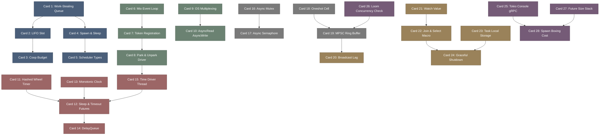

# tokio-高密度卡片系统设计大图.md

本文件定义了 **tokio (Rust 工业级异步运行时与并发调度器)** 28张核心知识卡片之间的依赖拓扑结构，以及物理代码映射锚点。

---

## 🗺️ 28 张卡片依赖拓扑图 (Mermaid)

---

## 📍 Tokio 物理源码位置映射

本设计大图的知识节点与 Tokio 核心类库及 Crate 物理源码强关联：
1. **Work-Stealing Scheduler**: `tokio/src/runtime/sched/multi_thread/` 及其核心数据结构 `queue.rs`。
2. **Coop Budget**: `tokio/src/coop.rs` 内部的上下文计数控制。
3. **Mio Reactor Driver**: `tokio/src/io/driver/` 关联 `mio::Poll`。
4. **Hashed Wheel Timer**: `tokio/src/util/time/` 内部基于槽位的时间轮实现。
5. **Loom Concurrency Verify**: `loom` 独立 Crate（`https://github.com/tokio-rs/loom`）。
