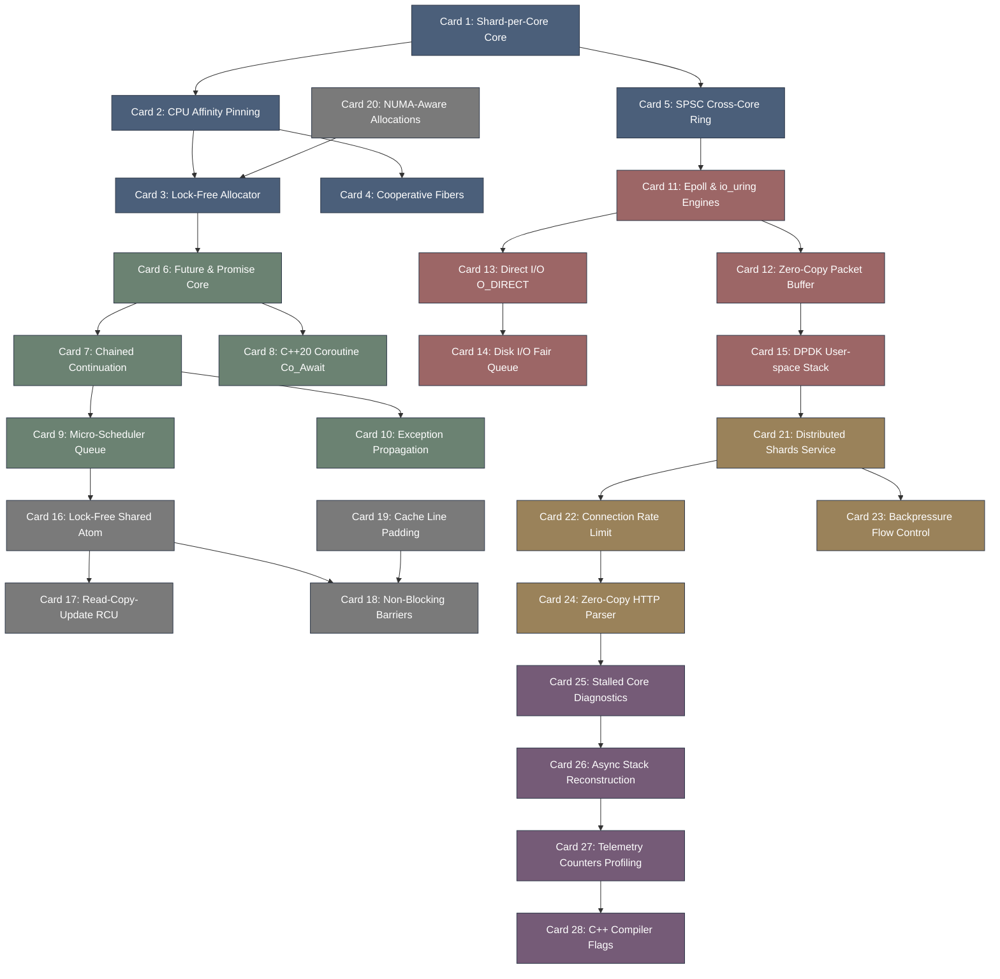

# seastar-高密度卡片系统设计大图

## 1. 卡片依赖拓扑图 (Mermaid)

## 2. 源码符号映射
- `seastar/core/reactor.hh` (Card 1, 9) - 事件循环、CPU 调度及任务执行管道核心。
- `seastar/core/future.hh` (Card 6, 7) - 异步 Promise、Future 及其 Chaining 路由。
- `seastar/core/smp.hh` (Card 5, 18) - 跨核心通信、SPSC 无锁环形队列元信息。
- `seastar/net/dpdk.hh` (Card 15) - 用户态 DPDK 驱动层零拷贝数据包处理。
