# system_design_primer 高密度卡片系统设计大图

本文定义了 28 张核心 cheatsheet 卡片与系统设计（System Design）核心分布式演进算法、系统组件与架构拓扑的映射锚点。

---

## 1. 依赖与演进拓扑大图 (Mermaid)

```mermaid
graph TD
    %% M1: Load Balancing & Consistent Hashing
    M1_1["Card 1: Anycast DNS & CDN"] --> M1_2["Card 2: L4 vs L7 Load Balancer"]
    M1_2 --> M1_3["Card 3: Consistent Hash Ring"]
    M1_3 --> M1_4["Card 4: Virtual Nodes Balance"]
    
    %% M2: Caching & Strategies
    M1_4 --> M2_5["Card 5: Caching Layers"]
    M2_5 --> M2_6["Card 6: Cache-aside Sequence"]
    M2_6 --> M2_7["Card 7: Write-through & Write-behind"]
    M2_7 --> M2_8["Card 8: LRU vs LFU Eviction"]
    M2_8 --> M2_9["Card 9: Bloom Filter Protections"]
    
    %% M3: Database Scalability
    M2_9 --> M3_10["Card 10: Replication sync/async"]
    M3_10 --> M3_11["Card 11: Database Sharding Key"]
    M3_11 --> M3_12["Card 12: Snowflake ID Generator"]
    M3_12 --> M3_13["Card 13: Federation & Denormalize"]
    
    %% M4: Distributed Consensus
    M3_13 --> M4_14["Card 14: CAP & PACELC Model"]
    M4_14 --> M4_15["Card 15: Gossip Convergence"]
    M4_15 --> M4_16["Card 16: 2PC Coordinator Lock"]
    M4_16 --> M4_17["Card 17: 3PC Timeout Alleviate"]
    M4_17 --> M4_18["Card 18: Raft Leader Election"]
    
    %% M5: Messaging & Queues
    M4_18 --> M5_19["Card 19: Message Queue Buffer"]
    M5_19 --> M5_20["Card 20: Delivery Guarantees"]
    M5_20 --> M5_21["Card 21: Consumer Idempotency"]
    M5_21 --> M5_22["Card 22: Queue Backpressure Flow"]
    M5_22 --> M5_23["Card 23: Dead Letter Queue (DLQ)"]
    
    %% M6: Resiliency & Security
    M5_23 --> M6_24["Card 24: Circuit Breaker State"]
    M6_24 --> M6_25["Card 25: Token vs Leaky Bucket"]
    M6_25 --> M6_26["Card 26: Bulkhead Isolation"]
    M6_26 --> M6_27["Card 27: Feature Toggles Graceful"]
    M6_27 --> M6_28["Card 28: SLA & MTBF/MTTR Metrics"]
```

---

## 2. 28张卡片核心原理与架构映射

### 📂 M1: 负载均衡与一致性哈希
*   **Card 1 (Anycast DNS & CDN)**:
    *   `系统映射`: BGP Anycast 选路、GeoDNS 智能地域解析、CDN 动态加速边缘计算。
    *   `核心原理`: 客户端向最近的 Anycast IP 发起请求，DNS 根据地理位置返回最近的 CDN 节点；静态资源就近响应，动态资源经由优化网络路由（TCP 优化、持久连接）汇聚至源站。
*   **Card 2 (L4 vs L7 Load Balancer)**:
    *   `系统映射`: LVS (Linux Virtual Server), Nginx, HAProxy, Envoy。
    *   `核心原理`: L4 负载均衡工作在传输层，通过修改包 IP / 端口转发，基于网络连接分发；L7 工作在应用层，读取完整 HTTP 报文，能够基于 Host, URL Path 甚至 Header 头进行复杂的业务逻辑分流。
*   **Card 3 (Consistent Hash Ring)**:
    *   `系统映射`: Ketama 一致性哈希算法、Memcached 客户端分配。
    *   `核心原理`: 使用一致性哈希，数据键和物理节点均被哈希投射到 $0 \sim 2^{32}-1$ 闭合哈希环上。节点在环上定位，数据键沿环顺时针寻找首个遇到的节点进行挂载。增删节点仅影响该节点在环上的顺时针相邻区域，免除全网重组。
*   **Card 4 (Virtual Nodes Balance)**:
    *   `系统映射`: DynamoDB, Cassandra 的哈希环实现。
    *   `核心原理`: 由于物理节点有限，哈希不均会导致热点倾斜。通过为每个物理节点映射数十或数百个虚拟节点（Virtual Nodes，如 `NodeA#1`, `NodeA#2`）均匀散布在环上，使多节点物理能力差异被屏蔽，且数据负载极其均衡地分摊。

### 📂 M2: 多级缓存与一致性策略
*   **Card 5 (Caching Layers)**:
    *   `系统映射`: 浏览器缓存 (HTTP Headers)、CDN (边缘缓存)、网关缓存 (Varnish)、应用本地缓存 (Guava/Ehcache)、分布式缓存 (Redis/Memcached)。
    *   `核心原理`: 读请求沿链路逐级向下匹配：Local ➜ Edge ➜ Proxy ➜ Redis ➜ DB。各级缓存的物理距离与查询开销呈指数降低，旨在拦截 80% 以上的只读事务。
*   **Card 6 (Cache-aside Sequence)**:
    *   `系统映射`: 旁路缓存模式。
    *   `核心原理`: 读时先查缓存：命规则直接返回；失效则读 DB 并回种缓存。写时必须先写入 DB，再**删除（Invalidate）**缓存。先写 DB 后删缓存利用高并发下 DB 写入耗时远大于缓存删除的物理真实，将缓存脏数据几率最小化。
*   **Card 7 (Write-through & Write-behind)**:
    *   `系统映射`: 直写与后写策略。
    *   `核心原理`: 直写（Write-through）时，应用程序写缓存，缓存组件同步写 DB，两者都成功才返回，保证绝对一致性但写延迟大；后写（Write-behind）时，应用写入缓存即返回，由后台线程通过队列异步合并批量刷入 DB，写入吞吐极高但存在节点故障丢数据与脏读风险。
*   **Card 8 (LRU vs LFU Eviction)**:
    *   `系统映射`: Redis `maxmemory-policy` 逐出算法。
    *   `核心原理`: 当缓存空间耗尽，LRU（Least Recently Used）优先淘汰最久未被访问的数据（通过哈希表+双向链表在 O(1) 内完成位置置顶与尾部删除）；LFU（Least Frequently Used）优先淘汰访问频次最低的数据（通过维护访问计数），兼顾热点持久性。
*   **Card 9 (Bloom Filter Protections)**:
    *   `系统映射`: Google Guava BloomFilter, Redis Bloom module。
    *   `核心原理`: 针对缓存穿透（查询 DB 不存在的数据），在缓存前架设布隆过滤器。通过多个无偏哈希函数计算数据键，在位数组中标记。由于“若判定为无，则绝对无”，布隆过滤器能在 O(1) 内拦截无效的恶意穿透流量。

### 📂 M3: 数据库读写分离与分库分表
*   **Card 10 (Replication sync/async)**:
    *   `系统映射`: MySQL binlog 复制、PostgreSQL WAL 复制。
    *   `核心原理`: 异步复制在主库提交事务即返回，从库异步拉取日志，主备延迟明显但写入吞吐最高；同步复制需所有从库完成才返回，强一致但可用性差；半同步（Semi-synchronous）仅需一个从库确认收包即返回，折衷了可用性与一致性。
*   **Card 11 (Database Sharding Key)**:
    *   `系统映射`: 数据库水平分片。
    *   `核心原理`: 水平扩展写能力的核心。将一张表打散到多个物理实例中，必须选定高基数、查询高频且分布均匀的字段作为分片键（Shard Key，如 `user_id`）。如果查询不带 Shard Key，需要触发昂贵的全分片广播扫描（Scatter-Gather）。
*   **Card 12 (Snowflake ID Generator)**:
    *   `系统映射`: Twitter Snowflake 算法、分布式全局唯一 ID。
    *   `核心原理`: 为解决分库分表下主键冲突。Snowflake 使用 64 位的 Long 型：1位符号位 + 41位时间戳（毫秒级） + 10位工作机器 ID（5位数据中心+5位机器ID） + 12位自增序列号。通过时钟拨回校验、序列号自增，在无锁环境下单机每毫秒产生 4096 个唯一有序 ID。
*   **Card 13 (Federation & Denormalize)**:
    *   `系统映射`: 数据库联合、非规范化反范式设计。
    *   `核心原理`: 联合（Federation）将单一数据库按功能拆解为不同主机的专有库，减少单点瓶颈；非规范化（Denormalization）通过在表中冗余存储（如存储冗余的用户名而不是仅存储用户ID），消除了海量读查询时的多表联合（JOIN）开销，空间换时间提速读取。

### 📂 M4: 分布式协同与共识机制
*   **Card 14 (CAP & PACELC Model)**:
    *   `系统映射`: CAP 定理与 PACELC 分布式折衷模型。
    *   `核心原理`: CAP 指出在网络分区（P）发生时，一致性（C）与可用性（A）不可兼得；PACELC 进一步补充：即使在正常无分区（E）状态下，系统也必须在延迟（L）与一致性（C）之间做出架构抉择。
*   **Card 15 (Gossip Convergence)**:
    *   `系统映射`: Cassandra, Redis Cluster 拓扑心跳。
    *   `核心原理`: 去中心化通信协议。节点以固定周期随机挑选 $k$ 个邻居节点发送自身状态信息，邻居节点再递归向外传播。系统以指数级速度扩散，最终达到整个集群状态的一致，具有极高的容错性。
*   **Card 16 (2PC Coordinator Lock)**:
    *   `系统映射`: 二阶段提交分布式事务协议。
    *   `核心原理`: 强一致事务保证。准备阶段，协调者向所有参与者发送 CanCommit 询问，参与者执行本地事务并锁定资源；提交阶段，协调者根据反馈发出 DoCommit 或 Abort。缺点是协调者单点故障会导致参与者陷入长久锁等待阻塞。
*   **Card 17 (3PC Timeout Alleviate)**:
    *   `系统映射`: 三阶段提交分布式事务。
    *   `核心原理`: 2PC 的演进版。引入了准备（CanCommit）、预提交（PreCommit）和提交（DoCommit）三阶段，并在参与者端引入了超时机制。若参与者在 PreCommit 阶段后未收到协调者指令，超时会自动触发 Commit，避免了无限期死锁。
*   **Card 18 (Raft Leader Election)**:
    *   `系统映射`: Raft 一致性共识算法。
    *   `核心原理`: 分布式共识基石。节点处于 Follower、Candidate、Leader 三种状态之一。通过随机化的选举超时（Randomized Election Timeout）避免多候选人瓜分选票；一旦选出 Leader，通过强一致的 Log Replication 机制（多数派写成功后提交）保证分布式日志流的绝对一致性。

### 📂 M5: 异步通信与消息队列流控
*   **Card 19 (Message Queue Buffer)**:
    *   `系统映射`: Apache Kafka, RabbitMQ, RocketMQ。
    *   `核心原理`: 异步架构枢纽。将瞬时的海量请求吸纳入队列缓冲区，下游服务根据自身处理能力匀速拉取（Pull）消费，保护后端逻辑不受并发峰值压崩，实现削峰填谷。
*   **Card 20 (Delivery Guarantees)**:
    *   `系统映射`: 消息投递保证。
    *   `核心原理`: 最多一次（At-most-once，发完即忘，可能丢消息）；最少一次（At-least-once，带重试重发，会收到重复消息）；精确一次（Exactly-once，通过消息幂等配合分布式两阶段提交完成强事务性收发）。
*   **Card 21 (Consumer Idempotency)**:
    *   `系统映射`: 幂等消费者。
    *   `核心原理`: 实现 At-least-once 投递安全落地的前提。每个消息必须携带唯一的 UUID。消费者在消费时，通过 Redis SETNX 或数据库唯一索引将该 UUID 锁定；若后续收到重复的 UUID，则直接跳过业务逻辑直接确认，保证重复消息不引发多次扣款等副作用。
*   **Card 22 (Queue Backpressure Flow)**:
    *   `系统映射`: 消息中间件回压与消费者自适应流控。
    *   `核心原理`: 当消费端处理慢，导致中间件队列内存/磁盘积压逼近上限时，中间件通过挂起写套接字（阻塞生产者 Socket 写入）或返回限流帧阻断生产者发送，直到消费端清理完未决包，将高压负反馈传导到生产源头。
*   **Card 23 (Dead Letter Queue (DLQ))**:
    *   `系统映射`: 死信队列。
    *   `核心原理`: 保证消息系统容错的关键。当某条消息因为数据格式异常或业务逻辑持续报错，导致超出最大重试次数时，消息队列不应将其丢弃或阻塞当前队列，而是将其转投到死信队列中，以便运维人员单独分析和手动补单。

### 📂 M6: 系统弹性设计：熔断、限流与防雪崩
*   **Card 24 (Circuit Breaker State)**:
    *   `系统映射`: Netflix Hystrix, Sentinel。
    *   `核心原理`: 系统自愈机制。熔断器处于三种状态：**Close**（正常通行，统计失败率）；**Open**（失败率超阈值，快速断路拦截所有请求，本地返回 Fallback 默认值）；**Half-Open**（经过冷却期后允许少数流量探测，成功率高则回到 Close，否则重新打回 Open）。
*   **Card 25 (Token vs Leaky Bucket)**:
    *   `系统映射`: Nginx rate limiting, Envoy rate limiting。
    *   `核心原理`: 漏桶（Leaky Bucket）以恒定速率滴水（发包），能产生绝对平滑的流量，但无法应对突发流量；令牌桶（Token Bucket）以恒定速率向桶内注令牌，允许请求瞬间取光积存的令牌，支持短时并发突发（Burst）。
*   **Card 26 (Bulkhead Isolation)**:
    *   `系统映射`: 舱壁隔离模式。
    *   `核心原理`: 借鉴泰坦尼克号防沉设计。在网关中为各个独立后端服务分配独立的专属线程池或信号量额度。即使服务 A 出现死锁或耗尽线程资源，由于隔离屏障，服务 B、C 依然可以正常响应，阻止局部故障演变成系统雪崩。
*   **Card 27 (Feature Toggles Graceful)**:
    *   `系统映射`: 优雅降级与特性开关。
    *   `核心原理`: 当大促或系统高负荷时，通过集中控制台下发指令触发 Feature Toggles 降级开关，优雅关闭非核心链路（如展示推荐、评论、积分），腾挪出宝贵的 CPU 与数据库带宽资源优先保障核心付款业务。
*   **Card 28 (SLA & MTBF/MTTR Metrics)**:
    *   `系统映射`: 服务等级协议、可用性度量。
    *   `核心原理`: 可用性公式为 $\text{Availability} = \frac{\text{MTBF}}{\text{MTBF} + \text{MTTR}}$。其中 MTBF 是平均无故障时间，MTTR 是平均修复时间。减少 MTTR（如通过完善的自动容灾、灰度快速回滚、详尽日志大盘）是达成 4 个 9 (99.99%) 系统可用性的核心技术关键。
