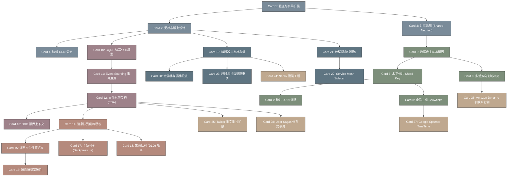

# awesome_scalability-高密度卡片系统设计大图 (大厂高并发与高扩展模式系统架构)

本大图描绘了 `checkcheckzz / awesome-scalability` 库中 28 张核心卡片的相互依赖和数据/控制流关系，涵盖了系统扩容、数据层拆分、异步流控、容灾弹性和大厂经典架构设计的全景闭环。

## 1. 卡片依赖拓扑 (Mermaid Diagram)

---

## 2. 核心架构原理与物理概念映射

*   **一致性边界与状态外置 (Statelessness)**：
    *   应用层的无状态化核心在于剥离 HTTP Session、本地临时状态文件，将其存储外置到高速共享介质（Redis 或分布式 DB）。
    *   消除了水平扩展时由于单点机器宕机导致的会话丢失风险，实现了 L7 网关的完全轮询调度。
*   **读写隔离与 CQRS (Command Query Responsibility Segregation)**：
    *   Command Model 处理变更，追求极致的写安全性和领域完整性（常映射到强一致性的数据库或事件存储区）。
    *   Read Model 处理查询，结构非规范化，高频冗余（冗余所需的所有字段，支持极速反范式单表拉取，可投射至 Elasticsearch/Redis/MongoDB 等读优化引擎中）。
*   **回压与过载控制 (Backpressure & Rate Limiting)**：
    *   当队列积压（Queue Lagging）超出警戒阈值时，自动反向缩紧 TCP window size，迫使生产者阻塞或报错，避免内存风暴。
    *   配合熔断器（Circuit Breaker）提供级联灾备隔离，避免微服务调用树上“由于一个叶子节点超时，导致整个树所有中间节点线程池耗尽”的系统性瘫痪。
*   **大厂特有工业算法机制**：
    *   **Vector Clocks**：在无主（Masterless）复制架构中，利用向量时钟追踪数据更新因果依赖，判定并发冲突。
    *   **Sagas Pattern**：在跨微服务事务中，通过定义每个步骤的正向操作（Action）和对应的反向补偿（Compensating Action）来实现最终一致，避免 2PC 阻塞死锁。
