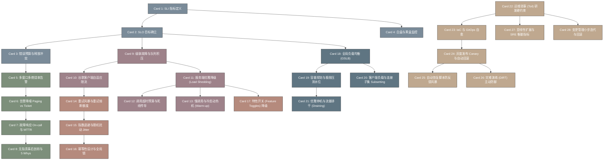

# sre_book-高密度卡片系统设计大图 (SRE 运维与架构稳定性圣经)

本大图描绘了 `google / sre-book` 库中 28 张核心卡片的相互依赖和数据/控制流关系，涵盖了可用性管理、自动化告警响应、过载雪崩级联防御、瞬态重试自愈以及运维自动化效率指标等高可用核心拼图。

## 1. 卡片依赖拓扑 (Mermaid Diagram)

---

## 2. 核心架构算法与物理公式映射

*   **Error Budget 消耗速度与多燃烧率告警 (Multi-burn-rate Alerting)**：
    *   SRE 告警的核心在于监控错误预算消耗速度（即燃烧率 Burn Rate）。
    *   燃烧率定义为消耗全部错误预算的理论速度倍数。如一个月的 $99\%$ SLO，错误预算为 $1\%$。如果系统在 1 小时内发生 $100\%$ 的全部故障，则燃烧率 $B = 30 \times 24 = 720$。
    *   多燃烧率告警规则定义了在特定窗口内发生高燃烧率时立刻 paging。例如：如果在 1 小时内燃烧率 $\ge 14.4$（消耗了 $2\%$ 预算）或 6 小时内燃烧率 $\ge 6$（消耗了 $5\%$ 预算），则触发紧急 paging。
*   **Google 客户端自适应限流算法 (Adaptive Client Throttling)**：
    *   当后端过载开始报错时，为避免流量持续积压拖死服务，客户端应就地丢弃一部分请求。
    *   丢弃概率公式定义为：
        $$P_{\text{reject}} = \max\left(0, \frac{\text{requests} - K \times \text{accepts}}{\text{requests} + 1}\right)$$
        *   `requests` 是客户端发起的总请求数；
        *   `accepts` 是后端成功处理并返回的请求数；
        *   `K` 是自适应激进系数（通常为 $1.1$ 到 $2.0$，如 $2$ 表示允许客户端发起超出接受量两倍的超载试探）。
    *   该公式使客户端在后端成功率下跌时迅速呈指数级自动本地抛弃请求，在后端恢复时逐步放行。
*   **指数退避与随机扰动 (Exponential Backoff with Jitter)**：
    *   重试间隔计算公式：
        $$\text{sleep} = \min(\text{max\_sleep}, \text{base} \times 2^{\text{attempt}})$$
    *   为防止重试时所有客户端同时发包形成 thundering herd，必须加入随机扰动（Jitter）：
        $$\text{sleep} = \text{random}(0, \min(\text{max\_sleep}, \text{base} \times 2^{\text{attempt}}))$$
