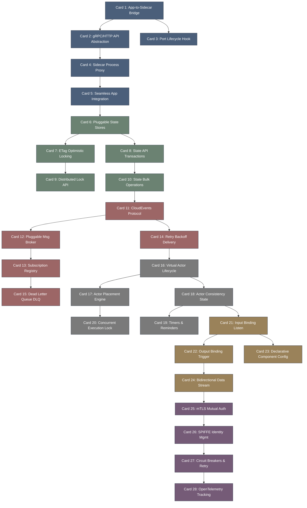

# dapr-高密度卡片系统设计大图

## 1. 卡片依赖拓扑图 (Mermaid)

## 2. 源码符号映射
- `dapr/pkg/runtime/runtime.go` (Card 1, 2, 4) - Dapr Sidecar 运行时初始化、端口管理、API 服务装载。
- `dapr/pkg/components/state/registry.go` (Card 6, 8) - 可插拔状态管理组件中心注册、状态数据流序列化。
- `dapr/pkg/messaging/pubsub/pubsub.go` (Card 11, 12) - 消息发布订阅组件交互、CloudEvents 标准事件解析。
- `dapr/pkg/actors/placement.go` (Card 16, 17) - 虚拟 Actor 多实例位置 Placement 位置调度逻辑。
