# devops_firefighting-高密度卡片系统设计大图.md

本文件定义了 **devops_firefighting (云原生与 SRE 生产救火手册)** 28张核心知识卡片之间的依赖拓扑结构，以及物理代码/组件映射锚点。

---

## 🗺️ 28 张卡片依赖拓扑图 (Mermaid)

```mermaid
graph TD
    classDef default fill:#151d30,stroke:#24324f,color:#e2e8f0;
    classDef M1 fill:#4B5F7A,stroke:#2f3d52,color:white;
    classDef M2 fill:#6B8272,stroke:#4b5c50,color:white;
    classDef M3 fill:#9C6666,stroke:#704949,color:white;
    classDef M4 fill:#7A7A7A,stroke:#595959,color:white;
    classDef M5 fill:#9A825A,stroke:#6e5c40,color:white;

    Card1["Card 1: OOMKilled 137"]:::M1
    Card2["Card 2: CrashLoopBackOff"]:::M1
    Card3["Card 3: Pod Pending"]:::M1
    Card4["Card 4: ImagePullBackOff"]:::M1
    Card5["Card 5: Ephemeral Storage"]:::M1
    Card6["Card 6: Pod Evicted QoS"]:::M1
    Card7["Card 7: DNS ndots search"]:::M2
    Card8["Card 8: SYN Flood somaxconn"]:::M2
    Card9["Card 9: TCP RST conntrack"]:::M2
    Card10["Card 10: Nginx 502 refused"]:::M2
    Card11["Card 11: Nginx 504 timeout"]:::M2
    Card12["Card 12: Cilium eBPF redirect"]:::M2
    Card13["Card 13: Terraform State Lock"]:::M3
    Card14["Card 14: PV PVC CSI Multi-Attach"]:::M3
    Card15["Card 15: IMDSv2 Hop Limit"]:::M3
    Card16["Card 16: VPC Peering CIDR conflict"]:::M3
    Card17["Card 17: Vault Lease expiration"]:::M3
    Card18["Card 18: Bucket Public Access Allow"]:::M3
    Card19["Card 19: Prometheus Card churn"]:::M4
    Card20["Card 20: Fluentd Backpressure queue"]:::M4
    Card21["Card 21: Trace Context propagation"]:::M4
    Card22["Card 22: Grafana range scan"]:::M4
    Card23["Card 23: Alertmanager group wait"]:::M4
    Card24["Card 24: SRE SLO Burn Rate"]:::M4
    Card25["Card 25: Chaos Mesh network delay"]:::M5
    Card26["Card 26: Feature Flag fallback"]:::M5
    Card27["Card 27: Database PITR recovery"]:::M5
    Card28["Card 28: Blameless Post-Mortem Timeline"]:::M5

    Card1 --> Card6
    Card2 --> Card1
    Card3 --> Card14
    Card4 --> Card3
    Card5 --> Card6
    Card7 --> Card12
    Card8 --> Card9
    Card10 --> Card11
    Card12 --> Card10
    Card14 --> Card13
    Card15 --> Card18
    Card16 --> Card15
    Card17 --> Card26
    Card19 --> Card22
    Card20 --> Card19
    Card21 --> Card20
    Card23 --> Card24
    Card24 --> Card28
    Card25 --> Card24
    Card26 --> Card27
    Card27 --> Card28
```

---

## 📂 核心运维物理/组件映射锚点

在云原生与 SRE 生产救火中，排错模式映射于以下核心开源组件与代码结构中：

*   `/etc/resolv.conf`: 宿主机与容器 DNS 解析 search 路径与 ndots 跳数限制控制文件。
*   `kube-scheduler`: K8s 核心调度器组件，负责评估 NodeSelector、Taints/Tolerations 以及亲和性硬限制。
*   `sysctl.conf`: Linux 网络核心内核参数配置文件，控制全连接与半连接队列容量（`somaxconn`, `tcp_max_syn_backlog`）。
*   `Cilium Agent / SOCKMAP`: 基于 eBPF 的高性能网络数据面重定向 Map 条目，跳过 TCP 协议栈发送数据包。
*   `CSI (Container Storage Interface)`: 存储卷接口控制面，负责物理磁盘在各计算节点间的 Detach、Attach 与 Mount 状态管理。
*   `Prometheus / Alertmanager`: 监控指标存储与告警合并聚合核心引擎，负责错误预算消耗速率（Burn Rate）报警。
*   `Vault Secrets Engine`: HashiCorp 动态凭证管理器，为客户端提供防泄漏的 Lease 限时临时账号。
