# tech_selection-高密度卡片系统设计大图.md

本文件定义了 **tech_selection (高频架构设计折中矩阵)** 28张核心知识卡片之间的依赖拓扑结构，以及物理代码/组件映射锚点。

---

## 🗺️ 28 张卡片依赖拓扑图 (Mermaid)

```mermaid
graph TD
    classDef default fill:#151d30,stroke:#24324f,color:#e2e8f0;
    classDef M1 fill:#4B5F7A,stroke:#2f3d52,color:white;
    classDef M2 fill:#6B8272,stroke:#4b5c50,color:white;
    classDef M3 fill:#9C6666,stroke:#704949,color:white;
    classDef M4 fill:#7A7A7A,stroke:#595959,color:white;
    classDef M5 fill:#9A825A,stroke:#6e5c40,color:white;

    Card1["Card 1: MySQL vs PG"]:::M1
    Card2["Card 2: Mongo vs Cassandra"]:::M1
    Card3["Card 3: Redis vs Memcached"]:::M1
    Card4["Card 4: Influx vs Timescale"]:::M1
    Card5["Card 5: RocksDB vs LevelDB"]:::M1
    Card6["Card 6: Cockroach vs TiDB"]:::M1
    Card7["Card 7: Kafka vs Pulsar"]:::M2
    Card8["Card 8: RocketMQ vs RabbitMQ"]:::M2
    Card9["Card 9: Redis Streams vs MQTT"]:::M2
    Card10["Card 10: Event Sourcing vs EDA"]:::M2
    Card11["Card 11: Push vs Pull Consumer"]:::M2
    Card12["Card 12: Partition vs Hash Ring"]:::M2
    Card13["Card 13: REST vs gRPC"]:::M3
    Card14["Card 14: GraphQL vs REST"]:::M3
    Card15["Card 15: WebSocket vs SSE"]:::M3
    Card16["Card 16: Protobuf vs JSON vs Avro"]:::M3
    Card17["Card 17: Dubbo vs gRPC"]:::M3
    Card18["Card 18: Kong vs Envoy"]:::M3
    Card19["Card 19: Raft vs Paxos"]:::M4
    Card20["Card 20: etcd vs ZooKeeper"]:::M4
    Card21["Card 21: Strong vs Eventual Consist"]:::M4
    Card22["Card 22: Gossip vs Registry"]:::M4
    Card23["Card 23: Redlock vs ZK Lock"]:::M4
    Card24["Card 24: Vector vs HLC Clock"]:::M4
    Card25["Card 25: Sync IPC vs Async EDA"]:::M5
    Card26["Card 26: Sidecar Mesh vs Proxyless"]:::M5
    Card27["Card 27: FaaS vs K8s Pod"]:::M5
    Card28["Card 28: Blue-Green vs Canary"]:::M5

    Card1 --> Card6
    Card3 --> Card1
    Card5 --> Card6
    Card7 --> Card11
    Card8 --> Card11
    Card12 --> Card7
    Card16 --> Card13
    Card17 --> Card13
    Card18 --> Card26
    Card19 --> Card20
    Card20 --> Card23
    Card21 --> Card19
    Card24 --> Card21
    Card25 --> Card8
    Card26 --> Card25
    Card27 --> Card26
    Card28 --> Card27
```

---

## 📂 核心选型物理组件/规范映射锚点

在分布式架构选型中，决策与物理底层实现紧密相关：

*   `MySQL / InnoDB (MVCC)`: 使用 Undo Log 物理页与 B+ 树主键聚簇索引的段管理结构。
*   `PostgreSQL (MVCC)`: 利用 Heap Page (堆页) 中的行头（t_xmin, t_xmax）进行版本物理隔离与 VACUUM 释放页。
*   `Consistent Hash Ring`: 32 位无符号整数哈希环空间分配，映射节点物理 IP 与虚拟倍数（3x/10x）以收敛 Key 负载。
*   `Kafka / Broker PageCache`: 发送端直接调用操作系统 `sendfile()` 零拷贝短路到网络套接字句柄。
*   `RabbitMQ / flow control`: 消费者慢时，Erlang Actor 信道直接阻塞 TCP 连接，通过 Socket 读写状态实现物理背压。
*   `gRPC / HTTP2 Frame`: 底层连接多路复用通过 Frame（标头帧、数据帧）在单一 TCP 通道上并轨传输以消除 HOLB。
*   `HLC (Hybrid Logical Clock)`: 基于物理时钟的 Epoch 毫秒级拼接自增计数器的统一 64 位整型偏序结构。
