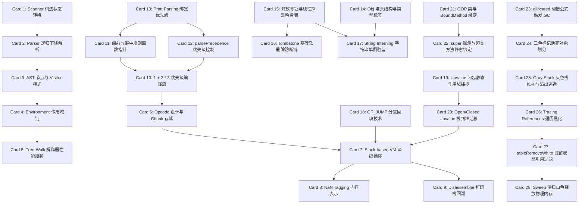

# Crafting Interpreters 高密度卡片系统设计大图

## 1. 28张卡片依赖拓扑关系图

---

## 2. Crafting Interpreters 物理源码位置映射锚点

为便于硬核技术速查，以下是 28 张核心卡片对应在《Crafting Interpreters》官方开源仓库 `munificent/craftinginterpreters` 中的核心源码文件及函数位置：

*   **jlox 解释器前端与运行期 (M1)**:
    *   词法扫描状态机：`lox/Scanner.java` -> `scanToken()`
    *   递归下降解析：`lox/Parser.java` -> `expression()`, `equality()`
    *   AST 动态定义与 Visitor：`lox/Expr.java` & `tool/GenerateAst.java`
    *   变量环境作用域：`lox/Environment.java` -> `define()`, `get()`
    *   Tree-Walk 树遍历求值：`lox/Interpreter.java` -> `visitBinaryExpr()`, `visitLiteralExpr()`
*   **clox 字节码虚拟机基础 (M2)**:
    *   OPCODE 设计与 Chunk 组装：`src/chunk.c` -> `initChunk()`, `writeChunk()`
    *   Stack VM 核心译码循环：`src/vm.c` -> `run()` -> `switch (instruction = READ_BYTE())`
    *   Value 运行时值及 NaN Tagging 优化：`src/value.h` -> `Value` (带 `NAN_MASK` 的位操作)
    *   反汇编器与栈打印：`src/debug.c` -> `disassembleInstruction()`
*   **Pratt Parsing 普拉特优先级编译器 (M3)**:
    *   Pratt 解析绑定优先级表：`src/compiler.c` -> `rules` 数组 (包含前缀/缀中函数指针及优先级)
    *   缀前与缀中编译流分发：`src/compiler.c` -> `number()`, `binary()`, `unary()`
    *   优先级解析自愈驱动：`src/compiler.c` -> `parsePrecedence()`
*   **哈希表与字符串驻留 (M4)**:
    *   Obj 堆头基类定义：`src/object.h` -> `struct Obj` (带 `type` 标签与 `next` 堆链表指针)
    *   开放寻址线性探测实现：`src/table.c` -> `findEntry()`
    *   Tombstone 墓碑软删除逻辑：`src/table.c` -> `tableDelete()` (标记为 `val=BOOL_VAL(true)` 表示墓碑)
    *   字符串驻留去重 Interning：`src/object.c` -> `tableFindString()`, `allocateString()`
*   **控制流与闭包机制 (M5)**:
    *   Backpatching 分支回填代码：`src/compiler.c` -> `emitJump()`, `patchJump()`
    *   Upvalue 闭包上值编译结构：`src/object.h` -> `ObjClosure`, `ObjUpvalue`
    *   Open 转向 Closed Upvalue 栈迁移：`src/vm.c` -> `captureUpvalue()`, `closeUpvalues()`
    *   面向对象实例字段与 BoundMethod：`src/vm.c` -> `bindMethod()`, `callValue()`
    *   Inheritance 继承超类绑定：`src/compiler.c` -> `super_()`
*   **三色标记垃圾回收 GC (M6)**:
    *   根扫描与 GC 触发阈值计算：`src/memory.c` -> `collectGarbage()`, `markRoots()`
    *   三色标记与着色逻辑：`src/memory.c` -> `markObject()`, `markValue()`
    *   工作队列灰色黑化推导：`src/memory.c` -> `blackenObject()`
    *   Intern 驻留表白色清除：`src/table.c` -> `tableRemoveWhite()`
    *   Sweep 物理清扫回收堆内存：`src/memory.c` -> `sweep()`
