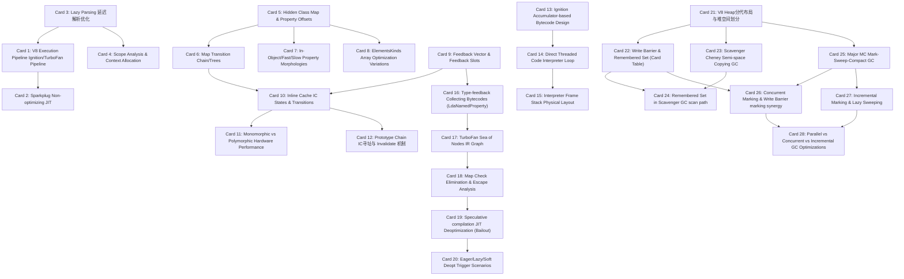

# V8 引擎高密度卡片系统设计大图

## 1. 28张卡片依赖拓扑关系图

---

## 2. V8 引擎物理源码位置映射锚点

为便于硬核技术速查，以下是 28 张核心卡片对应在谷歌 V8 引擎官方开源项目 `v8/v8` 中的核心源码文件及函数位置：

*   **V8 执行管线与解析器 (M1)**:
    *   执行管线总控与 JIT 决策：`src/execution/execution.cc` -> `Execution::Call()`
    *   Sparkplug 编译器入口：`src/compiler/sparkplug/sparkplug.cc` -> `CompileSparkplug()`
    *   解析器与延迟解析决策：`src/parsing/parser.cc` -> `Parser::ParseFunction()`
    *   作用域分析与 Context 提升：`src/ast/scopes.cc` -> `Scope::Analyze()`
*   **隐藏类与属性寻址优化 (M2)**:
    *   隐藏类 Map 物理布局与结构定义：`src/objects/map.h` -> `class Map`
    *   隐藏类 Map 转换树创建：`src/objects/map-updater.cc` -> `MapUpdater::ReconfigureToDataField()`
    *   对象属性物理形态转换（快 ➜ 慢）：`src/objects/js-objects.cc` -> `JSObject::MigrateInstance()`
    *   数组元素类型 ElementsKinds 转换：`src/objects/elements-kind.h` & `src/objects/elements.cc`
*   **反馈向量与内联缓存 (M3)**:
    *   反馈向量与插槽数据结构：`src/objects/feedback-vector.h` -> `class FeedbackVector`
    *   内联缓存 IC 状态转换管理：`src/ic/ic.cc` -> `IC::UpdateMonomorphic()`, `IC::UpdatePolymorphic()`
    *   IC 单态与多态硬件指令生成：`src/ic/stub-cache.cc` -> `StubCache::Set()`
    *   原型链寻址与原型 Map 失效：`src/objects/prototype-info.h` -> `PrototypeInfo`
*   **Ignition 解释器虚拟机 (M4)**:
    *   Ignition 字节码定义与寄存器模型：`src/interpreter/bytecode-register.h`
    *   直接线程化译码循环生成：`src/interpreter/interpreter-generator.cc` -> `GenerateBytecodeHandler()`
    *   解释器物理栈帧布局定义：`src/execution/frames.h` -> `InterpreterFrame`
    *   收集反馈信息的字节码 Handler：`src/interpreter/interpreter-assembler.cc` -> `LdaNamedProperty` Handler
*   **TurboFan 编译器与去优化 (M5)**:
    *   Sea of Nodes 节点与图结构：`src/compiler/node.h` & `src/compiler/graph.h`
    *   Map 检查消除与逃逸分析：`src/compiler/map-inference.cc`, `src/compiler/escape-analysis.cc`
    *   去优化 Bailout 物理栈帧重构：`src/deoptimizer/deoptimizer.cc` -> `Deoptimizer::DeoptimizeFunction()`
    *   去优化触发类型定义与检查：`src/deoptimizer/deoptimizer.h` -> `DeoptimizeKind`
*   **V8 分代内存与垃圾回收 (M6)**:
    *   V8 堆内存分代结构布局：`src/heap/heap.h` & `src/heap/spaces.h`
    *   写屏障物理汇编指令发射：`src/heap/remembered-set.h` -> `RememberedSet`
    *   新生代 Scavenger Cheney 拷贝：`src/heap/scavenger.cc` -> `Scavenger::ScavengePage()`
    *   新生代扫描 Remembered Set：`src/heap/scavenger-inl.h` -> `Scavenger::VisitRememberedSet()`
    *   老生代 Major MC 标记与整理：`src/heap/mark-compact.cc` -> `MarkCompactCollector::Collect()`
    *   并发标记线程控制：`src/heap/concurrent-marking.cc` -> `ConcurrentMarking::Run()`
    *   增量标记切片步进控制：`src/heap/incremental-marking.cc` -> `IncrementalMarking::Step()`
    *   GC 线程调度（Parallel / Concurrent）：`src/heap/sweeper.cc` -> `Sweeper::StartSweeping()`
