# OpenJDK / Java HotSpot VM 高密度卡片系统设计大图

## 1. 28张卡片依赖拓扑关系图

```mermaid
graph TD
    %% M1: Class Loader & Runtime Memory
    Card1["Card 1: ClassLoader 类加载与双亲委派"] --> Card2["Card 2: Metaspace & Klass Object Layout"]
    Card2 --> Card3["Card 3: Template Interpreter 模板汇编解释器"]
    Card3 --> Card4["Card 4: Stack Frame 物理布局与操作数栈交互"]

    %% M2: JMM & Memory Barriers
    Card5["Card 5: JMM happens-before 内存模型规范"] --> Card6["Card 6: Instruction Reordering & CPU乱序执行"]
    Card6 --> Card7["Card 7: Hardware-level Memory Barrier (Fence) Design"]
    Card7 --> Card8["Card 8: JVM logic barriers & Volatile compilation implementation"]
    Card8 --> Card4

    %% M3: Tiered Compilation & JIT
    Card9["Card 9: Tiered Compilation (Interpreter, C1, C2)"] --> Card10["Card 10: Method Invocation Counter thresholds"]
    Card10 --> Card11["Card 11: Escape Analysis & Scalar Replacement Optimization"]
    Card11 --> Card12["Card 12: Speculative Compilation & Deoptimization (Bailout)"]
    Card12 --> Card4

    %% M4: Synchronizer Lock Inflation
    Card13["Card 13: Object Header Mark Word layout"] --> Card14["Card 14: Biased Locking Acquisition, Revocation & Deprecation"]
    Card14 --> Card15["Card 15: Lightweight Locking CAS stack Record (BasicObjectLock)"]
    Card15 --> Card16["Card 16: Heavyweight Locking ObjectMonitor Inflation model"]

    %% M5: ZGC Low Latency GC
    Card17["Card 17: ZGC Colored Pointers Virtual Address Layout"] --> Card18["Card 18: Concurrent Relocate page copying"]
    Card17 --> Card19["Card 19: ZGC Load Barrier & Self-healing pointer remapping"]
    Card18 --> Card19
    Card17 --> Card20["Card 20: Small/Medium/Large Page fine-grained management"]

    %% M6: GC Components & Loom Virtual Threads
    Card21["Card 21: G1 Region division & Remembered Set (RSet) Card Table"] --> Card26["Card 26: SATB write barrier & tri-color synchronization"]
    Card22["Card 22: Shenandoah Brooks Pointer CAS atomic redirect"] --> Card19
    Card23["Card 23: Project Loom Virtual Threads carrier architecture"] --> Card24["Card 24: Continuation Mount/Unmount Stack freeze/thaw state machine"]
    Card24 --> Card25["Card 25: Virtual Thread Pinning synchronized limitations"]
    Card21 --> Card27["Card 27: Card Table dirty card tagging process"]
    Card28["Card 28: Safepoint poll mechanism & Safe Region tracking"] --> Card24
```

---

## 2. OpenJDK / HotSpot VM 物理源码位置映射锚点

为便于硬核技术速查，以下是 28 张核心卡片对应在 OpenJDK / HotSpot VM 官方开源项目 `openjdk/jdk` 中的核心源码文件及函数位置：

*   **类加载与解释执行 (M1)**:
    *   双亲委派机制底层入口：`src/hotspot/share/classfile/classLoader.cpp`
    *   元空间 Klass 物理结构：`src/hotspot/share/oops/klass.hpp` -> `class Klass`
    *   模板解释器指令翻译生成：`src/hotspot/share/interpreter/templateInterpreterGenerator.cpp` -> `TemplateInterpreterGenerator::generate_all()`
    *   物理栈帧数据存储布局：`src/hotspot/share/runtime/frame.hpp` & `src/hotspot/cpu/x86/frame_x86.hpp`
*   **Java 内存模型与屏障 (M2)**:
    *   Happens-before 规范保证实现：`src/hotspot/share/runtime/orderAccess.hpp`
    *   硬件级屏障指令生成 (x86)：`src/hotspot/cpu/x86/orderAccess_x86.hpp` -> `OrderAccess::fence()`
    *   C2 编译器中屏障节点选择插入：`src/hotspot/share/opto/memnode.cpp` -> `MemNode::make()`
*   **分层编译与 JIT 编译器 (M3)**:
    *   分层编译决策Broker总控：`src/hotspot/share/compiler/compileBroker.cpp`
    *   编译阈值控制与决策策略：`src/hotspot/share/runtime/simpleThresholdPolicy.cpp`
    *   逃逸分析与标量替换执行优化：`src/hotspot/share/opto/escape.cpp` -> `ConnectionGraph::do_analysis()`
    *   去优化 Bailout 物理栈帧重构：`src/hotspot/share/runtime/deoptimization.cpp` -> `Deoptimization::deoptimize()`
*   **锁升级与 Synchronizer 膨胀 (M4)**:
    *   对象头 Mark Word 位定义：`src/hotspot/share/oops/markWord.hpp` -> `class markWord`
    *   偏向锁获取与 Safepoint 撤销：`src/hotspot/share/runtime/biasedLocking.cpp`
    *   轻量锁与重量锁 ObjectMonitor 分配膨胀：`src/hotspot/share/runtime/synchronizer.cpp` -> `ObjectSynchronizer::inflate()`
    *   重量锁 ObjectMonitor 阻塞链表控制：`src/hotspot/share/runtime/objectMonitor.cpp` -> `ObjectMonitor::enter()`
*   **ZGC 低延迟垃圾回收 (M5)**:
    *   彩色指针高位标记物理掩码：`src/hotspot/share/gc/z/zAddress.inline.hpp` -> `ZAddress::is_marked()`
    *   并发转移 Relocate 拷贝执行：`src/hotspot/share/gc/z/zRelocate.cpp` -> `ZRelocate::relocate()`
    *   读屏障 Load Barrier 指令拦截自愈：`src/hotspot/share/gc/z/zBarrier.inline.hpp` -> `ZBarrier::load_barrier_on_oop_field_preloaded()`
    *   页面划分 Fine-grained 内存页控制：`src/hotspot/share/gc/z/zPage.cpp`
*   **GC 组件与 Loom 虚拟线程 (M6)**:
    *   G1 RSet 与卡表脏卡标记：`src/hotspot/share/gc/g1/g1RemSet.cpp`
    *   Shenandoah 转发指针 Brooks Pointer：`src/hotspot/share/gc/shenandoah/shenandoahForwarding.inline.hpp`
    *   Loom 虚拟线程冻结/解冻栈帧 Freeze/Thaw：`src/hotspot/share/runtime/continuationFreezeThaw.cpp`
    *   协程底层 mount/unmount 挂载卸载切换：`src/hotspot/share/runtime/continuation.cpp` -> `Continuation::yield()`
    *   Safepoint 主动轮询段错误机制：`src/hotspot/share/runtime/safepointMechanism.cpp` -> `SafepointMechanism::should_block()`
