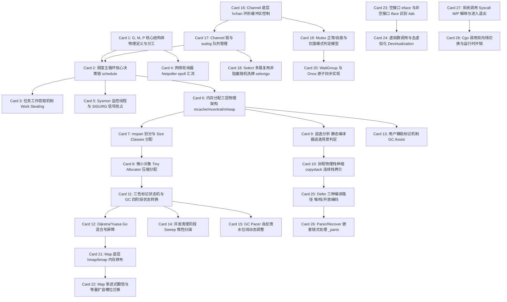

# Go Runtime 高密度卡片系统设计大图

## 1. 28张卡片依赖拓扑关系图

---

## 2. Go Runtime 物理源码位置映射锚点

为便于硬核技术速查，以下是 28 张核心卡片对应在 Go 语言官方源码仓 `golang/go` 中的核心源码文件及函数位置：

*   **Goroutine GMP 调度与网络轮询器 (M1)**:
    *   G, M, P 核心结构体定义：`src/runtime/runtime2.go` -> `type g struct`、`type m struct`、`type p struct`
    *   调度循环入口决策链：`src/runtime/proc.go` -> `schedule()`、`findrunnable()`
    *   工作窃取实现：`src/runtime/proc.go` -> `stealWork()`
    *   网络轮询器物理底层：`src/runtime/netpoll.go` & `src/runtime/netpoll_epoll.go` -> `netpoll()`
    *   系统监控与非协作抢占：`src/runtime/proc.go` -> `sysmon()`、`preemptone()` & `src/runtime/preempt.go`
*   **内存分配与协程栈 (M2)**:
    *   分配器总架构：`src/runtime/malloc.go` -> `mallocgc()`
    *   本地缓存与全局堆结构：`src/runtime/mcache.go`、`src/runtime/mcentral.go`、`src/runtime/mheap.go`
    *   内存跨度管理：`src/runtime/mspan.go` -> `mspan`
    *   逃逸分析静态检查入口：`src/cmd/compile/internal/escape/escape.go`
    *   连续栈拷贝与扩容：`src/runtime/stack.go` -> `copystack()`、`newstack()`
*   **三色 GC 与写屏障 (M3)**:
    *   GC 主控状态机：`src/runtime/mgc.go` -> `gcStart()`
    *   三色标记与工作队列：`src/runtime/mgcmark.go` -> `gcDrain()`
    *   混合写屏障底层：`src/runtime/mbarrier.go` -> `writebarrierptr()`
    *   GC 协程辅助机制：`src/runtime/mgcassist.go` -> `gcAssistAlloc()`
    *   GC Pacer 调优器：`src/runtime/mgcpacer.go`
*   **Channels 与同步原语 (M4)**:
    *   管道核心实现：`src/runtime/chan.go` -> `hchan` & `makechan()`、`chansend()`、`chanrecv()`
    *   Select 展开运行期：`src/runtime/select.go` -> `selectgo()`
    *   互斥锁核心实现：`src/sync/mutex.go` -> `Mutex.Lock()`、`Mutex.lockSlow()`
    *   Once 与同步机制：`src/sync/once.go` & `src/sync/waitgroup.go`
*   **Maps 与接口 (M5)**:
    *   字典底层排布与冲突：`src/runtime/map.go` -> `hmap` & `makemap()`、`mapaccess1()`
    *   字典扩容槽位迁移：`src/runtime/map.go` -> `hashGrow()`、`evacuate()`
    *   接口底层表示与反射元数据：`src/runtime/iface.go` -> `iface`、`eface` & `itab`
    *   去虚拟化静态Pass：`src/cmd/compile/internal/devirtualize/devirtualize.go`
*   **Defer、Panic、Syscall 与 Cgo (M6)**:
    *   Defer 堆栈优化与开放编码：`src/runtime/panic.go` -> `deferproc()`、`deferreturn()`
    *   Panic 与恢复控制：`src/runtime/panic.go` -> `gopanic()`、`gorecover()`
    *   系统调用包装与 GMP 剥离：`src/runtime/proc.go` -> `entersyscall()`、`exitsyscall()`
    *   Cgo 运行时切换与屏障：`src/runtime/cgocall.go` -> `cgocall()` & `src/runtime/cgo/`
