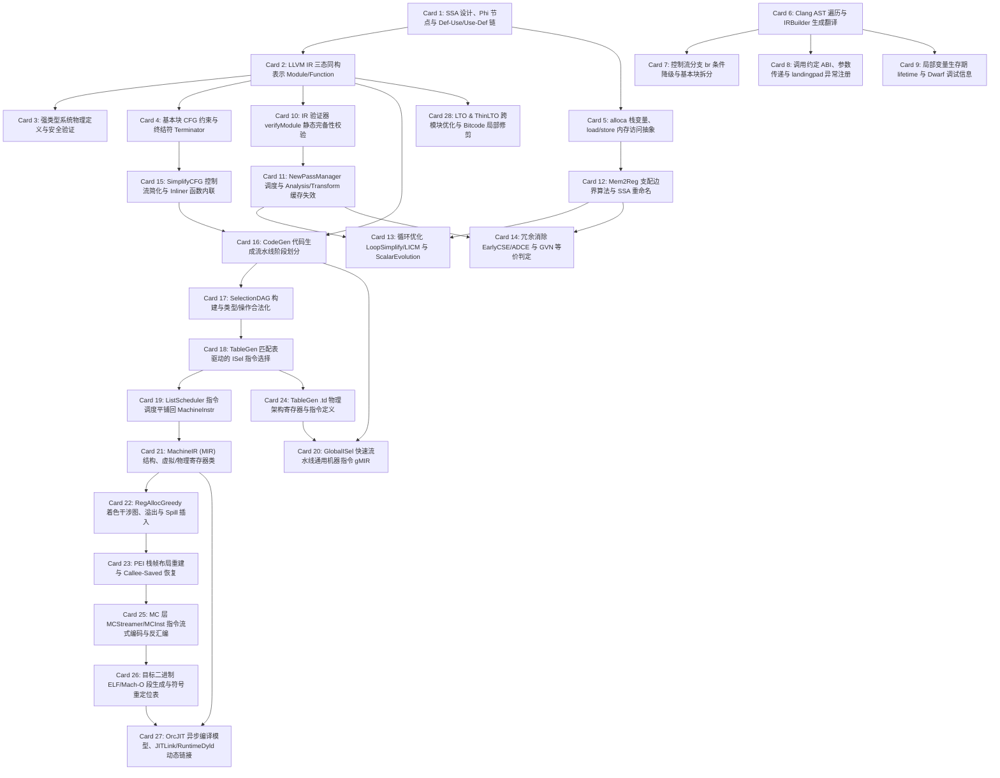

# LLVM 核心原理高密度卡片系统设计大图

## 1. 28张卡片依赖拓扑关系图

---

## 2. LLVM 物理源码位置映射锚点

为便于硬核技术速查，以下是 28 张核心卡片对应在 LLVM 官方源码仓 `llvm/llvm-project` 中的核心源码文件及类/函数位置：

*   **LLVM IR 核心语法与类型 (M1)**:
    *   SSA 设计与 Def-Use/Use-Def 链：`llvm/lib/IR/Value.cpp` -> `llvm::Value::use_iterator` 遍历，以及 `llvm/include/llvm/IR/Use.h`
    *   IR 三态表示：`llvm/lib/IR/Module.cpp`、`llvm/lib/IR/Function.cpp`、`llvm/lib/IR/BasicBlock.cpp`
    *   强类型定义：`llvm/lib/IR/Type.cpp` -> `llvm::Type` 核心衍生类（`PointerType`、`StructType` 等）
    *   基本块终结符规范：`llvm/lib/IR/Instructions.cpp` -> `BranchInst`、`ReturnInst`、`SwitchInst` 的实现
    *   内存分配抽象：`llvm/lib/IR/Instructions.cpp` -> `AllocaInst`、`LoadInst`、`StoreInst`
*   **前端 AST 降级与 IR 生成 (M2)**:
    *   Clang 降级生成入口：`clang/lib/CodeGen/CodeGenModule.cpp` -> `CodeGenModule::EmitTopLevelDecl` 与 `clang/lib/CodeGen/CGExpr.cpp`
    *   控制流分支降级：`clang/lib/CodeGen/CGStmt.cpp` -> `CodeGenFunction::EmitBranch`
    *   异常处理 Landingpad：`clang/lib/CodeGen/CGException.cpp` -> `CodeGenFunction::EmitLandingPad`
    *   调试信息元数据：`llvm/lib/IR/DIBuilder.cpp` -> `DIBuilder` 核心元数据接口
    *   IR 静态验证器：`llvm/lib/IR/Verifier.cpp` -> `llvm::verifyModule()` & `Verifier::visitFunction`
*   **Pass 管理器与经典优化 (M3)**:
    *   PassManager 骨架：`llvm/lib/IR/PassManager.cpp` -> `PassManager::run`
    *   Mem2Reg 提升算法：`llvm/lib/Transforms/Utils/PromoteMemoryToRegister.cpp` -> `llvm::PromoteMemToReg` 与 `llvm/lib/Transforms/Utils/Local.cpp`
    *   LICM 循环不变外提：`llvm/lib/Transforms/Scalar/LICM.cpp` -> `LICM::run` 与 `llvm/lib/Analysis/ScalarEvolution.cpp`
    *   EarlyCSE/GVN 消除：`llvm/lib/Transforms/Scalar/EarlyCSE.cpp` -> `EarlyCSE::run` & `llvm/lib/Transforms/Scalar/GVN.cpp`
    *   SimplifyCFG 与 Inliner：`llvm/lib/Transforms/Scalar/SimplifyCFGPass.cpp` & `llvm/lib/Transforms/IPO/Inliner.cpp`
*   **SelectionDAG 与 ISel 后端 (M4)**:
    *   代码生成流程控制器：`llvm/lib/CodeGen/TargetPassConfig.cpp`
    *   SelectionDAG 选择图构建：`llvm/lib/CodeGen/SelectionDAG/SelectionDAGISel.cpp` & `llvm/lib/CodeGen/SelectionDAG/SelectionDAGBuilder.cpp`
    *   TableGen 指令选择匹配：`llvm/lib/CodeGen/SelectionDAG/SelectionDAGISel.cpp` -> `SelectCode` 逻辑
    *   指令调度 ListScheduler：`llvm/lib/CodeGen/SelectionDAG/ScheduleDAGSDNodes.cpp`
    *   GlobalISel 管道：`llvm/lib/CodeGen/GlobalISel/InstructionSelect.cpp` & `llvm/lib/CodeGen/GlobalISel/Legalizer.cpp`
*   **MachineIR 与寄存器分配 (M5)**:
    *   MachineIR 类表示：`llvm/lib/CodeGen/MachineFunction.cpp`、`llvm/lib/CodeGen/MachineBasicBlock.cpp`、`llvm/lib/CodeGen/MachineInstr.cpp`
    *   贪婪寄存器分配器：`llvm/lib/CodeGen/RegAllocGreedy.cpp` -> `RAGreedy::runOnMachineFunction`
    *   Spill 溢出生成器：`llvm/lib/CodeGen/Spiller.cpp` -> `llvm::createInlineSpiller`
    *   PEI 栈帧重建：`llvm/lib/CodeGen/PrologEpilogInserter.cpp` -> `PEI::runOnMachineFunction`
*   **MC 层、Object 发射与 JIT (M6)**:
    *   MC 流式发射器与指令：`llvm/lib/MC/MCStreamer.cpp` & `llvm/lib/MC/MCInst.cpp`
    *   ELF 二进制文件发射：`llvm/lib/MC/ELFObjectWriter.cpp` -> `ELFObjectWriter::writeHeader`
    *   OrcJIT 异步执行：`llvm/lib/ExecutionEngine/Orc/OrcCore.cpp` -> `AsynchronousSymbolQuery` 与 `llvm/lib/ExecutionEngine/Orc/LLJIT.cpp`
    *   LTO 链接跨模块：`llvm/lib/LTO/LTO.cpp` -> `LTO::run` & `llvm/lib/LTO/ThinLTOCodeGenerator.cpp`
