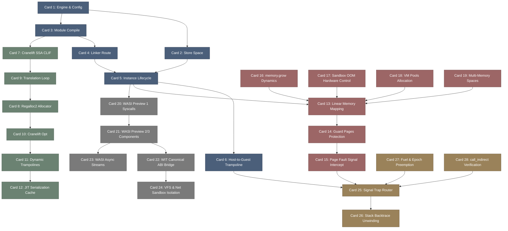

# wasmtime-高密度卡片系统设计大图.md

本文件定义了 **wasmtime (WebAssembly 高效 JIT 虚拟机与轻量沙箱运行时)** 28张核心知识卡片之间的依赖拓扑结构，以及物理代码映射锚点。

---

## 🗺️ 28 张卡片依赖拓扑图 (Mermaid)

---

## 📍 Wasmtime 物理源码位置映射

本设计大图的知识节点与 Wasmtime 核心类库及 Crate 物理源码强关联：
1. **Engine / Store / Instance**: `wasmtime/src/runtime/` 下的 `engine.rs`, `store.rs`, `instance.rs`。
2. **Cranelift Compiler & Regalloc2**: `cranelift/codegen/`（Cranelift 编译器核心）与 `regalloc2/`。
3. **Linear Memory & Signal Handler**: `wasmtime-runtime/src/` 中的 `memory.rs`（线性内存映射）与 `traphandlers/`（Signal 异常陷阱）。
4. **WASI Component Model**: `wasmtime-wasi/` 与 `wasmtime-environ/src/component/`。
