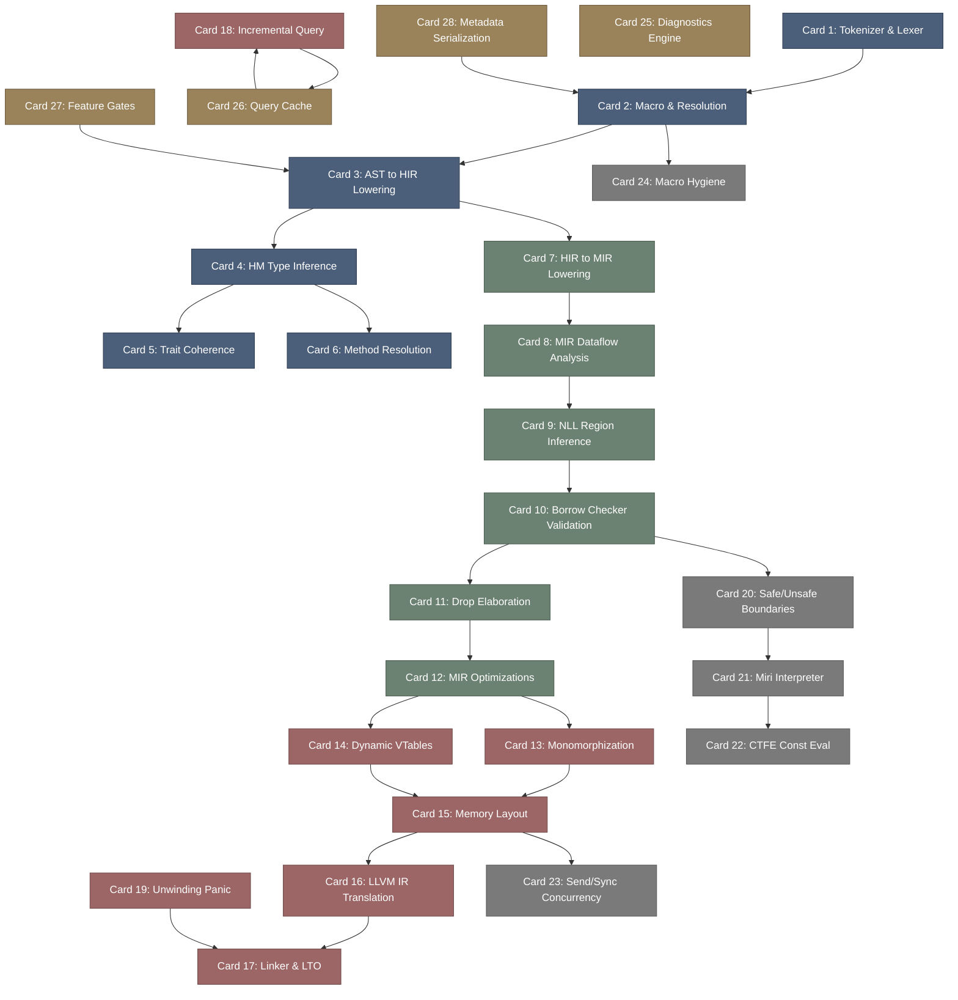

# rustc-高密度卡片系统设计大图.md

本文件定义了 **rustc (Rust 官方编译器内核、HIR/MIR 变换与 NLL 借用检查器)** 28张核心知识卡片之间的依赖拓扑结构，以及物理代码映射锚点。

---

## 🗺️ 28 张卡片依赖拓扑图 (Mermaid)

---

## 📍 rustc 物理源码位置映射

本设计大图的知识节点与 rustc 核心类库及 Crate 物理源码强关联：
1. **Frontend / Resolution**: `compiler/rustc_lexer/`, `compiler/rustc_parse/`, `compiler/rustc_resolve/`。
2. **Type Checking & Traits**: `compiler/rustc_hir/`, `compiler/rustc_typeck/`, `compiler/rustc_trait_selection/`。
3. **MIR & Borrow Check (NLL)**: `compiler/rustc_mir_build/`, `compiler/rustc_mir_dataflow/`, `compiler/rustc_borrowck/`。
4. **Codegen & LLVM**: `compiler/rustc_codegen_ssa/`, `compiler/rustc_codegen_llvm/`。
5. **CTFE & Miri**: `compiler/rustc_const_eval/`。
