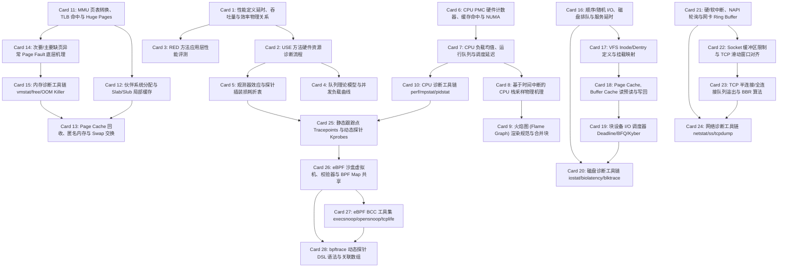

# 系统性能调优与诊断高密度卡片系统设计大图

## 1. 28张卡片依赖拓扑关系图

---

## 2. 性能诊断工具与 Linux 内核映射锚点

为便于硬核技术速查，以下是 28 张核心卡片对应在 Linux 内核源码仓 `torvalds/linux` 及工具链中的核心源码文件及伪文件系统路径位置：

*   **性能分析方法与指标 (M1)**:
    *   `/proc` 伪文件系统统计源：`fs/proc/stat.c` -> `/proc/stat`（CPU 时间片计数器）
    *   物理资源状态汇总：`/proc/meminfo`（内存详情）与 `/proc/loadavg`（平均负载数据源）
    *   核心观测开销控制：`kernel/trace/trace.c` -> 跟踪环形缓冲区（Ring Buffer）内存分配限制
*   **CPU 调度与火焰图 (M2)**:
    *   CPU 调度器负载及运行队列统计：`kernel/sched/core.c` -> `update_rq_clock()`
    *   进程级上下文切换计数：`fs/proc/array.c` -> `/proc/<pid>/status`（`voluntary_ctxt_switches`）
    *   Linux `perf` 工具源码：`tools/perf/` 目录（尤其是 `tools/perf/util/evlist.c` 采样事件链表）
    *   火焰图生成渲染源头：`github.com/brendangregg/FlameGraph` -> `flamegraph.pl` 及 `stackcollapse-perf.pl`
*   **内存管理与缺页异常 (M3)**:
    *   缺页中断处理器（X86 架构）：`arch/x86/mm/fault.c` -> `do_user_addr_fault()`
    *   伙伴系统物理分配器：`mm/page_alloc.c` -> `__alloc_pages()`
    *   Slab/Slub 内存分配核心：`mm/slub.c` -> `kmem_cache_alloc()`
    *   OOM Killer 评分与杀死机制：`mm/oom_kill.c` -> `oom_evaluate_task()` 与 `badness()` 计算权重
*   **磁盘 I/O 调度与 VFS 缓存 (M4)**:
    *   VFS 读写与 Inode 寻址：`fs/read_write.c` -> `vfs_read()` 与 `vfs_write()`
    *   Page Cache 读预读策略：`mm/readahead.c` -> `page_cache_sync_readahead()`
    *   脏页后台写回刷盘：`mm/page-writeback.c` -> `balance_dirty_pages_ratelimited()`
    *   块设备 I/O 调度器入口：`block/blk-mq.c` -> I/O 请求队列分配与 Kyber/BFQ 调度接口
*   **网络协议栈与套接字队列 (M5)**:
    *   软中断与 NAPI 接收机制：`net/core/dev.c` -> `netif_rx()` 与 `net_rx_action()` 轮询
    *   Socket 缓冲区 Ring Buffer 分配：`net/core/skbuff.c` -> `__alloc_skb()`
    *   TCP 全连接队列控制：`net/ipv4/tcp_ipv4.c` -> `tcp_v4_syn_recv_sock()` 校验队列溢出
    *   TCP 拥塞控制算法骨架：`net/ipv4/tcp_cong.c` -> 注册拥塞控制回调（Cubic & BBR 接口）
*   **内核跟踪与 eBPF (M6)**:
    *   Kprobes 动态插装底层：`kernel/kprobes.c` -> `register_kprobe()`，修改指令为 `int3` 中断
    *   eBPF 系统调用入口：`kernel/bpf/syscall.c` -> `sys_bpf()` 分发 MAP_CREATE 等命令
    *   eBPF 安全校验器：`kernel/bpf/verifier.c` -> `do_check()` 执行指令有向无环图深度搜索
    *   BCC 工具链源码：`github.com/iovisor/bcc` -> `src/cc/`（BCC 编译引擎与 BPF C 语言解析）
    *   bpftrace 编译器源码：`github.com/iovisor/bpftrace` -> `src/ast/`（bpftrace 抽象语法树解析与 LLVM IR 生成）
