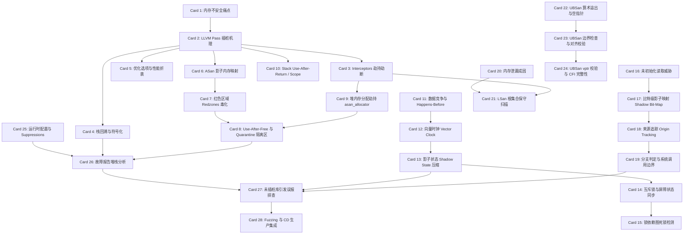

# Sanitizers 运行时内存与并发检测套件高密卡片系统设计大图

## 1. 28 张卡片依赖拓扑图 (Mermaid)

---

## 2. LLVM 与 compiler-rt 物理源码路径映射

### M1: Sanitizers 体系公理与编译器插桩机理
*   **LLVM Pass 插桩框架**: [llvm/lib/Transforms/Instrumentation/](file:///D:/llvm-project/llvm/lib/Transforms/Instrumentation) 
    *   ASan Pass: `AddressSanitizer.cpp`
    *   TSan Pass: `ThreadSanitizer.cpp`
    *   MSan Pass: `MemorySanitizer.cpp`
*   **运行时拦截器 (Interceptors)**: [compiler-rt/lib/sanitizer_common/sanitizer_common_interceptors.inc](file:///D:/llvm-project/compiler-rt/lib/sanitizer_common/sanitizer_common_interceptors.inc)
*   **符号化引擎**: [compiler-rt/lib/sanitizer_common/sanitizer_symbolizer_libcdep.cpp](file:///D:/llvm-project/compiler-rt/lib/sanitizer_common/sanitizer_symbolizer_libcdep.cpp)

### M2: AddressSanitizer (ASan) 影子内存与越界释放检测
*   **影子内存映射公式与状态定义**: [compiler-rt/lib/asan/asan_mapping.h](file:///D:/llvm-project/compiler-rt/lib/asan/asan_mapping.h)
*   **堆内存分配器劫持**: [compiler-rt/lib/asan/asan_allocator.cpp](file:///D:/llvm-project/compiler-rt/lib/asan/asan_allocator.cpp)
*   **内存隔离区 (Quarantine)**: [compiler-rt/lib/sanitizer_common/sanitizer_quarantine.h](file:///D:/llvm-project/compiler-rt/lib/sanitizer_common/sanitizer_quarantine.h)
*   **拦截器实现**: [compiler-rt/lib/asan/asan_interceptors.cpp](file:///D:/llvm-project/compiler-rt/lib/asan/asan_interceptors.cpp)

### M3: ThreadSanitizer (TSan) 状态机、向量时钟与数据竞争
*   **向量时钟更新与时钟逻辑**: [compiler-rt/lib/tsan/rtl/tsan_clock.cpp](file:///D:/llvm-project/compiler-rt/lib/tsan/rtl/tsan_clock.cpp)
*   **互斥锁同步拦截器**: [compiler-rt/lib/tsan/rtl/tsan_mutex.cpp](file:///D:/llvm-project/compiler-rt/lib/tsan/rtl/tsan_mutex.cpp)
*   **影子状态更新与数据竞争碰撞判定**: [compiler-rt/lib/tsan/rtl/tsan_rtl_report.cpp](file:///D:/llvm-project/compiler-rt/lib/tsan/rtl/tsan_rtl_report.cpp)

### M4: MemorySanitizer (MSan) 未初始化内存读取检测
*   **比特影子图映射与 Origin 追踪**: [compiler-rt/lib/msan/msan.cpp](file:///D:/llvm-project/compiler-rt/lib/msan/msan.cpp)
*   **MSan 专用拦截器**: [compiler-rt/lib/msan/msan_interceptors.cpp](file:///D:/llvm-project/compiler-rt/lib/msan/msan_interceptors.cpp)

### M5: UBSan 与 LSan 运行时检测与分析
*   **LSan 保守 GC 扫描与根集合检索**: [compiler-rt/lib/lsan/lsan_common.cpp](file:///D:/llvm-project/compiler-rt/lib/lsan/lsan_common.cpp)
*   **UBSan 算术溢出与对齐检测 Handlers**: [compiler-rt/lib/ubsan/ubsan_handlers.cpp](file:///D:/llvm-project/compiler-rt/lib/ubsan/ubsan_handlers.cpp)
*   **Clang 前端编译期溢出插桩点**: [clang/lib/CodeGen/CGExprScalar.cpp](file:///D:/llvm-project/clang/lib/CodeGen/CGExprScalar.cpp)

### M6: Sanitizers 物理部署、运维排查与故障字典
*   **解析 Suppressions 规则**: [compiler-rt/lib/sanitizer_common/sanitizer_suppressions.cpp](file:///D:/llvm-project/compiler-rt/lib/sanitizer_common/sanitizer_suppressions.cpp)
*   **报告格式化输出**: [compiler-rt/lib/asan/asan_report.cpp](file:///D:/llvm-project/compiler-rt/lib/asan/asan_report.cpp)
