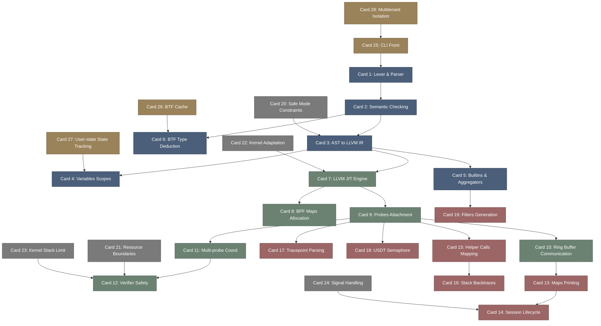

# bpftrace-高密度卡片系统设计大图.md

本文件定义了 **bpftrace (性能调优与动态追踪语言)** 28张核心知识卡片之间的依赖拓扑结构，以及物理代码映射锚点。

---

## 🗺️ 28 张卡片依赖拓扑图 (Mermaid)

---

## 📍 bpftrace 物理源码位置映射

本设计大图的知识节点与 bpftrace 核心类库及 Crate 物理源码强关联：
1. **Frontend & AST**: `src/parser.yy`, `src/lexer.l`, `src/ast/`。
2. **Semantic Analysis**: `src/semantic_analyser.cpp`, `src/ast/semantic_analyser_visit.cpp`。
3. **LLVM Codegen & JIT**: `src/codegen_llvm.cpp`, `src/ast/codegen_llvm_visit.cpp`。
4. **Probe Attachment**: `src/attached_probe.cpp`, `src/probe_metadata.cpp`。
5. **BTF & Symbols**: `src/btf.cpp`, `src/symbols.cpp`。
