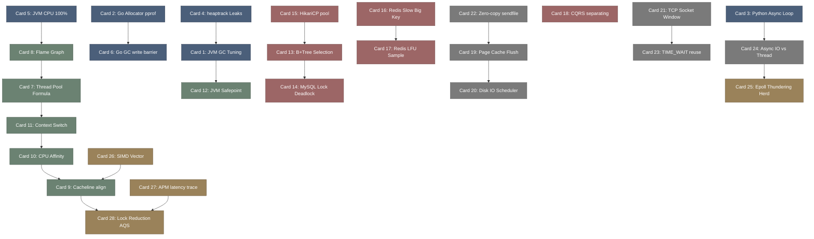

# daily_diagnostics-高密度卡片系统设计大图.md

本文件定义了 **daily_diagnostics (线上故障定位与性能榨汁机)** 28张核心知识卡片之间的依赖拓扑结构，以及物理代码/组件映射锚点。

---

## 🗺️ 28 张卡片依赖拓扑图 (Mermaid)

---

## 📂 核心调优物理/组件映射锚点

在系统与应用调优中，性能榨汁模式映射于以下核心开源组件与代码结构中：

*   `sysctl.conf / limits.conf`: Linux 操作系统性能核弹阀，调优脏页参数、打开文件句柄（`nofile`）、TCP 缓冲区参数。
*   `async-profiler / perf`: Linux CPU 栈采样利器，非在安全点下采样，直接生成 SVG 交互式火焰图的最佳辅助组件。
*   `HikariCP / Druid`: 数据库连接池，在内存中管理多线程连接复用、探活以及并发 CAS 连接获取的性能库。
*   `Intel AVX-512 / ARM Neon`: 物理 CPU SIMD 向量化并行处理寄存器与指令集支持。
*   `LMAX Disruptor RingBuffer`: 无锁环形缓冲区，基于 CAS 和内存屏障，替代传统并发 BlockingQueue 的超高性能无锁队列库。
*   `std::net::TcpStream / sendfile`: POSIX 零拷贝底层网络方法，将文件描述符直接由内核写回网卡，跳过用户空间转换。
