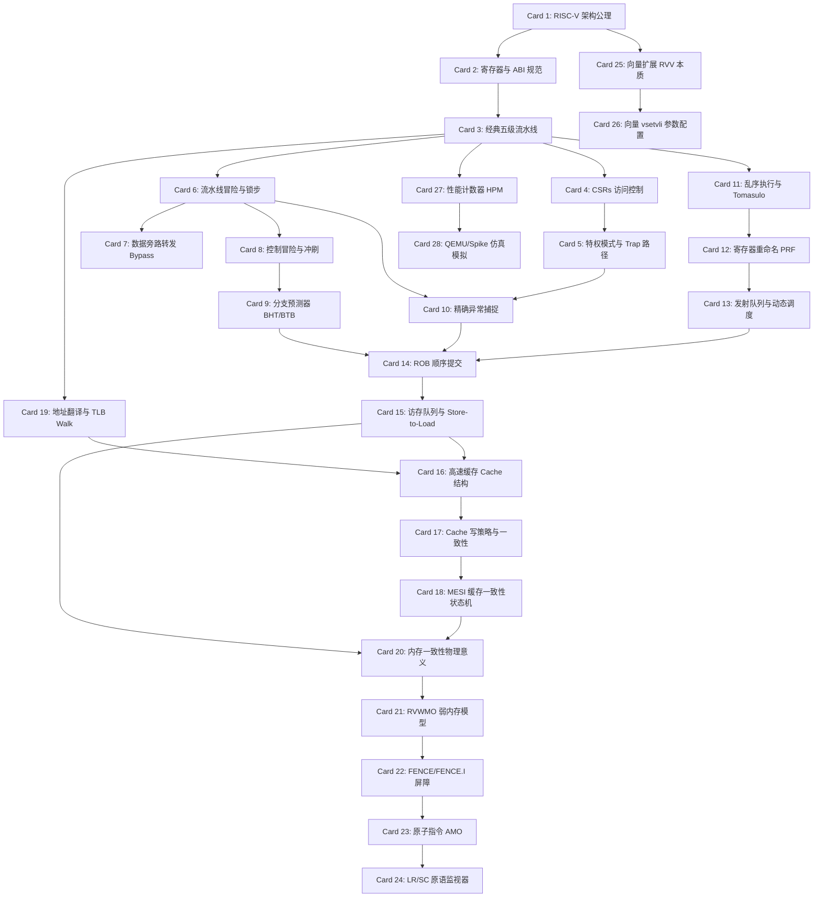

# RISC-V 指令集体系结构规范高密卡片系统设计大图

## 1. 28 张卡片依赖拓扑图 (Mermaid)

---

## 2. 经典 RISC-V 处理器硬件与模拟器源码物理路径映射

为了印证 28 张核心卡片中涉及的处理器微架构设计，我们将其映射至经典的开源 RISC-V 处理器项目 [chipsalliance/rocket-chip](https://github.com/chipsalliance/rocket-chip)（顺序流水线标杆）、[riscv-boom/riscv-boom](https://github.com/riscv-boom/riscv-boom)（乱序执行标杆）以及 [riscv-software-src/riscv-isa-sim (Spike)](https://github.com/riscv-software-src/riscv-isa-sim)（指令集模拟器金丝雀）的物理源码路径中：

### M1-M2: 五级流水线、特权模式、CSR 与冒险旁路
*   **Rocket Chip 顺序流水线控制流**: [rocket-chip/src/main/scala/rocket/IDecode.scala](file:///D:/riscv-cores/rocket-chip/src/main/scala/rocket/IDecode.scala) (指令译码映射表)
*   **CSR 寄存器控制与陷入跳转**: [rocket-chip/src/main/scala/rocket/CSR.scala](file:///D:/riscv-cores/rocket-chip/src/main/scala/rocket/CSR.scala) (xepc/xcause 陷入逻辑处理)
*   **数据旁路转发与流水线锁步**: [rocket-chip/src/main/scala/rocket/Rocket.scala](file:///D:/riscv-cores/rocket-chip/src/main/scala/rocket/Rocket.scala) (五级顺序流水线数据前推逻辑)
*   **分支预测器 (BHT/BTB)**: [rocket-chip/src/main/scala/rocket/BTB.scala](file:///D:/riscv-cores/rocket-chip/src/main/scala/rocket/BTB.scala) (两比特饱和计数器与目标地址缓冲实现)

### M3: 乱序执行、重命名、发射与重排序缓冲区 (BOOM 乱序核)
*   **寄存器重命名与映射表**: [riscv-boom/src/main/scala/exu/rename/rename.scala](file:///D:/riscv-cores/riscv-boom/src/main/scala/exu/rename/rename.scala) (消除伪相关的重命名逻辑)
*   **发射队列与动态调度**: [riscv-boom/src/main/scala/exu/issue-unit.scala](file:///D:/riscv-cores/riscv-boom/src/main/scala/exu/issue-unit.scala) (唤醒 Wakeup 与选择 Select 逻辑)
*   **重排序缓冲区 (ROB) 顺序提交**: [riscv-boom/src/main/scala/exu/rob.scala](file:///D:/riscv-cores/riscv-boom/src/main/scala/exu/rob.scala) (实现精确异常的顺序 Commit 缓冲)
*   **加载/存储队列 (LSU) 与访存前推**: [riscv-boom/src/main/scala/exu/lsu/lsu.scala](file:///D:/riscv-cores/riscv-boom/src/main/scala/exu/lsu/lsu.scala) (Store-to-Load Forwarding)

### M4-M5: MESI 缓存一致性、虚存翻译与内存屏障
*   **Cache 控制与一致性协议**: [rocket-chip/src/main/scala/tilelink/Metadata.scala](file:///D:/riscv-cores/rocket-chip/src/main/scala/tilelink/Metadata.scala) (缓存行 MESI 状态定义)
*   **硬件页表遍历 (Page Table Walker)**: [rocket-chip/src/main/scala/rocket/PTW.scala](file:///D:/riscv-cores/rocket-chip/src/main/scala/rocket/PTW.scala) (硬件地址翻译翻译机理)
*   **FENCE 与原子指令同步原语**: [rocket-chip/src/main/scala/rocket/ALU.scala](file:///D:/riscv-cores/rocket-chip/src/main/scala/rocket/ALU.scala) (AMO 原子操作硬件执行)

### M6: 向量扩展 (RVV) 与 Spike 仿真器
*   **Spike 向量指令集执行定义**: [riscv-isa-sim/riscv/insns/](file:///D:/riscv-cores/riscv-isa-sim/riscv/insns) 
    *   `vsetvli.cc` (元素宽度 SEW 与倍率 LMUL 参数配置)
    *   `vadd_vv.cc` (向量加法并行流水线仿真)
