# cuda_programming-高密度卡片系统设计大图.md

本文件定义了 **nvidia / cuda-samples (CUDA 并行计算与 GPGPU 编程)** 28张核心知识卡片之间的依赖拓扑结构，以及物理代码映射锚点。

---

## 🗺️ 28 张卡片依赖拓扑图 (Mermaid)

```mermaid
graph TD
    classDef default fill:#151d30,stroke:#24324f,color:#e2e8f0;
    classDef M1 fill:#4B5F7A,stroke:#2f3d52,color:white;
    classDef M2 fill:#6B8272,stroke:#4b5c50,color:white;
    classDef M3 fill:#9C6666,stroke:#704949,color:white;
    classDef M4 fill:#7A7A7A,stroke:#595959,color:white;
    classDef M5 fill:#9A825A,stroke:#6e5c40,color:white;
    classDef M6 fill:#755B77,stroke:#534054,color:white;

    Card1["Card 1: Grid-Block-Thread Model"]:::M1
    Card2["Card 2: Kernel Life Cycle"]:::M1
    Card3["Card 3: SM Microarchitecture"]:::M1
    Card4["Card 4: SIMT & Warp Scheduling"]:::M1
    Card5["Card 5: Warp Divergence"]:::M1

    Card6["Card 6: Latency Hiding & Occupancy"]:::M2
    Card7["Card 7: Memory Hierarchy"]:::M2
    Card8["Card 8: Global Memory Coalescing"]:::M2
    Card9["Card 9: Shared Memory & 32-Banks"]:::M2
    Card10["Card 10: Bank Conflict & Broadcast"]:::M2

    Card11["Card 11: Register Spilling"]:::M3
    Card12["Card 12: Constant/Texture Cache"]:::M3
    Card13["Card 13: L1/L2 Cache Tuning"]:::M3
    Card14["Card 14: Unified Memory (UM)"]:::M3
    Card15["Card 15: Barrier & Memory Fence"]:::M3

    Card16["Card 16: Cooperative Groups"]:::M4
    Card17["Card 17: Warp Shuffle Sync"]:::M4
    Card18["Card 18: Atomic & L2 Cache ALU"]:::M4
    Card19["Card 19: CUDA Streams Async"]:::M4
    Card20["Card 20: CPU-GPU Async & Events"]:::M4

    Card21["Card 21: CUDA Graphs"]:::M5
    Card22["Card 22: Pinned Memory & DMA"]:::M5
    Card23["Card 23: Multi-GPU P2P & NVLink"]:::M5
    Card24["Card 24: Tensor Cores MMA"]:::M5
    Card25["Card 25: Dynamic Parallelism"]:::M5

    Card26["Card 26: Performance Optimization Matrix"]:::M6
    Card27["Card 27: GPGPU Parallel Patterns"]:::M6
    Card28["Card 28: Nsight Compute & Systems"]:::M6

    %% Relationships
    Card1 --> Card2
    Card1 --> Card3
    Card3 --> Card4
    Card4 --> Card5
    Card4 --> Card6
    Card3 --> Card7
    Card7 --> Card8
    Card7 --> Card9
    Card9 --> Card10
    Card3 --> Card11
    Card7 --> Card12
    Card7 --> Card13
    Card7 --> Card14
    Card4 --> Card15
    Card15 --> Card16
    Card4 --> Card17
    Card7 --> Card18
    Card2 --> Card19
    Card19 --> Card20
    Card19 --> Card21
    Card7 --> Card22
    Card22 --> Card23
    Card3 --> Card24
    Card1 --> Card25
    Card8 & Card10 & Card11 --> Card26
    Card16 & Card17 & Card18 --> Card27
    Card26 & Card27 --> Card28
```

---

## 锚点物理位置映射 (CUDA Samples & CUTLASS 物理源码剖析)

为了与实际的工业级微架构及算子层对接，本设计图将 28 个卡片逻辑节点锚定到 `nvidia/cuda-samples`、`NVIDIA/cutlass` 以及 `thrust` 的物理源码库中，帮助进行源码级调试和剖析。

### 1. CUDA 编程模型与网格拓扑 (M1)
*   **物理源码映射**：
    - `cuda-samples/Samples/0_Introduction/vectorAdd/vectorAdd.cu#L57-L70`：最经典的主机端与设备端内存分离，核函数调用语法。
    - `cuda-samples/Samples/0_Introduction/matrixMul/matrixMul.cu#L90-L105`：通过二维网格拓扑 `dim3 threads` 和 `dim3 grid` 建立矩阵乘法一维/二维分块映射的起点。

### 2. 流多处理器与 Warp 调度机制 (M2)
*   **物理源码映射**：
    - `cuda-samples/Samples/1_Utilities/deviceQuery/deviceQuery.cpp#L110-L135`：查询 GPU 各 SM 内的寄存器数量、最大 Warp 数以及活跃 Warp 限制，是分析占用率 (Occupancy) 的标准工具。
    - `cuda-samples/Samples/3_Imaging/dxtc/dxtc.cu`：复杂的解压缩内核，用于观察分支分歧 (Warp Divergence) 对执行时间的影响。

### 3. 存储层次与 Bank 冲突控制 (M3)
*   **物理源码映射**：
    - `cuda-samples/Samples/3_Imaging/bicubicTexture/bicubicTexture.cu`：展示纹理存储（Texture Memory）通过硬件二维滤波及只读 Cache 实现高性能仿射变换。
    - `cuda-samples/Samples/0_Introduction/matrixMul/matrixMul.cu#L150-L190`：共享内存分块机制（Shared Memory Tiling），设计时必须将 Block 划分为 sub-matrix，以循环分步加载并避免 Bank 冲突。

### 4. 协作组与片上洗牌原语 (M4)
*   **物理源码映射**：
    - `cuda-samples/Samples/2_Concepts_and_Techniques/reduction/reduction.cu`：经典的并行规约算子。其中 `warpReduce` 使用 `__shfl_down_sync()` 洗牌原语，免去了读写共享内存的同步代价。
    - `cuda-samples/Samples/2_Concepts_and_Techniques/cooperativeGroups/cooperativeGroups.cu`：全面展示 `cooperative_groups::this_grid()`，利用协作组跨多 Block 实现网格级同步屏障。

### 5. 异步流重叠与统一内存 (M5)
*   **物理源码映射**：
    - `cuda-samples/Samples/0_Introduction/simpleStreams/simpleStreams.cu#L150-L210`：演示通过多个自定义 `cudaStream_t` 创建并行流，让 `cudaMemcpyAsync`（Host to Device）和 Kernel 执行在硬件上完美重叠（Overlap）。
    - `cuda-samples/Samples/2_Concepts_and_Techniques/simpleUnifiedMemory/simpleUnifiedMemory.cu`：展示使用 `cudaMallocManaged` 申请统一内存（UM）并在 CPU 与 GPU 之间利用缺页异常透明流转。

### 6. 张量核心 MMA 与 Nsight 诊断 (M6)
*   **物理源码映射**：
    - `cuda-samples/Samples/3_Imaging/cudaTensorCoreGemm/cudaTensorCoreGemm.cu#L90-L140`：底层使用 `nsubwarp` 协作，调用 CUDA 核心的 `wmma::mma_sync()` 进行硬件级张量核心 FP16 矩阵乘法加速。
    - `cutlass/include/cutlass/gemm/device/gemm.h`：工业级矩阵乘法库的切片级线程块流水线，是 Roofline 模型的巅峰之作。
