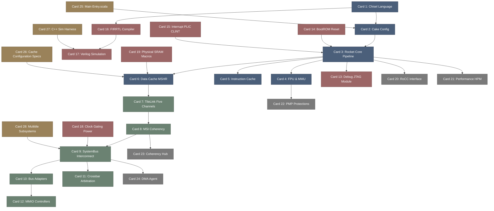

# rocket_chip-高密度卡片系统设计大图.md

本文件定义了 **rocket_chip (RISC-V 参数化芯片生成器与 TileLink 一致性总线)** 28张核心知识卡片之间的依赖拓扑结构，以及物理代码映射锚点。

---

## 🗺️ 28 张卡片依赖拓扑图 (Mermaid)

---

## 📍 Rocket Chip 物理源码位置映射

本设计大图的知识节点与 Rocket Chip 核心 Scala/Chisel 物理源码强关联：
1. **Diplomacy & Subsystem**: `src/main/scala/diplomacy/`, `src/main/scala/subsystem/`。
2. **Rocket Core & Cache**: `src/main/scala/rocket/` 下的 `RocketCore.scala`, `IBuf.scala`, `HellaCache.scala` (D$)。
3. **TileLink Bus**: `src/main/scala/tilelink/`。
4. **Devices & MMIO**: `src/main/scala/devices/tilelink/` (PLIC, CLINT)。
5. **Generator Entry**: `src/main/scala/system/Generator.scala`。
