# openssl-高密度卡片系统设计大图.md

本文件定义了 **openssl / openssl (密码学协议与安全通信基础设施)** 28张核心知识卡片之间的依赖拓扑结构，以及物理代码映射锚点。

---

## 🗺️ 28 张卡片依赖拓扑图 (Mermaid)

```mermaid
graph TD
    classDef default fill:#151d30,stroke:#24324f,color:#e2e8f0;
    classDef M1 fill:#4B5F7A,stroke:#2f3d52,color:white;
    classDef M2 fill:#6B8272,stroke:#4b5c50,color:white;
    classDef M3 fill:#9C6666,stroke:#704949,color:white;
    classDef M4 fill:#7A7A7A,stroke:#595959,color:white;
    classDef M5 fill:#9A825A,stroke:#6e5c40,color:white;
    classDef M6 fill:#755B77,stroke:#534054,color:white;

    Card1["Card 1: Random & DRBG"]:::M1
    Card2["Card 2: EVP High-Level APIs"]:::M1
    Card3["Card 3: Block Modes & Padding"]:::M1
    Card4["Card 4: AEAD Encryption"]:::M1
    Card5["Card 5: Message Digest & HMAC"]:::M1

    Card6["Card 6: ECDHE Key Exchange"]:::M2
    Card7["Card 7: RSA & OAEP"]:::M2
    Card8["Card 8: ECC & ECDSA Signature"]:::M2
    Card9["Card 9: ASN.1 & DER/PEM"]:::M2
    Card10["Card 10: X.509 Certificate CA"]:::M2

    Card11["Card 11: TLS 1.2 Handshake"]:::M3
    Card12["Card 12: TLS 1.3 1-RTT"]:::M3
    Card13["Card 13: HKDF Key Derivation"]:::M3
    Card14["Card 14: Session Ticket & 0-RTT"]:::M3
    Card15["Card 15: Record Protocol framing"]:::M3

    Card16["Card 16: OPENSSL_malloc security"]:::M4
    Card17["Card 17: Constant-time execution"]:::M4
    Card18["Card 18: Zeroization cleansing"]:::M4
    Card19["Card 19: Heartbleed root cause"]:::M4
    Card20["Card 20: Side-channel blinding"]:::M4

    Card21["Card 21: EVP_PKEY Asymmetric"]:::M5
    Card22["Card 22: SSL_CTX configuration"]:::M5
    Card23["Card 23: BIO I/O Pipeline"]:::M5
    Card24["Card 24: Engine hardware adapter"]:::M5
    Card25["Card 25: Provider slot architecture"]:::M5

    Card26["Card 26: Intel QAT SSL offloading"]:::M6
    Card27["Card 27: AES-NI CPU instructions"]:::M6
    Card28["Card 28: Cipher strength audit"]:::M6

    %% Relationships
    Card1 --> Card2
    Card2 --> Card3
    Card3 --> Card4
    Card4 & Card5 --> Card15
    Card6 --> Card12
    Card7 & Card8 --> Card10
    Card9 --> Card10
    Card10 --> Card11
    Card10 --> Card12
    Card12 --> Card13
    Card13 --> Card15
    Card14 --> Card12
    Card16 --> Card19
    Card17 --> Card20
    Card18 --> Card20
    Card21 --> Card22
    Card22 --> Card23
    Card24 --> Card25
    Card25 --> Card26
    Card27 --> Card26
    Card26 --> Card28
```

---

## 锚点物理位置映射 (OpenSSL 物理源码剖析)

### 1. EVP 抽象层接口与对称分组 (M1)
*   **物理源码映射**：
    - `openssl/crypto/evp/evp_enc.c`：所有对称加解密 EVP 核心接口（`EVP_EncryptInit_ex`, `EVP_EncryptUpdate`）的高层调度中心。
    - `openssl/providers/implementations/ciphers/cipher_aes_gcm.c`：AEAD 认证加密的真实物理芯片算法实现，处理 GCM 认证标签（Tag）的校验逻辑。

### 2. TLS 1.3 状态机与密钥派生 (M2)
*   **物理源码映射**：
    - `openssl/ssl/statem/statem_srvr.c#L1100-L1250`：TLS 握手服务器端状态机，处理 `ClientHello` 到 `ServerHello` 转换以及 PSK 会话恢复。
    - `openssl/crypto/kdf/hkdf.c`：HKDF 派生算法实现，包含 `kdf_hkdf_extract` 与 `kdf_hkdf_expand` 的底层散列计算循环。

### 3. 安全零化与侧信道防护 (M3)
*   **物理源码映射**：
    - `openssl/crypto/mem_clr.c#L15-L25`：`OPENSSL_cleanse` 物理代码。其通过强制写屏障避免编译器对密钥释放零化循环的死代码消除（Dead-code elimination）优化。
    - `openssl/crypto/rsa/rsa_ossl.c#L450-L550`：RSA 模幂运算中防范侧信道（Timing Attack）的时序掩码（Blinding）动态混合。
