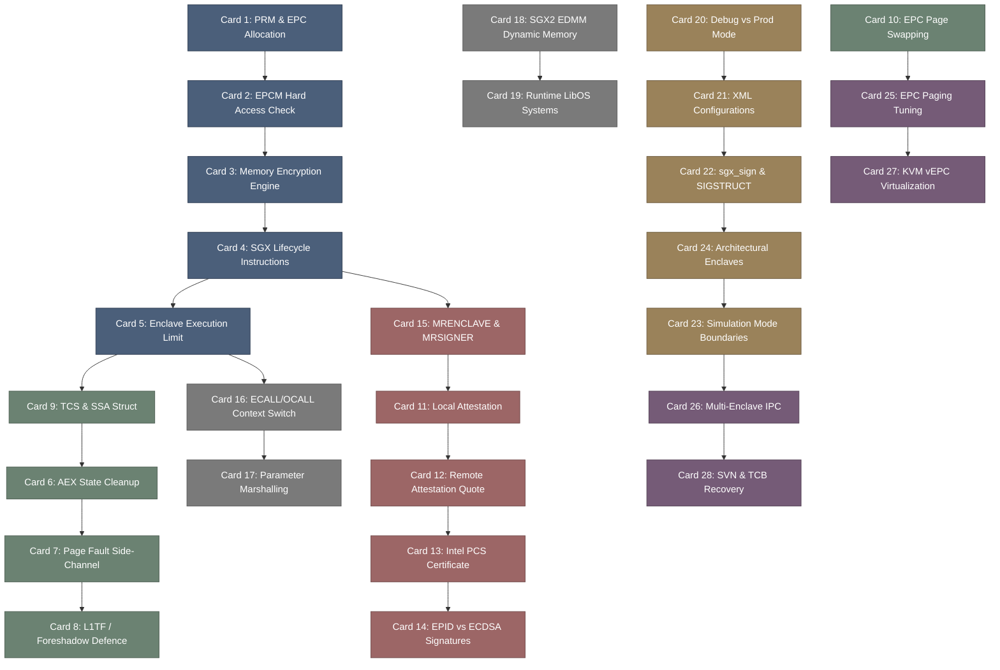

# intel_sgx-高密度卡片系统设计大图.md

本文件定义了 **intel / sgx-software-enable (Intel SGX 安全计算)** 28张核心知识卡片之间的依赖拓扑结构，以及物理代码映射锚点。

---

## 🗺️ 28 张卡片依赖拓扑图 (Mermaid)

---

## 📍 SGX-Software-Enable 物理源码位置映射

本设计大图的知识节点与 Intel SGX 驱动及 SDK 物理源码模块强关联：
1. **EPCM & Memory Management**: `arch/x86/kernel/cpu/sgx/main.c` (EPC 页面分配与管理)。
2. **SGX Core Driver**: `arch/x86/kernel/cpu/sgx/encl.c` (Enclave 飞地内存结构与页表控制)。
3. **Attestation & Cryptography**: `sdk/attestation/` (本地与远程认证实现库)。
4. **Context Switching & SSA**: `sdk/simulation/assembly/` (AEX 汇编与飞地边界跳转)。
5. **Architectural Enclaves**: `psw/ae/` (QE, LE, PCE 等架构飞地模块源码)。
6. **Virtualization vEPC**: `arch/x86/kvm/vmx/sgx.c` (KVM SGX 虚拟化驱动)。
