# rustls-高密度卡片系统设计大图.md

本文件定义了 **rustls (现代密码安全 TLS 1.3 协议栈)** 28张核心知识卡片之间的依赖拓扑结构，以及物理代码映射锚点。

---

## 🗺️ 28 张卡片依赖拓扑图 (Mermaid)

```mermaid
graph TD
    classDef default fill:#151d30,stroke:#24324f,color:#e2e8f0;
    classDef M1 fill:#4B5F7A,stroke:#2f3d52,color:white;
    classDef M2 fill:#6B8272,stroke:#4b5c50,color:white;
    classDef M3 fill:#9C6666,stroke:#704949,color:white;
    classDef M4 fill:#7A7A7A,stroke:#595959,color:white;
    classDef M5 fill:#9A825A,stroke:#6e5c40,color:white;

    Card1["Card 1: Memory Safety"]:::M1
    Card2["Card 2: TLS 1.3 Handshake"]:::M1
    Card3["Card 3: ClientHello/ServerHello"]:::M1
    Card4["Card 4: CryptoProvider"]:::M1
    Card5["Card 5: HKDF Key Derivation"]:::M1
    Card6["Card 6: Resumption & PSK"]:::M1
    Card7["Card 7: Session Tickets"]:::M2
    Card8["Card 8: Record Layer Protocol"]:::M2
    Card9["Card 9: AEAD Encryption"]:::M2
    Card10["Card 10: Transcript Hash"]:::M2
    Card11["Card 11: Webpki Validation"]:::M2
    Card12["Card 12: Client Auth & mTLS"]:::M2
    Card13["Card 13: Signature Schemes"]:::M3
    Card14["Card 14: Key Exchange DHE"]:::M3
    Card15["Card 15: Zero-RTT (0-RTT)"]:::M3
    Card16["Card 16: Encrypted Extensions"]:::M3
    Card17["Card 17: KeyUpdate Rotation"]:::M3
    Card18["Card 18: Alert Protocol"]:::M3
    Card19["Card 19: Heartbleed Prevention"]:::M4
    Card20["Card 20: Middlebox Compatibility"]:::M4
    Card21["Card 21: Finished Message Check"]:::M4
    Card22["Card 22: Constant-Time Mitigations"]:::M4
    Card23["Card 23: Configuration API"]:::M4
    Card24["Card 24: Async Tokio-rustls"]:::M5
    Card25["Card 25: Certificate Pinning"]:::M5
    Card26["Card 26: Fuzzing & Auditing"]:::M5
    Card27["Card 27: Benchmarking Performance"]:::M5
    Card28["Card 28: Post-Quantum Cryptography"]:::M5

    Card1 --> Card2
    Card2 --> Card3
    Card4 --> Card2
    Card4 --> Card5
    Card5 --> Card6
    Card6 --> Card7
    Card8 --> Card9
    Card2 --> Card10
    Card11 --> Card12
    Card13 --> Card14
    Card2 --> Card15
    Card3 --> Card16
    Card9 --> Card17
    Card8 --> Card18
    Card1 --> Card19
    Card2 --> Card20
    Card10 --> Card21
    Card9 --> Card22
    Card1 --> Card23
    Card2 --> Card24
    Card11 --> Card25
    Card1 --> Card26
    Card27 --> Card24
    Card14 --> Card28
```

---

## 📂 核心代码物理映射锚点

在 `rustls` 源码库中，核心设计原则与卡片知识点在底层代码中有清晰的物理位置映射，供深入开发和审计参考：

*   `rustls::conn::Connection`: 连接上下文核心结构，编排握手状态机、网络 I/O 驱动以及对称加解密逻辑。
*   `rustls::conn::HandshakeState`: 握手状态机强类型定义枚举，控制 1-RTT 与 0-RTT 状态转换逻辑。
*   `rustls::crypto::CryptoProvider`: 密码适配层抽象接口，注入底层对称 AEAD、非对称签名及 Diffie-Hellman 运算引擎。
*   `rustls::record_layer::RecordLayer`: 记录协议控制模块，负责 TLS 分帧头部的封装、密文封包与解密校验。
*   `rustls::hash_handshake::HandshakeHash`: 握手哈希记录器，全程单向哈希记录握手交互字节，在 Finished 阶段提供防篡改校验。
*   `rustls::key_schedule::KeySchedule`: 密钥排期管理器，驱动 HKDF-Extract 与 HKDF-Expand 完成临时秘密派生为应用流量密钥的物理计算。

---

## 🔬 Zone T2: 密码协议与系统执行错误字典

*   `tls_handshake_unexpected_message`: 接收到与当前握手状态机预期不符的消息类型，导致连接被致命警报关闭。
*   `tls_record_decrypt_failed`: AEAD 对称解密失败，通常是由密文被篡改、密钥不同步或 Nonce 重复导致。
*   `webpki_cert_path_invalid`: 证书信任链验证失败，可能由于根证书不被信任、签名失效或证书已过期。
*   `tls_handshake_transcript_mismatch`: 最终 Finished 消息校验和计算不匹配，表明握手内容曾被篡改。
*   `constant_time_comparison_leak`: 未能完全使用常数时间比较算法，引发侧信道时序泄露。
*   `zero_rtt_replay_detected`: 检测到 0-RTT 重放攻击，握手被服务器拒绝或强制降级至 1-RTT。
