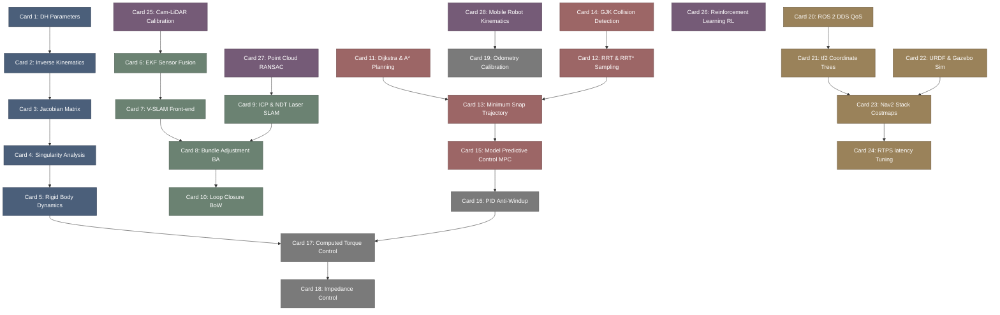

# awesome_robotics-高密度卡片系统设计大图.md

本文件定义了 **awesome-robotics (机器人系统与运动规划)** 28张核心知识卡片之间的依赖拓扑结构，以及物理代码映射锚点。

---

## 🗺️ 28 张卡片依赖拓扑图 (Mermaid)

---

## 📍 Awesome-Robotics 物理源码位置映射

本设计大图的知识节点与自主机器人核心软件系统物理源码模块强关联：
1. **Kinematics & Dynamics**: ROS Orocos KDL (`orocos_kdl/src/`) / Pinocchio C++ 动力学库。
2. **SLAM Back-end**: g2o (`g2o/core/`) / Ceres Solver (优化后端)。
3. **Motion Planning**: OMPL (`ompl/src/ompl/geometric/planners/`) / MoveIt! 库。
4. **Control Core**: `ros2_control/` 硬件控制循环抽象接口。
5. **DDS & Middleware**: FastDDS (`fastdds/src/cpp/rtps/`) QoS 通信实现。
6. **Mobile Kinematics**: Nav2 Controller Server (`navigation2/nav2_controller/`)。
