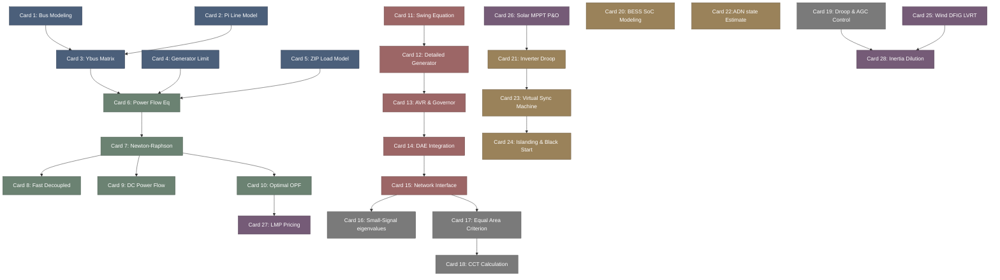

# power_systems-高密度卡片系统设计大图.md

本文件定义了 **PowerSystems.jl (现代电力系统仿真)** 28张核心知识卡片之间的依赖拓扑结构，以及物理代码映射锚点。

---

## 🗺️ 28 张卡片依赖拓扑图 (Mermaid)

---

## 📍 PowerSystems.jl 物理源码位置映射

本设计大图的知识节点与 Julia 电力系统核心仿真软件物理源码模块强关联：
1. **Grid Modeling**: `PowerSystems.jl` 中的 `src/models/` 目录，涵盖 `Bus.jl`、`Branch.jl`、`ThermalGen.jl` 及 `ZIPLoad.jl`。
2. **Power Flow Solvers**: `PowerFlows.jl` 仓库下的 `src/power_flow.jl`，利用稀疏矩阵求解非线性雅可比。
3. **Dynamic Simulator**: `PowerSimulationsDynamics.jl` 仓库下的 `src/models/` (Swing, AVR, Governor 模型) 与 `src/simulation/` (DAE 求解模块)。
4. **Market & OPF**: `PowerModels.jl` 中的数学规划接口 `src/prob/opf.jl`，基于 JuMP 库。
