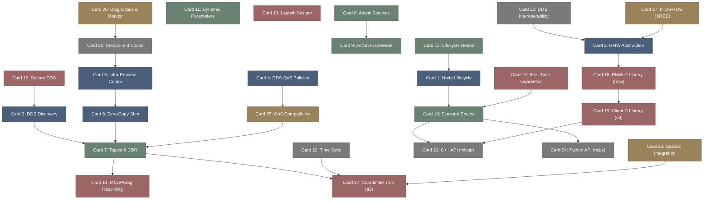

# ros2-高密度卡片系统设计大图.md

本文件定义了 **ros2 (机器人 DDS 实时中间件与共享内存)** 28张核心知识卡片之间的依赖拓扑结构，以及物理代码映射锚点。

---

## 🗺️ 28 张卡片依赖拓扑图 (Mermaid)

---

## 📂 核心代码物理映射锚点

在 `ros2` 源码库中，核心设计原则与卡片知识点在底层代码中有清晰的物理位置映射，供深入开发和审计参考：

*   `rclcpp::Node`: C++ 客户端库核心节点管理，驱动参数绑定及等待集分发。
*   `rcl::rcl`: C 语言客户端层，负责中间件解耦，处理时间、执行器状态调度。
*   `rmw::rmw`: 中间件接口层，封装 DDS 订阅发布动作，维护底层的网络发现状态。
*   `rcutils::rcutils`: 统一底层工具集，负责零内存分配内存池、日志排版格式控制。
*   `tf2::BufferCore`: tf2 位姿树后台存储核心，解算分布式机器人的高频坐标转换。
*   `rclcpp::executors::MultiThreadedExecutor`: 多线程调度器核心，分配 Callback Group 并管理内核级线程锁绑定。

---

## 🔬 Zone T2: 机器人分布式中间件与运行错误字典

*   `dds_qos_incompatible_match`: 发布端与订阅端的 QoS 策略不匹配（Offered vs Requested 违规），导致话题数据无法成功传输。
*   `shared_memory_segment_overflow`: iceoryx 共享内存数据段不足或环形缓冲区耗尽，引发零拷贝发布端借用失败（Loan Refused）。
*   `executor_deadlock_callback_stall`: 在同一个单线程 Executor 中发起了相互等待的重入式服务调用，导致调度线程死锁。
*   `realtime_priority_inversion`: 高优先级运动控制线程由于获取了低优先级节点持有的锁，引发优先级翻转而导致时间抖动。
*   `tf2_extrapolation_out_of_range`: 请求解算的坐标变换时间戳超出了缓冲区窗口，引发 tf2 外推边界超时异常。
*   `lifecycle_invalid_state_transition`: 试图在非受控节点状态下触发非法生命周期跳变，被 Lifecycle 状态机硬件抛出拒绝警报。
