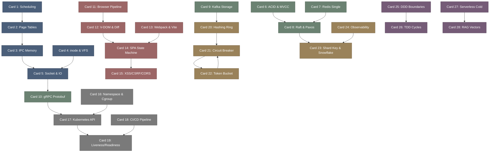

# developer_roadmap-高密度卡片系统设计大图.md

本文件定义了 **developer-roadmap (开发者技术栈)** 28张核心知识卡片之间的依赖拓扑结构，以及物理代码映射锚点。

---

## 🗺️ 28 张卡片依赖拓扑图 (Mermaid)

---

## 📍 Developer Roadmap 物理源码与系统拓扑映射

本设计大图的知识节点与计算机科学及主流全栈中间件源码模块强关联：
1. **Linux Kernel Systems**: Linux Kernel 调度器 (`kernel/sched/`) 与虚拟内存 (`mm/`) 源码。
2. **Database Core**: MySQL MVCC 事务引擎 (`storage/innobase/`) 与 Redis 事件库 (`src/ae.c`)。
3. **Frontend Renders**: Chromium Blink 渲染引擎 (`third_party/blink/renderer/`) 与 React 协调器 (`packages/react-reconciler/`)。
4. **Cloud Infrastructure**: Kubernetes 部署控制器 (`pkg/controller/deployment/`)。
